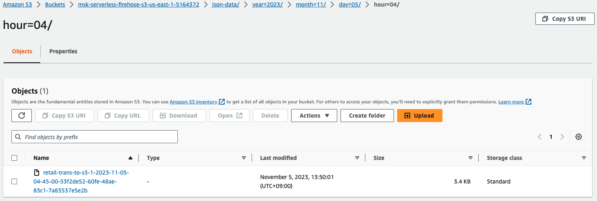

# Build CDC (Change Data Capture) Data Pipeline using Amazon MSK Connect

This repository provides you cdk scripts and sample code on how to implement end to end data pipeline for replicating transactional data from MySQL DB to Amazon S3 through Amazon MSK Serverless using Amazon MSK Connect.

## Streaming Pipeline

Below diagram shows what we are implementing.


The `cdk.json` file tells the CDK Toolkit how to execute your app.

This project is set up like a standard Python project.  The initialization
process also creates a virtualenv within this project, stored under the `.venv`
directory.  To create the virtualenv it assumes that there is a `python3`
(or `python` for Windows) executable in your path with access to the `venv`
package. If for any reason the automatic creation of the virtualenv fails,
you can create the virtualenv manually.

To manually create a virtualenv on MacOS and Linux:

```
$ python3 -m venv .venv
```

After the init process completes and the virtualenv is created, you can use the following
step to activate your virtualenv.

```
$ source .venv/bin/activate
```

If you are a Windows platform, you would activate the virtualenv like this:

```
% .venv\Scripts\activate.bat
```

Once the virtualenv is activated, you can install the required dependencies.

```
(.venv) $ pip install -r requirements.txt
```

To add additional dependencies, for example other CDK libraries, just add
them to your `setup.py` file and rerun the `pip install -r requirements.txt`
command.

## Prerequisites

Before synthesizing the CloudFormation, make sure getting a Debezium source connector reday.

1. Create a custom plugin

   (a) Download the MySQL connector plugin for the latest stable release from the [Debezium](https://debezium.io/releases/) site.<br/>
   (b) Download and extract the [AWS Secrets Manager Config Provider](https://www.confluent.io/hub/jcustenborder/kafka-config-provider-aws).<br/>
   (c) After completing steps (a), (b) above, you may have the following archives:
      - `debezium-connector-mysql-2.4.0.Final-plugin.tar.gz`: Debezim MySQL Connector
      - `jcustenborder-kafka-config-provider-aws-0.1.2.zip`: AWS Secrets Manager Config Provider

    Place the archives into the same directory and
    compress the directory that you created in the previous step into a ZIP file and then upload the ZIP file to an S3 bucket.<br/>
    For example, you can do it like this:
    ```
    $ mkdir -p debezium-connector-mysql
    $ tar -xzf debezium-connector-mysql-2.4.0.Final-plugin.tar.gz -C debezium-connector-mysql
    $ unzip jcustenborder-kafka-config-provider-aws-0.1.2.zip -d debezium-connector-mysql
    $ cd debezium-connector-mysql/jcustenborder-kafka-config-provider-aws-0.1.2/lib
    $ wget https://repo1.maven.org/maven2/com/google/guava/guava/31.1-jre/guava-31.1-jre.jar
    $ cd ../../
    $ zip -9 -r ../debezium-connector-mysql-v2.4.0.zip *
    $ cd ..
    $ aws s3 cp debezium-connector-mysql-v2.4.0.zip s3://my-bucket/path/
    ```
   (d) Copy the following JSON and paste it in a file. For example, `debezium-source-custom-plugin.json`.<br/>
    ```json
    {
      "name": "debezium-connector-mysql-v2-4-0",
      "contentType": "ZIP",
      "location": {
          "s3Location": {
            "bucketArn": "arn:aws:s3:::<my-bucket>",
            "fileKey": "<path>/debezium-connector-mysql-v2.4.0.zip"
        }
      }
    }
    ```
   (e) Run the following AWS CLI command from the folder where you saved the JSON file to create a plugin.
    <pre>
    aws kafkaconnect create-custom-plugin --cli-input-json file://<i>debezium-source-custom-plugin.json</i>
    </pre>

2. Create a custom worker configuration with information about your configuration provider.

   (a) Copy the following worker configuration properties into a file.<br/>
      To learn more about the configuration properties for the AWS Secrets Manager Config Provider, see [SecretsManagerConfigProvider](https://jcustenborder.github.io/kafka-connect-documentation/projects/kafka-config-provider-aws/configProviders/SecretsManagerConfigProvider.html) in the plugin's documentation.
      <pre>
      key.converter=<i>org.apache.kafka.connect.storage.StringConverter</i>
      key.converter.schemas.enable=<i>false</i>
      value.converter=<i>org.apache.kafka.connect.json.JsonConverter</i>
      value.converter.schemas.enable=<i>false</i>
      config.providers.secretManager.class=com.github.jcustenborder.kafka.config.aws.SecretsManagerConfigProvider
      config.providers=secretManager
      config.providers.secretManager.param.aws.region=<i>us-east-1</i>
      </pre>
    (b) Run the following AWS CLI command to create your custom worker configuration.<br/>
        Replace the following values:

     - `my-worker-config-name` - a descriptive name for your custom worker configuration (e.g., `AuroraMySQLSource` )
     - `encoded-properties-file-content-string` - a base64-encoded version of the plaintext properties that you copied in the previous step

      <pre>
      aws kafkaconnect create-worker-configuration \
          --name <i>&lt;my-worker-config-name&gt;</i> \
          --properties-file-content <i>&lt;encoded-properties-file-content-string&gt;</i>
      </pre>
      You should see output similar to the following example on the AWS Web console.
      

     - Woker configuration
        <pre>
        key.converter=org.apache.kafka.connect.storage.StringConverter
        key.converter.schemas.enable=false
        value.converter=org.apache.kafka.connect.json.JsonConverter
        value.converter.schemas.enable=false
        config.providers.secretManager.class=com.github.jcustenborder.kafka.config.aws.SecretsManagerConfigProvider
        config.providers=secretManager
        config.providers.secretManager.param.aws.region=us-east-1
        </pre>

    :information_source: To learn more about how to create a Debezium source connector, see [Debezium source connector with configuration provider](https://docs.aws.amazon.com/msk/latest/developerguide/mkc-debeziumsource-connector-example.html)

3. Set up the cdk context configuration file, `cdk.context.json`.

   For example:
    <pre>
    {
      "db_cluster_name": "<i>retail</i>",
      "msk_cluster_name": "<i>retail-trans</i>",
      "msk_connector_worker_configuration_name": "<i>AuroraMySQLSource</i>",
      "msk_connector_custom_plugin_name": "<i>debezium-connector-mysql-v2-4-0</i>",
      "msk_connector_name": "<i>retail-changes</i>",
      "msk_connector_configuration": {
        "tasks.max": "1",
        "database.include.list": "<i>testdb</i>",
        "topic.prefix": "<i>retail-server</i>",
        "topic.creation.default.partitions": "3",
        "topic.creation.default.replication.factor": "2",
        "include.schema.changes": "true",
        "schema.history.internal.kafka.topic": "<i>schema-changes.testdb</i>"
      },
      "firehose": {
        "buffering_hints": {
          "intervalInSeconds": 300,
          "sizeInMBs": 100
        },
        "topic_name": "<i>retail-server.testdb.retail_trans</i>"
      }
    }
    </pre>

Now you can now synthesize the CloudFormation template for this code.

## (Step 1) Creating Aurora MySQL cluster

Create an Aurora MySQL Cluster
<pre>
(.venv) $ cdk deploy MSKServerlessToS3VpcStack \
                     AuroraMySQLAsDataSourceStack
</pre>

## (Step 2) Creating Kafka cluster

Create a MSK Serverless Cluster
<pre>
(.venv) $ cdk deploy MSKServerlessStack \
                     MSKClusterPolicy
</pre>

## (Step 3) Confirm that binary logging is enabled

Create a bastion host to access the Aurora MySQL cluster
<pre>
(.venv) $ cdk deploy BastionHost
</pre>

<b><em>In order to set up the Aurora MySQL, you need to connect the Aurora MySQL cluster on an EC2 Bastion host.</em></b>

1. Connect to the Aurora cluster writer node.
   <pre>
    $ BASTION_HOST_ID=$(aws cloudformation describe-stacks --stack-name <i>BastionHost</i> | jq -r '.Stacks[0].Outputs | .[] | select(.OutputKey | endswith("EC2InstanceId")) | .OutputValue')
    $ mssh -r <i>us-east-1</i> ec2-user@${BASTION_HOST_ID}
    [ec2-user@ip-172-31-7-186 ~]$ mysql -h<i>db-cluster-name</i>.cluster-<i>xxxxxxxxxxxx</i>.<i>region-name</i>.rds.amazonaws.com -uadmin -p
    Enter password:
    Welcome to the MariaDB monitor.  Commands end with ; or \g.
    Your MySQL connection id is 20
    Server version: 8.0.23 Source distribution

    Copyright (c) 2000, 2018, Oracle, MariaDB Corporation Ab and others.

    Type 'help;' or '\h' for help. Type '\c' to clear the current input statement.

    MySQL [(none)]>
   </pre>

   > :information_source: `BastionHost` is a CDK Stack to create the bastion host.

   > :information_source: You can also connect to an EC2 instance using the EC2 Instance Connect CLI.
   For more information, see [Connect using the EC2 Instance Connect CLI](https://docs.aws.amazon.com/AWSEC2/latest/UserGuide/ec2-instance-connect-methods.html#ec2-instance-connect-connecting-ec2-cli).
   For example,
       <pre>
       $ sudo pip install ec2instanceconnectcli
       $ mssh ec2-user@i-001234a4bf70dec41EXAMPLE # ec2-instance-id
       </pre>

2. At SQL prompt run the below command to confirm that binary logging is enabled:
   <pre>
    MySQL [(none)]> SHOW GLOBAL VARIABLES LIKE "log_bin";
    +---------------+-------+
    | Variable_name | Value |
    +---------------+-------+
    | log_bin       | ON    |
    +---------------+-------+
    1 row in set (0.00 sec)
   </pre>

3. Also run this to AWS DMS has bin log access that is required for replication
   <pre>
    MySQL [(none)]> CALL mysql.rds_set_configuration('binlog retention hours', 24);
    Query OK, 0 rows affected (0.01 sec)
   </pre>

## (Step 4) Create a sample database and table

1. Run the below command to create the sample database named `testdb`.
   <pre>
    MySQL [(none)]> SHOW DATABASES;
    +--------------------+
    | Database           |
    +--------------------+
    | information_schema |
    | mysql              |
    | performance_schema |
    | sys                |
    +--------------------+
    4 rows in set (0.00 sec)

    MySQL [(none)]> CREATE DATABASE IF NOT EXISTS testdb;
    Query OK, 1 row affected (0.01 sec)

    MySQL [(none)]> USE testdb;
    Database changed
    MySQL [testdb]> SHOW TABLES;
    Empty set (0.00 sec)
   </pre>
2. Also run this to create the sample table named `retail_trans`
   <pre>
    MySQL [testdb]> CREATE TABLE IF NOT EXISTS testdb.retail_trans (
             trans_id BIGINT(20) AUTO_INCREMENT,
             customer_id VARCHAR(12) NOT NULL,
             event VARCHAR(10) DEFAULT NULL,
             sku VARCHAR(10) NOT NULL,
             amount INT DEFAULT 0,
             device VARCHAR(10) DEFAULT NULL,
             trans_datetime DATETIME DEFAULT CURRENT_TIMESTAMP,
             PRIMARY KEY(trans_id),
             KEY(trans_datetime)
           ) ENGINE=InnoDB AUTO_INCREMENT=0;
    Query OK, 0 rows affected, 1 warning (0.04 sec)

    MySQL [testdb]> SHOW TABLES;
    +------------------+
    | Tables_in_testdb |
    +------------------+
    | retail_trans     |
    +------------------+
    1 row in set (0.00 sec)

    MySQL [testdb]> DESC retail_trans;
    +----------------+-------------+------+-----+-------------------+-------------------+
    | Field          | Type        | Null | Key | Default           | Extra             |
    +----------------+-------------+------+-----+-------------------+-------------------+
    | trans_id       | bigint      | NO   | PRI | NULL              | auto_increment    |
    | customer_id    | varchar(12) | NO   |     | NULL              |                   |
    | event          | varchar(10) | YES  |     | NULL              |                   |
    | sku            | varchar(10) | NO   |     | NULL              |                   |
    | amount         | int         | YES  |     | 0                 |                   |
    | device         | varchar(10) | YES  |     | NULL              |                   |
    | trans_datetime | datetime    | YES  | MUL | CURRENT_TIMESTAMP | DEFAULT_GENERATED |
    +----------------+-------------+------+-----+-------------------+-------------------+
    7 rows in set (0.00 sec)

    MySQL [testdb]>
   </pre>

<b><em>After setting up the Aurora MySQL, you should come back to the terminal where you are deploying stacks.</em></b>

## (Step 5) Run MSK Connect

1. Create and run MSK Connect
   <pre>
   (.venv) $ cdk deploy KafkaConnectorStack
   </pre>

2. Then, go back to the database connection in the terminal to insert a few records in the `retail_trans` table:
   <pre>
    MySQL [testdb]> INSERT INTO testdb.retail_trans (customer_id, event, sku, amount, device, trans_datetime) VALUES("460104780596", "cart", "IQ6879MMTB", 8, "mobile", "2023-11-05 03:16:13");
    Query OK, 1 row affected (0.00 sec)

    MySQL [testdb]> INSERT INTO testdb.retail_trans (customer_id, event, sku, amount, device, trans_datetime) VALUES("758933025159", "like", "RL1573WWLT", 1, "tablet", "2023-11-05 03:34:42");
    Query OK, 1 row affected (0.00 sec)

    MySQL [testdb]> INSERT INTO testdb.retail_trans (customer_id, event, sku, amount, device, trans_datetime) VALUES("754384589074", "like", "PX4135DYNT", 1, "mobile", "2023-11-05 03:17:45");
    Query OK, 1 row affected (0.00 sec)

    MySQL [testdb]>
   </pre>

## (Step 6) Create Kinesis Data Firehose

Create a Kinesis Data Firehose to deliver CDC coming from MSK Serverless to S3
<pre>
(.venv) $ cdk deploy S3AsFirehoseDestinationStack \
                     FirehosefromMSKtoS3Stack
</pre>

## Run Test

1. Generate test data.
   <pre>
    $ BASTION_HOST_ID=$(aws cloudformation describe-stacks --stack-name <i>BastionHost</i> | jq -r '.Stacks[0].Outputs | .[] | select(.OutputKey | endswith("EC2InstanceId")) |.OutputValue')
    $ mssh -r <i>us-east-1</i> ec2-user@${BASTION_HOST_ID}
    [ec2-user@ip-172-31-7-186 ~]$ cat <&ltEOF >requirements-dev.txt
    > boto3
    > dataset==1.5.2
    > Faker==13.3.1
    > PyMySQL==1.0.2
    > EOF
    [ec2-user@ip-172-31-7-186 ~]$ pip install -U -r requirements-dev.txt
    [ec2-user@ip-172-31-7-186 ~]$ python3 gen_fake_mysql_data.py \
                   --database <i>your-database-name</i> \
                   --table <i>your-table-name</i> \
                   --user <i>user-name</i> \
                   --password <i>password</i> \
                   --host <i>db-cluster-name</i>.cluster-<i>xxxxxxxxxxxx</i>.<i>region-name</i>.rds.amazonaws.com \
                   --max-count 200
   </pre>

2. Check streaming data in S3<br/>
   After `5~7` minutes, you can see that the streaming data have been delivered from MSK to S3.<br/>
   For example,
   
   
   You will be able to find records like the following from the selected object:
   <pre>
   {
     "before": null,
     "after": {
       "trans_id": 2,
       "customer_id": "758933025159",
       "event": "like",
       "sku": "RL1573WWLT",
       "amount": 1,
       "device": "tablet",
       "trans_datetime": 1699155282000
     },
     "source": {
       "version": "2.4.0.Final",
       "connector": "mysql",
       "name": "retail-server",
       "ts_ms": 1699159500000,
       "snapshot": "false",
       "db": "testdb",
       "sequence": null,
       "table": "retail_trans",
       "server_id": 1906697801,
       "gtid": null,
       "file": "mysql-bin-changelog.000003",
       "pos": 10025,
       "row": 0,
       "thread": 287,
       "query": null
     },
     "op": "c",
     "ts_ms": 1699159500135,
     "transaction": null
   }
   {
     "before": null,
     "after": {
       "trans_id": 3,
       "customer_id": "754384589074",
       "event": "like",
       "sku": "PX4135DYNT",
       "amount": 1,
       "device": "mobile",
       "trans_datetime": 1699154265000
     },
     "source": {
       "version": "2.4.0.Final",
       "connector": "mysql",
       "name": "retail-server",
       "ts_ms": 1699159513000,
       "snapshot": "false",
       "db": "testdb",
       "sequence": null,
       "table": "retail_trans",
       "server_id": 1906697801,
       "gtid": null,
       "file": "mysql-bin-changelog.000003",
       "pos": 10387,
       "row": 0,
       "thread": 287,
       "query": null
     },
     "op": "c",
     "ts_ms": 1699159513592,
     "transaction": null
   }
   {
     "before": null,
     "after": {
       "trans_id": 5,
       "customer_id": "758933025159",
       "event": "like",
       "sku": "RL1573WWLT",
       "amount": 1,
       "device": "tablet",
       "trans_datetime": 1699158882000
     },
     "source": {
       "version": "2.4.0.Final",
       "connector": "mysql",
       "name": "retail-server",
       "ts_ms": 1699159659000,
       "snapshot": "false",
       "db": "testdb",
       "sequence": null,
       "table": "retail_trans",
       "server_id": 1906697801,
       "gtid": null,
       "file": "mysql-bin-changelog.000003",
       "pos": 11099,
       "row": 0,
       "thread": 801,
       "query": null
     },
     "op": "c",
     "ts_ms": 1699159659046,
     "transaction": null
   }
   {
     "before": null,
     "after": {
       "trans_id": 6,
       "customer_id": "754384589074",
       "event": "like",
       "sku": "PX4135DYNT",
       "amount": 1,
       "device": "mobile",
       "trans_datetime": 1699157865000
     },
     "source": {
       "version": "2.4.0.Final",
       "connector": "mysql",
       "name": "retail-server",
       "ts_ms": 1699159662000,
       "snapshot": "false",
       "db": "testdb",
       "sequence": null,
       "table": "retail_trans",
       "server_id": 1906697801,
       "gtid": null,
       "file": "mysql-bin-changelog.000003",
       "pos": 11455,
       "row": 0,
       "thread": 801,
       "query": null
     },
     "op": "c",
     "ts_ms": 1699159662052,
     "transaction": null
   }
   {
     "before": null,
     "after": {
       "trans_id": 7,
       "customer_id": "602811489876",
       "event": "purchase",
       "sku": "PI7913TREO",
       "amount": 66,
       "device": "pc",
       "trans_datetime": 1699156935000
     },
     "source": {
       "version": "2.4.0.Final",
       "connector": "mysql",
       "name": "retail-server",
       "ts_ms": 1699159665000,
       "snapshot": "false",
       "db": "testdb",
       "sequence": null,
       "table": "retail_trans",
       "server_id": 1906697801,
       "gtid": null,
       "file": "mysql-bin-changelog.000003",
       "pos": 11811,
       "row": 0,
       "thread": 801,
       "query": null
     },
     "op": "c",
     "ts_ms": 1699159665062,
     "transaction": null
   }
   </pre>

## Clean Up

Delete the CloudFormation stack by running the below command.
<pre>
(.venv) $ cdk destroy --force --all
</pre>

## Useful commands

 * `cdk ls`          list all stacks in the app
 * `cdk synth`       emits the synthesized CloudFormation template
 * `cdk deploy`      deploy this stack to your default AWS account/region
 * `cdk diff`        compare deployed stack with current state
 * `cdk docs`        open CDK documentation

Enjoy!

## References

 * [Break data silos and stream your CDC data with Amazon Redshift streaming and Amazon MSK (2023-12-03)](https://aws.amazon.com/blogs/big-data/break-data-silos-and-stream-your-cdc-data-with-amazon-redshift-streaming-and-amazon-msk/)
 * [Introducing Amazon MSK Connect – Stream Data to and from Your Apache Kafka Clusters Using Managed Connectors (2021-09-16)](https://aws.amazon.com/blogs/aws/introducing-amazon-msk-connect-stream-data-to-and-from-your-apache-kafka-clusters-using-managed-connectors/)
   * [Amazon MSK - Debezium source connector with configuration provider](https://docs.aws.amazon.com/msk/latest/developerguide/mkc-debeziumsource-connector-example.html)
 * [Amazon MSK Introduces Managed Data Delivery from Apache Kafka to Your Data Lake (2023-09-27)](https://aws.amazon.com/blogs/aws/amazon-msk-introduces-managed-data-delivery-from-apache-kafka-to-your-data-lake/)
 * [MSK -> Kinesis Data Streams (or Firehose) with Kafka-Kinesis-Connector](https://aws.amazon.com/ko/premiumsupport/knowledge-center/kinesis-kafka-connector-msk/) - How do I connect to my Amazon MSK cluster using the Kafka-Kinesis-Connector?
 * [Amazon MSK multi-VPC private connectivity in a single Region](https://docs.aws.amazon.com/msk/latest/developerguide/aws-access-mult-vpc.html)
   * **Requirements and limitations for multi-VPC private connectivity**
     * Multi-VPC private connectivity is supported only on Apache Kafka 2.7.1 or higher. Make sure that any clients that you use with the MSK cluster are running Apache Kafka versions that are compatible with the cluster.
     * Multi-VPC private connectivity supports auth types IAM, TLS and SASL/SCRAM. Unauthenticated clusters can't use multi-VPC private connectivity.
     * Multi-VPC private connectivity doesn’t support the t3.small instance type.
 * [Build an end-to-end change data capture with Amazon MSK Connect and AWS Glue Schema Registry (2023-03-08)](https://aws.amazon.com/blogs/big-data/build-an-end-to-end-change-data-capture-with-amazon-msk-connect-and-aws-glue-schema-registry/)
 * [(Debezium Blog) Streaming MySQL Data Changes to Amazon Kinesis (2018-08-30)](https://debezium.io/blog/2018/08/30/streaming-mysql-data-changes-into-kinesis/)
 * [(AWS:rePost) How do I turn on binary logging for my Amazon Aurora MySQL-Compatible cluster?](https://repost.aws/knowledge-center/enable-binary-logging-aurora)
 * [Amazon MSK Labs - Tutorial](https://catalog.workshops.aws/msk-labs/en-US)

 * [Amazon Managed Streaming for Apache Kafka - Custom MSK configurations](https://docs.aws.amazon.com/msk/latest/developerguide/msk-configuration-properties.html)
    ```
    auto.create.topics.enable=true
    ```
 * [Debezium - MySQL connector configuration properties](https://debezium.io/documentation/reference/stable/connectors/mysql.html#mysql-connector-properties)
    ```
    topic.creation.enable=true
    topic.creation.default.partitions=-1
    topic.creation.default.replication.factor=-1
    ```

 * [(aws-samples) Build Data Analytics using Amazon Data Migration Service(DMS)](https://github.com/aws-samples/aws-dms-cdc-data-pipeline)

 * [Amazon MSK integrations - Kinesis Data Firehose](https://docs.aws.amazon.com/msk/latest/developerguide/integrations-kinesis-data-firehose.html)

 * [Connect using the EC2 Instance Connect CLI](https://docs.aws.amazon.com/AWSEC2/latest/UserGuide/ec2-instance-connect-methods.html#ec2-instance-connect-connecting-ec2-cli)
   * mssh
     <pre>
     $ sudo pip install ec2instanceconnectcli
     $ mssh ec2-user@i-001234a4bf70dec41EXAMPLE # ec2-instance-id
     </pre>
   * msftp
     ```
     $ msftp ec2-user@i-001234a4bf70dec41EXAMPLE
     Connected to 44.211.52.192.
     sftp> put jcustenborder-kafka-config-provider-aws-0.1.2.zip
     Uploading jcustenborder-kafka-config-provider-aws-0.1.2.zip to /home/ec2-user/jcustenborder-kafka-config-provider-aws-0.1.2.zip
     jcustenborder-kafka-config-provider-aws-0.1.2.zip                                                                                      100% 7840KB   2.4MB/s   00:03
     sftp> ls
     jcustenborder-kafka-config-provider-aws-0.1.2.zip
     sftp> exit
     ```

## Related Works

 * [aws-msk-cdc-data-pipeline-with-debezium](https://github.com/aws-samples/aws-msk-cdc-data-pipeline-with-debezium)
   
 * [aws-dms-cdc-data-pipeline](https://github.com/aws-samples/aws-dms-cdc-data-pipeline)
   
 * [aws-dms-serverless-to-kinesis-data-pipeline](https://github.com/aws-samples/aws-dms-serverless-to-kinesis-data-pipeline)
   
 * [aws-dms-serverless-mysql-to-s3-migration](https://github.com/aws-samples/aws-dms-serverless-mysql-to-s3-migration)
   

## Troubleshooting

 * Amazon MSK Serverless does not allow `auto.create.topics.enable` to be set to `true`.

    ```
    $ aws kafka update-cluster-configuration --cluster-arn arn:aws:kafka:us-east-1:123456789012:cluster/msk/39bb8562-e1b9-42a5-ba82-703ac0dee7ea-s1 --configuration-info file://msk-cluster-config.json --current-version K2EUQ1WTGCTBG2

    An error occurred (BadRequestException) when calling the UpdateClusterConfiguration operation: This operation cannot be performed on serverless clusters.
    ```
   * **Solution**: To automatically create Kafka topics, use a Debezium configuration with `topic.creation.enable` set to `true`.

 * Debezium connector failure with the following error message:

    ```
    2023-11-02T06:21:09.000Z [Worker-03ae84b36842a92e0] java.lang.NoClassDefFoundError: com/google/common/base/Strings
    2023-11-02T06:21:09.000Z [Worker-03ae84b36842a92e0] at com.github.jcustenborder.kafka.connect.utils.config.ConfigKeyBuilder.build(ConfigKeyBuilder.java:61)
    2023-11-02T06:21:09.000Z [Worker-03ae84b36842a92e0] at com.github.jcustenborder.kafka.config.aws.SecretsManagerConfigProviderConfig.config(SecretsManagerConfigProviderConfig.java:75)
    2023-11-02T06:21:09.000Z [Worker-03ae84b36842a92e0] at com.github.jcustenborder.kafka.config.aws.SecretsManagerConfigProviderConfig.<init>(SecretsManagerConfigProviderConfig.java:53)
    2023-11-02T06:21:09.000Z [Worker-03ae84b36842a92e0] at com.github.jcustenborder.kafka.config.aws.SecretsManagerConfigProvider.configure(SecretsManagerConfigProvider.java:136)
    2023-11-02T06:21:09.000Z [Worker-03ae84b36842a92e0] at org.apache.kafka.common.config.AbstractConfig.instantiateConfigProviders(AbstractConfig.java:548)
    2023-11-02T06:21:09.000Z [Worker-03ae84b36842a92e0] at org.apache.kafka.common.config.AbstractConfig.resolveConfigVariables(AbstractConfig.java:491)
    2023-11-02T06:21:09.000Z [Worker-03ae84b36842a92e0] at org.apache.kafka.common.config.AbstractConfig.<init>(AbstractConfig.java:107)
    2023-11-02T06:21:09.000Z [Worker-03ae84b36842a92e0] at org.apache.kafka.common.config.AbstractConfig.<init>(AbstractConfig.java:129)
    2023-11-02T06:21:09.000Z [Worker-03ae84b36842a92e0] at org.apache.kafka.connect.runtime.WorkerConfig.<init>(WorkerConfig.java:452)
    2023-11-02T06:21:09.000Z [Worker-03ae84b36842a92e0] at org.apache.kafka.connect.runtime.distributed.DistributedConfig.<init>(DistributedConfig.java:405)
    2023-11-02T06:21:09.000Z [Worker-03ae84b36842a92e0] at org.apache.kafka.connect.cli.ConnectDistributed.startConnect(ConnectDistributed.java:95)
    2023-11-02T06:21:09.000Z [Worker-03ae84b36842a92e0] at org.apache.kafka.connect.cli.ConnectDistributed.main(ConnectDistributed.java:80)
    2023-11-02T06:21:09.000Z [Worker-03ae84b36842a92e0] Caused by: java.lang.ClassNotFoundException: com.google.common.base.Strings
    2023-11-02T06:21:09.000Z [Worker-03ae84b36842a92e0] at java.base/java.net.URLClassLoader.findClass(URLClassLoader.java:476)
    2023-11-02T06:21:09.000Z [Worker-03ae84b36842a92e0] at java.base/java.lang.ClassLoader.loadClass(ClassLoader.java:594)
    2023-11-02T06:21:09.000Z [Worker-03ae84b36842a92e0] at org.apache.kafka.connect.runtime.isolation.PluginClassLoader.loadClass(PluginClassLoader.java:104)
    2023-11-02T06:21:09.000Z [Worker-03ae84b36842a92e0] at java.base/java.lang.ClassLoader.loadClass(ClassLoader.java:527)
    2023-11-02T06:21:09.000Z [Worker-03ae84b36842a92e0] ... 12 more
    2023-11-02T06:21:09.000Z [Worker-03ae84b36842a92e0] MSK Connect encountered errors and failed.
    ```
    * **Solution**: [Confluent hub installation is missing guava #2](https://github.com/jcustenborder/kafka-config-provider-aws/issues/2)

      > To resolve the MSK Connect issue I downloaded the guava jar (guava-31.1-jre.jar) directly from [here](https://repo1.maven.org/maven2/com/google/guava/guava/31.1-jre/)
      >
      > When you create the custom plugin for MSK Connect, after extracting jcusten-border-kafka-config-provider-aws drop the guava jar in the lib folder, before creating the archive that you upload to S3.

## Kafka Commands CheatSheet

 * Set up `client.properties`

   <pre>
   $ cat client.properties
   security.protocol=SASL_SSL
   sasl.mechanism=AWS_MSK_IAM
   sasl.jaas.config=software.amazon.msk.auth.iam.IAMLoginModule required;
   sasl.client.callback.handler.class=software.amazon.msk.auth.iam.IAMClientCallbackHandler
   </pre>

    :information_source: `client.properties` is a property file containing configs to be passed to Admin Client. This is used only with `--bootstrap-server` option for describing and altering broker configs.<br/>
    For more information, see [Getting started using MSK Serverless clusters - Step 3: Create a client machine](https://docs.aws.amazon.com/msk/latest/developerguide/create-serverless-cluster-client.html)

 * Get Bootstrap server information
   <pre>
   $ aws kafka get-bootstrap-brokers --cluster-arn <i>msk_cluster_arn</i>
   $ export BS=<i>{BootstrapBrokerStringSaslIam}</i>
   </pre>

 * List Kafka toipics
   <pre>
   $ kafka-topics.sh --bootstrap-server $BS \
                     --command-config client.properties \
                     --list
   </pre>

 * Create a Kafka toipic
   <pre>
   $ kafka-topics.sh --bootstrap-server $BS \
                     --command-config client.properties \
                     --create \
                     --topic <i>topic_name</i> \
                     --partitions 3 \
                     --replication-factor 2
   </pre>

 * Consume records from a Kafka toipic
   <pre>
   $ kafka-console-consumer.sh --bootstrap-server $BS \
                               --consumer.config client.properties \
                               --topic <i>topic_name</i> \
                               --from-beginning
   </pre>

 * Produce records into a Kafka toipic
   <pre>
   $ kafka-console-producer.sh --bootstrap-server $BS \
                               --producer.config client.properties \
                               --topic <i>topic_name</i>
   </pre>

## Security

See [CONTRIBUTING](CONTRIBUTING.md#security-issue-notifications) for more information.

## License

This library is licensed under the MIT-0 License. See the LICENSE file.
