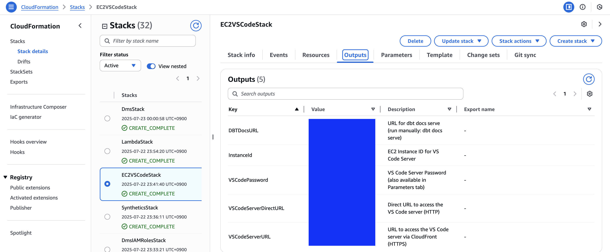
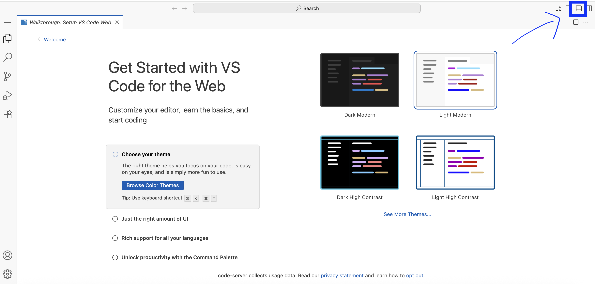
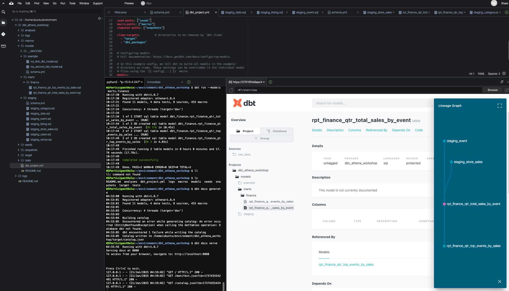

# Build Cost-Effective Analytics Platform using Amazon Athena and dbt

This repository provides you CDK scripts and sample code on how to implement end-to-end data analytics platform for cost optimization using Aurora MySQL, DMS, Athena, and Glue with real-time data pipeline capabilities.

## Workshop Guide

For a comprehensive hands-on experience, follow the step-by-step workshop:

**[Cost-Effective Analytics with Amazon Athena and dbt Workshop](https://catalog.us-east-1.prod.workshops.aws/workshops/4afae33c-c126-461e-97a9-25ce668cdd51/en-US)**

This workshop will guide you through:
- Setting up the complete analytics infrastructure
- Understanding cost optimization strategies
- Hands-on exercises with real data scenarios
- Best practices for production deployments

## Analytics Pipeline

Below diagram shows what we are implementing.


The `cdk.json` file tells the CDK Toolkit how to execute your app.

This project is set up like a standard Python project. The initialization process also creates a virtualenv within this project, stored under the `.venv` directory. To create the virtualenv it assumes that there is a `python3` (or `python` for Windows) executable in your path with access to the `venv` package. If for any reason the automatic creation of the virtualenv fails, you can create the virtualenv manually.

To manually create a virtualenv on MacOS and Linux:

```
$ python3 -m venv .venv
```

After the init process completes and the virtualenv is created, you can use the following step to activate your virtualenv.

```
$ source .venv/bin/activate
```

If you are a Windows platform, you would activate the virtualenv like this:

```
% source.bat
```

Once the virtualenv is activated, you can install the required dependencies.

```
(.venv) $ pip install -r requirements.txt
```

To add additional dependencies, for example other CDK libraries, just add them to your `requirements.txt` file and rerun the `pip install -r requirements.txt` command.

## Prerequisites

**Install AWS CDK CLI**

If you don't have AWS CDK CLI installed, please follow the installation guide:
**[AWS CDK Getting Started - Installation](https://docs.aws.amazon.com/ko_kr/cdk/v2/guide/getting-started.html#getting-started-install)**

**Bootstrap AWS environment for AWS CDK app**

Before any AWS CDK app can be deployed, you have to bootstrap your AWS environment to create certain AWS resources that the AWS CDK CLI (Command Line Interface) uses to deploy your AWS CDK app.

Run the `cdk bootstrap` command to bootstrap the AWS environment.

```
(.venv) $ cdk bootstrap
```

Now you can deploy the CloudFormation template for this code.

## List all CDK Stacks

```
(.venv) $ cdk list
VpcStack
S3Stack
GlueDatabaseStack
GlueCrawlerStack
AuroraMysqlStack
LambdaStack
EC2VSCodeStack
DmsIAMRolesStack
DmsStack
```

## Deploy Infrastructure

### Option 1: Deploy All Stacks at Once (Recommended)

Deploy all stacks by explicitly specifying them:

```bash
(.venv) $ cdk deploy VpcStack S3Stack GlueDatabaseStack GlueCrawlerStack AuroraMysqlStack LambdaStack EC2VSCodeStack DmsIAMRolesStack DmsStack
```

CDK will automatically handle the deployment order based on stack dependencies.

### Option 2: Step-by-Step Deployment

If you prefer to deploy stacks individually or need to troubleshoot specific components:

#### Create VPC and S3 Resources

```bash
(.venv) $ cdk deploy VpcStack S3Stack
```

#### Create Glue Database and Crawler

```bash
(.venv) $ cdk deploy GlueDatabaseStack GlueCrawlerStack
```

#### Create Aurora MySQL cluster

```bash
(.venv) $ cdk deploy AuroraMysqlStack
```

#### Create Lambda Functions for Data Generation

```bash
(.venv) $ cdk deploy LambdaStack
```

#### Create EC2 VS Code Development Environment

```bash
(.venv) $ cdk deploy EC2VSCodeStack
```

#### Create DMS Replication Components

```bash
(.venv) $ cdk deploy DmsIAMRolesStack DmsStack
```


## Access VS Code Server Development Environment

After deploying the `EC2VSCodeStack`, you can access your cloud development environment through VS Code Server.

### Get Connection Information

Check the CloudFormation outputs for connection details:

```
(.venv) $ aws cloudformation describe-stacks --stack-name EC2VSCodeStack --query 'Stacks[0].Outputs'
```

**Expected Outputs:**
- `VSCodeServerURL`: Direct VS Code Server access URL
- `VSCodePassword`: Login password for VS Code Server
- `CloudFrontURL`: CloudFront access URL (recommended for HTTPS)

### Access VS Code Server



1. **Open in Browser**

   Use the CloudFront URL (recommended):
   ```
   https://<CloudFront-Domain-Name>
   ```

   Or direct access:
   ```
   http://<EC2-Public-DNS>:8081
   ```

2. **Login**
   - Enter the password from CloudFormation outputs
   - Access VS Code web interface

### VS code Terminal Access 



## Data Pipeline Flow

### 1. Data Ingestion & Replication

**Upload Static Data to S3**

Static data is automatically deployed to S3 during the CDK deployment process. The following CSV files are included in the `assets/data/` directory and will be uploaded to your S3 data lake bucket:

- `raw_data/ticket/category/category.csv` - Event categories
- `raw_data/ticket/date/date.csv` - Date dimension data
- `raw_data/ticket/event/event.csv` - Event information
- `raw_data/ticket/users/users.csv` - User data
- `raw_data/ticket/listing/listing.csv` - Ticket listings
- `raw_data/ticket/venue/venue.csv` - Venue information
- `raw_data/ticket/sales/sales.csv` - Sales transaction data

After deployment, you can verify the files are uploaded:

```bash
export ACCOUNT_ID=$(aws sts get-caller-identity --query Account --output text --region {your_current_region})
aws s3 ls s3://athena-data-lake-bucket-${ACCOUNT_ID}/raw_data/ticket/ --recursive
```

- Initial data upload to S3 data lake for baseline analytics
- Support for various file formats (CSV, JSON, Parquet)

**Database Migration Service**
- DMS Serverless replicates MySQL changes to S3 in real-time
- Full Load + CDC (Change Data Capture) approach
- Automated data synchronization between Aurora MySQL and S3

> **⚠️ IMPORTANT: Follow Workshop Guide for Next Steps**
> 
> For detailed setup and configuration, **you must follow the workshop guide from this step onwards**:
> **[Aurora DMS to S3 Configuration](https://catalog.us-east-1.prod.workshops.aws/workshops/4afae33c-c126-461e-97a9-25ce668cdd51/en-US/data-ingestion/aurora-dms-s3)**
> 
> All subsequent steps (DMS configuration, Glue Crawler setup, dbt transformation, etc.) should be completed following the workshop instructions rather than this README.

**Data Generation**
- Lambda function generates sample sales data in Aurora MySQL every 2 minutes
- Automated scheduling via EventBridge for continuous data flow
- Simulates real-world transactional data patterns

### 2. Data Cataloging & Metadata Management

**Setting Up Glue Crawlers**
- Glue Crawler scans S3 data to automatically discover schemas
- Creates and maintains data catalog with table definitions
- Handles schema evolution and data type inference

**Glue Data Catalog**
- Centralized metadata repository for all data sources
- Schema registry for consistent data structure management
- Integration with Athena for seamless querying experience

### 3. Data Transformation & Modeling



**DBT Transformation Staging Layer**
- Raw data cleaning and standardization
- Data quality checks and validation rules
- Preparation of clean datasets for analytics

**DBT Transformation Reporting Layer**
- Business logic implementation through SQL models
- Aggregations and metrics calculation
- Final datasets optimized for reporting and dashboards

**Generating Project Documentation in DBT**
- Automated documentation generation from code
- Data lineage visualization and impact analysis
- Collaborative documentation for data teams


## Clean Up

To avoid ongoing charges, clean up the resources when you're done:

```bash
# Stop DMS Serverless replication first
(.venv) $ DMS_CONFIG_ARN=$(aws cloudformation describe-stacks --stack-name DmsStack | jq -r '.Stacks[0].Outputs | map(select(.OutputKey == "DMSReplicationConfigArn")) | .[0].OutputValue')
(.venv) $ aws dms stop-replication --replication-config-arn $DMS_CONFIG_ARN

# Delete all stacks
(.venv) $ cdk destroy --all
```


## Troubleshooting

### S3 Bucket Deletion Issues

If you encounter "bucket is not empty" errors during stack deletion:

1. **Check bucket contents first**:
  ```bash
  aws s3 ls s3://<bucket-name> --recursive
  ```


2. **Manually empty buckets via AWS Console** (Recommended):
   - Go to S3 Console
   - Select the bucket
   - Click "Empty" button
   - Follow the confirmation steps

3. **Alternative: Use CLI** (⚠️ Use with caution):

  ```bash
  # Only if you're sure about the bucket contents
  aws s3 rm s3://<bucket-name> --recursive
  ```


4. **Then retry CDK destroy**:
  ```bash
  cdk destroy --all
  ```

## Useful commands

 * `cdk ls`          list all stacks in the app
 * `cdk synth`       emits the synthesized CloudFormation template
 * `cdk deploy`      deploy this stack to your default AWS account/region
 * `cdk diff`        compare deployed stack with current state
 * `cdk docs`        open CDK documentation

Enjoy!

## References

 * [AWS CDK Developer Guide](https://docs.aws.amazon.com/cdk/)
 * [AWS DMS User Guide](https://docs.aws.amazon.com/dms/)
 * [Amazon Athena User Guide](https://docs.aws.amazon.com/athena/)
 * [AWS Glue Developer Guide](https://docs.aws.amazon.com/glue/)
 * [AWS Well-Architected Framework](https://aws.amazon.com/architecture/well-architected/)
 * [AWS Cost Optimization](https://aws.amazon.com/aws-cost-management/)

## Related Works

 * [aws-dms-deployment-using-aws-cdk](https://github.com/aws-samples/aws-dms-deployment-using-aws-cdk) - AWS DMS deployment using AWS CDK
 * [aws-dms-serverless-to-kinesis-data-pipeline](https://github.com/aws-samples/aws-dms-serverless-to-kinesis-data-pipeline) - DMS Serverless to Kinesis pipeline
 * [aws-dms-serverless-mysql-to-s3-migration](https://github.com/aws-samples/aws-dms-serverless-mysql-to-s3-migration) - DMS Serverless MySQL to S3 migration

## Security

See [CONTRIBUTING](CONTRIBUTING.md#security-issue-notifications) for more information.

## License

This library is licensed under the MIT-0 License. See the LICENSE file.
