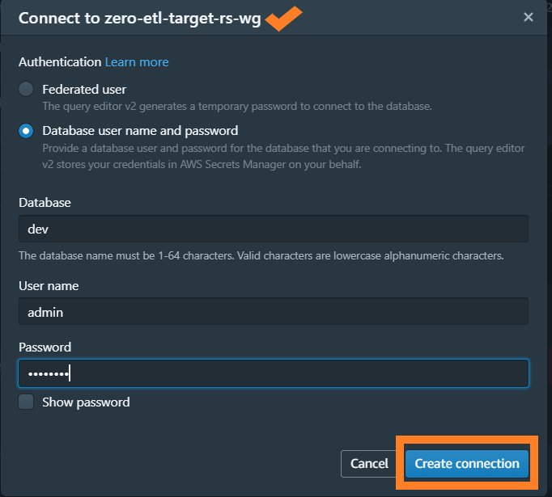

# Amazon Aurora Postgresql Zero-ETL integrations with Amazon Redshift Serverless

This repository provides you cdk scripts and sample code to create an Amazon RDS zero-ETL integration with Amazon Redshift Serverless.

An Amazon RDS zero-ETL integration with Amazon Redshift enables near real-time analytics and machine learning (ML) using Amazon Redshift on petabytes of transactional data from RDS.


The `cdk.json` file tells the CDK Toolkit how to execute your app.

This project is set up like a standard Python project.  The initialization
process also creates a virtualenv within this project, stored under the `.venv`
directory.  To create the virtualenv it assumes that there is a `python3`
(or `python` for Windows) executable in your path with access to the `venv`
package. If for any reason the automatic creation of the virtualenv fails,
you can create the virtualenv manually.

To manually create a virtualenv on MacOS and Linux:

```
$ git clone --depth=1 https://github.com/aws-samples/aws-kr-startup-samples.git
$ cd aws-kr-startup-samples
$ git sparse-checkout init --cone
$ git sparse-checkout set analytics/zero-etl-integrations/aurora-postgresql-to-redshift
$ cd analytics/zero-etl-integrations/aurora-postgresql-to-redshift

$ python3 -m venv .venv
```

After the init process completes and the virtualenv is created, you can use the following
step to activate your virtualenv.

```
(.venv) $ source .venv/bin/activate
```

If you are a Windows platform, you would activate the virtualenv like this:

```
(.venv) % .venv\Scripts\activate.bat
```

Once the virtualenv is activated, you can install the required dependencies.

```
(.venv) $ pip install -r requirements.txt
```

To add additional dependencies, for example other CDK libraries, just add
them to your `setup.py` file and rerun the `pip install -r requirements.txt`
command.

## Prerequisites

**Set up `cdk.context.json`**

Before synthesizing the CloudFormation, you need to prepare the cdk context configuration file, `cdk.context.json`:

For example,

<pre>
{
  "rds_cluster_name": "zero-etl-source-rds",
  "redshift": {
    "db_name": "zero-etl-target-rs",
    "namespace": "zero-etl-target-rs-ns",
    "workgroup": "zero-etl-target-rs-wg"
  },
  "zero_etl_integration": {
    "data_filter": "include: demodb.*.retail_trans",
    "integration_name": "zero-etl-rss"
  }
}
</pre>

**Bootstrap AWS environment for AWS CDK app**

Also, before any AWS CDK app can be deployed, you have to bootstrap your AWS environment to create certain AWS resources that the AWS CDK CLI (Command Line Interface) uses to deploy your AWS CDK app.

Run the `cdk bootstrap` command to bootstrap the AWS environment.

```
(.venv) $ cdk bootstrap
```

Now you can deploy the CloudFormation template for this code.

## List all CDK Stacks

```
(.venv) $ export CDK_DEFAULT_ACCOUNT=$(aws sts get-caller-identity --query Account --output text)
(.venv) $ export CDK_DEFAULT_REGION=$(aws configure get region)
(.venv) $ cdk list
AuroraPostgresVpcStack
AuroraPostgresStack
AuroraPostgresClientHostStack
RedshiftServerlessStack
ZeroETLfromRDStoRSS
```

## Create Aurora Postgresql cluster

  <pre>
  (.venv) $ cdk deploy AuroraPostgresVpcStack AuroraPostgresStack AuroraPostgresClientHostStack
  </pre>

## Create a sample database and table

<b><em>In order to set up the Aurora Postgresql, you need to connect the Aurora Postgresql cluster on an EC2 Bastion host.</em></b>

:information_source: The Aurora Postgresql `username` and `password` are stored in the [AWS Secrets Manager](https://console.aws.amazon.com/secretsmanager/listsecrets) as a name such as `DatabaseSecret-xxxxxxxxxxxx`.

**To retrieve a secret (AWS console)**

- (Step 1) Open the Secrets Manager console at [https://console.aws.amazon.com/secretsmanager/](https://console.aws.amazon.com/secretsmanager/).
- (Step 2) In the list of secrets, choose the secret you want to retrieve.
- (Step 3) In the **Secret value** section, choose **Retrieve secret value**.<br/>
Secrets Manager displays the current version (`AWSCURRENT`) of the secret. To see [other versions](https://docs.aws.amazon.com/secretsmanager/latest/userguide/getting-started.html#term_version) of the secret, such as `AWSPREVIOUS` or custom labeled versions, use the [AWS CLI](https://docs.aws.amazon.com/secretsmanager/latest/userguide/retrieving-secrets.html#retrieving-secrets_cli).

**To confirm that binary logging is enabled**

1. Connect to the Aurora cluster writer node.
   <pre>
    $ BASTION_HOST_ID=$(aws cloudformation describe-stacks --stack-name <i>AuroraPostgresClientHostStack</i> --region ${CDK_DEFAULT_REGION} | \
    jq -r '.Stacks[0].Outputs | .[] | select(.OutputKey | endswith("EC2InstanceId")) | .OutputValue')

    $ aws ec2-instance-connect ssh --instance-id ${BASTION_HOST_ID} --os-user ec2-user

    [ec2-user@ip-172-31-7-186 ~]$ psql -h <i>db-cluster-name</i>.cluster-<i>xxxxxxxxxxxx</i>.<i>region-name</i>.rds.amazonaws.com -U postgres -W
    Password:
    psql (16.1)
    SSL connection (protocol: TLSv1.2, cipher: AES128-SHA256, compression: off)
    Type "help" for help.

    postgres=>
   </pre>

   > :information_source: `AuroraPostgresClientHostStack` is a CDK Stack to create the bastion host.

   > :information_source: You can connect to an EC2 instance using the EC2 Instance Connect CLI: `aws ec2-instance-connect ssh`.
   For more information, see [Connect using the EC2 Instance Connect CLI](https://docs.aws.amazon.com/AWSEC2/latest/UserGuide/ec2-instance-connect-methods.html#ec2-instance-connect-connecting-ec2-cli).

2. Run the below command to create the sample database named `demodb`.
   <pre>
    postgres=> \l
                                                          List of databases
       Name    |  Owner   | Encoding | Locale Provider |   Collate   |    Ctype    | ICU Locale | ICU Rules |   Access privileges
    -----------+----------+----------+-----------------+-------------+-------------+------------+-----------+-----------------------
     postgres  | postgres | UTF8     | libc            | en_US.UTF-8 | en_US.UTF-8 |            |           |
     rdsadmin  | rdsadmin | UTF8     | libc            | en_US.UTF-8 | en_US.UTF-8 |            |           | rdsadmin=CTc/rdsadmin
     template0 | rdsadmin | UTF8     | libc            | en_US.UTF-8 | en_US.UTF-8 |            |           | =c/rdsadmin          +
               |          |          |                 |             |             |            |           | rdsadmin=CTc/rdsadmin
     template1 | postgres | UTF8     | libc            | en_US.UTF-8 | en_US.UTF-8 |            |           | =c/postgres          +
               |          |          |                 |             |             |            |           | postgres=CTc/postgres
    (4 rows)

    postgres=> CREATE DATABASE demodb;
    CREATE DATABASE
    postgres=> \c demodb
    Password:
    SSL connection (protocol: TLSv1.2, cipher: AES128-SHA256, compression: off)
    You are now connected to database "demodb" as user "postgres".
    demodb=> \dt
    Did not find any relations.
    demodb=>
   </pre>
3. Also run this to create the sample table named `retail_trans`
   <pre>
    demodb=> CREATE TABLE IF NOT EXISTS retail_trans (
           trans_id BIGSERIAL PRIMARY KEY,
           customer_id VARCHAR(12) NOT NULL,
           event VARCHAR(10) DEFAULT NULL,
           sku VARCHAR(10) NOT NULL,
           amount INT DEFAULT 0,
           device VARCHAR(10) DEFAULT NULL,
           trans_datetime TIMESTAMP DEFAULT CURRENT_TIMESTAMP
         );
    CREATE TABLE
    demodb=> CREATE INDEX trans_datetime_key ON retail_trans(trans_datetime);
    CREATE INDEX
    demodb=> \dt
                List of relations
     Schema |     Name     | Type  |  Owner
    --------+--------------+-------+----------
     public | retail_trans | table | postgres
    (1 row)
    demodb=> \d+ retail_trans
                                                                            Table "public.retail_trans"
         Column     |            Type             | Collation | Nullable |                    Default                     | Storage  | Compression | Stats target | Description
    ----------------+-----------------------------+-----------+----------+------------------------------------------------+----------+-------------+--------------+-------------
     trans_id       | bigint                      |           | not null | nextval('retail_trans_trans_id_seq'::regclass) | plain    |             |              |
     customer_id    | character varying(12)       |           | not null |                                                | extended |             |              |
     event          | character varying(10)       |           |          | NULL::character varying                        | extended |             |              |
     sku            | character varying(10)       |           | not null |                                                | extended |             |              |
     amount         | integer                     |           |          | 0                                              | plain    |             |              |
     device         | character varying(10)       |           |          | NULL::character varying                        | extended |             |              |
     trans_datetime | timestamp without time zone |           |          | CURRENT_TIMESTAMP                              | plain    |             |              |

    Indexes:
        "retail_trans_pkey" PRIMARY KEY, btree (trans_id)
        "trans_datetime_key" btree (trans_datetime)
    Access method: heap

    demodb=>
   </pre>

<b><em>After setting up the Aurora Postgresql, you should come back to the terminal where you are deploying stacks.</em></b>

## Create Redshift Serverless cluster

  <pre>
  (.venv) $ cdk deploy RedshiftServerlessStack
  </pre>

## Configure authorization for your Amazon Redshift data warehouse

  Before you create a zero-ETL integration, you must create a source database and a target Amazon Redshift data warehouse.
  You also must allow replication into the data warehouse by adding the database as an authorized integration source.

  You can configure authorized integration sources from the **Resource Policy** tab on the Amazon Redshift console or using the Amazon Redshift `PutResourcePolicy` API operation.

  To control the source that can create an inbound integration into the namespace, create a resource policy and attach it to the namespace. With the resource policy, you can specify the source that has access to the integration.

  The following is a sample resource policy (e.g., `rs-rp.json`).

  <pre>
  {
    "Version": "2012-10-17",
    "Statement": [
      {
        "Effect": "Allow",
        "Principal": {
          "Service": "redshift.amazonaws.com"
        },
        "Action": "redshift:AuthorizeInboundIntegration",
        "Resource": "arn:aws:redshift-serverless:<i>{region}</i>:<i>{account-id}</i>:namespace/<i>{namespace-uuid}</i>",
        "Condition": {
          "StringEquals": {
            "aws:SourceArn": "arn:aws:rds:<i>{region}</i>:<i>{account-id}</i>:cluster:<i>{rds-cluster-name}</i>"
          }
        }
      }
    ]
  }
  </pre>

  > :information_source: You can find out the Amazon Aurora Cluster ARN by running the following.
  <pre>
  aws cloudformation describe-stacks --stack-name <i>AuroraPostgresStack</i> --region <i>{region}</i>  | \
  jq -r '.Stacks[0].Outputs | .[] | select(.OutputKey | endswith("DBClusterArn")) | .OutputValue'
  </pre>

  > :information_source: You can find out the Amazon Redshift namespace ARN by running the following.
  <pre>
  aws cloudformation describe-stacks --stack-name <i>RedshiftServerlessStack</i> --region <i>{region}</i> | \
  jq -r '.Stacks[0].Outputs | .[] | select(.OutputKey | endswith("NamespaceNameArn")) | .OutputValue'
  </pre>

  To put a resource policy on your Amazon Redshift namespace ARN for a Aurora Postgresql source,
  run a AWS CLI command similar to the following.

  <pre>
  (.venv) $ export RSS_RESOURCE_ARN=$(aws cloudformation describe-stacks --stack-name <i>RedshiftServerlessStack</i> --region ${CDK_DEFAULT_REGION} | \
  jq -r '.Stacks[0].Outputs | .[] | select(.OutputKey | endswith("NamespaceNameArn")) | .OutputValue')
  (.venv) $ aws redshift put-resource-policy \
                --region ${CDK_DEFAULT_REGION} \
                --policy file://rs-rp.json \
                --resource-arn ${RSS_RESOURCE_ARN}
  </pre>

## Create Zero ETL Integration with filters

  In this example we only want to replicate data from the Postgresql table `demodb.retail_trans` to Redshift.
  So we add the data filtering option to `cdk.context.json` like this:
  <pre>
   {
     ...
     "zero_etl_integration": {
       "data_filter": "include: demodb.*.retail_trans",
       "integration_name": "zero-etl-rss"
     }
   }
  </pre>
  > :information_source: [Data filtering for Aurora zero-ETL integrations with Amazon Redshift](https://docs.aws.amazon.com/AmazonRDS/latest/AuroraUserGuide/zero-etl.filtering.html)

  Now let's create the Zero-ETL integration.
  It takes a few minutes to change the status of the Zero-ETL integration from **Creating** to **Active**.
  The time varies depending on size of the dataset already available in the source.
  <pre>
  (.venv) $ cdk deploy ZeroETLfromRDStoRSS
  </pre>

## Test Zero-ETL Integration

#### (1) Load Data Into Amazon Aurora Postgresql Cluster

<pre>
$ BASTION_HOST_ID=$(aws cloudformation describe-stacks --stack-name <i>AuroraPostgresClientHostStack</i> --region ${CDK_DEFAULT_REGION} | jq -r '.Stacks[0].Outputs | .[] | select(.OutputKey | endswith("EC2InstanceId")) | .OutputValue')

$ aws ec2-instance-connect ssh --instance-id ${BASTION_HOST_ID} --os-user ec2-user

[ec2-user@ip-172-31-7-186 ~]$ python3 gen_fake_postgres_data.py \
                              --database <i>{your-database-name}</i> \
                              --table <i>{your-table-name}</i> \
                              --user <i>{user-name}</i> \
                              --password <i>{password}</i> \
                              --host <i>{db-cluster-name}</i>.cluster-<i>xxxxxxxxxxxx</i>.<i>{region-name}</i>.rds.amazonaws.com \
                              --max-count 10
</pre>

After filling data into the Postgresql table, connect to the Aurora cluster writer node and run some queries.

For example, retrieve some records.
<pre>
$ BASTION_HOST_ID=$(aws cloudformation describe-stacks --stack-name <i>AuroraPostgresClientHostStack</i> --region ${CDK_DEFAULT_REGION} | \
jq -r '.Stacks[0].Outputs | .[] | select(.OutputKey | endswith("EC2InstanceId")) | .OutputValue')

$ aws ec2-instance-connect ssh --instance-id ${BASTION_HOST_ID} --os-user ec2-user

[ec2-user@ip-172-31-7-186 ~]$ psql -h <i>db-cluster-name</i>.cluster-<i>xxxxxxxxxxxx</i>.<i>region-name</i>.rds.amazonaws.com -U postgres -W
Password:
psql (16.1)
SSL connection (protocol: TLSv1.2, cipher: AES128-SHA256, compression: off)
Type "help" for help.

postgres=>
postgres=> \c demodb
Password:
SSL connection (protocol: TLSv1.2, cipher: AES128-SHA256, compression: off)
You are now connected to database "demodb" as user "postgres".
demodb=>
demodb=> SELECT count(*) FROM retail_trans;
 count
-------
    10
(1 row)
demodb=> SELECT * FROM retail_trans LIMIT 10;
 trans_id | customer_id  |  event   |    sku     | amount | device |   trans_datetime
----------+--------------+----------+------------+--------+--------+---------------------
        1 | 460104780596 | cart     | IQ6879MMTB |      8 | mobile | 2025-01-22 12:08:06
        2 | 758933025159 | like     | RL1573WWLT |      1 | tablet | 2025-01-22 12:17:21
        3 | 754384589074 | like     | PX4135DYNT |      1 | mobile | 2025-01-22 12:08:52
        4 | 602811489876 | purchase | PI7913TREO |     66 | pc     | 2025-01-22 12:31:21
        5 | 633562273212 | visit    | WU8498ZKAS |      1 | tablet | 2025-01-22 12:18:00
        6 | 222873787990 | list     | NC2470LAIB |      1 | pc     | 2025-01-22 12:05:58
        7 | 240843982894 | view     | WB4509MDAC |      1 | tablet | 2025-01-22 12:19:12
        8 | 292181770698 | list     | NL7801JSYP |      1 | mobile | 2025-01-22 12:26:40
        9 | 591774808340 | cart     | LZ4781KFOA |    100 | tablet | 2025-01-22 12:18:30
       10 | 263118465851 | list     | RX8118ZLSJ |      1 | mobile | 2025-01-22 12:29:10
(10 rows)

demodb=>
</pre>

#### (2) Create a database from the integration in Amazon Redshift

To create your database, complete the following steps:

1. On the Redshift Serverless dashboard, navigate to the `zero-etl-target-rs-ns` namespace.
2. Choose **Query data** to open Query Editor v2.
  
3. Connect to the Redshift Serverless data warehouse by choosing **Create connection**.
  
4. Obtain the `integration_id` from the `svv_integration` system table:
   ```
   ---- copy this result, use in the next sql
   SELECT integration_id FROM svv_integration;
   ```
5. Use the `integration_id` from the previous step to create a new database from the integration.

   For Aurora PostgreSQL sources, you must also include a reference to the named database within the cluster that you specified when you created the integration.

   For example:
   <pre>
   CREATE DATABASE aurora_zeroetl FROM INTEGRATION '<i>{result from above}</i>' DATABASE <i>demodb</i>;
   </pre>
   The integration is now complete, and an entire snapshot of the source will reflect as is in the destination. Ongoing changes will be synced in near-real time.

6. On the Redshift Serverless dashboard, open Query Editor v2 using the database you created as part of the integration setup. Use the following query to get information about checkpoint, snaphost, and subsequent CDC data replication:
   ```
   SELECT * FROM SYS_INTEGRATION_ACTIVITY
   WHERE TRUNC(INTEGRATION_START_TIME)= CURRENT_DATE
   ORDER BY INTEGRATION_START_TIME;
   ```

## Clean Up

1. To delete a zero-ETL integration, run the below command.
   <pre>
   (.venv) $ cdk destroy --force -e ZeroETLfromRDStoRSS
   </pre>

    When you delete a zero-ETL integration, your transactional data isn’t deleted from Aurora or Amazon Redshift, but Aurora doesn’t send new data to Amazon Redshift.

2. If you want to delete all CloudFormation stacks, run the below command.
   <pre>
   (.venv) $ cdk destroy --force --all
   </pre>

## Useful commands

#### CDK CLI Installation

 * `npm install -g aws-cdk`          install the AWS CDK Toolkit (the `cdk` command).
 * `npm install -g aws-cdk@latest`   install the latest AWS CDK Toolkit (the `cdk`command).

#### CDK CLI commands

 * `cdk init app --language python`  create a new, empty CDK Python project.
 * `cdk bootstrap --profile <AWS Profile>` Deploys the CDK Toolkit staging stack; see [Bootstrapping](https://docs.aws.amazon.com/cdk/v2/guide/bootstrapping.html)
 * `cdk ls`          list all stacks in the app
 * `cdk synth`       emits the synthesized CloudFormation template
 * `cdk deploy`      deploy this stack to your default AWS account/region
 * `cdk diff`        compare deployed stack with current state
 * `cdk docs`        open CDK documentation

Enjoy!

## References

 * [(User Guide) Aurora zero-ETL integrations with Amazon Redshift](https://docs.aws.amazon.com/AmazonRDS/latest/AuroraUserGuide/zero-etl.html)
   * [Data filtering for Aurora zero-ETL integrations with Amazon Redshift](https://docs.aws.amazon.com/AmazonRDS/latest/AuroraUserGuide/zero-etl.filtering.html)
   * [Aurora zero-ETL integrations with Amazon Redshift - Limitations](https://docs.aws.amazon.com/AmazonRDS/latest/AuroraUserGuide/zero-etl.html#zero-etl.reqs-lims)
 * [(Management Guide) Amazon Redshift - Zero-ETL integrations](https://docs.aws.amazon.com/redshift/latest/mgmt/zero-etl-using.html)
   * [Configure authorization for your Amazon Redshift data warehouse](https://docs.aws.amazon.com/redshift/latest/mgmt/zero-etl-using.redshift-iam.html)
   * [Creating destination databases in Amazon Redshift](https://docs.aws.amazon.com/redshift/latest/mgmt/zero-etl-using.creating-db.html)
 * [Supported Regions and Aurora DB engines for zero-ETL integrations with Amazon Redshift](https://docs.aws.amazon.com/AmazonRDS/latest/AuroraUserGuide/Concepts.Aurora_Fea_Regions_DB-eng.Feature.Zero-ETL.html)
 * [(AWS Blog) Getting started guide for near-real time operational analytics using Amazon Aurora zero-ETL integration with Amazon Redshift (2023-06-28)](https://aws.amazon.com/blogs/big-data/getting-started-guide-for-near-real-time-operational-analytics-using-amazon-aurora-zero-etl-integration-with-amazon-redshift/)
 * [(AWS Blog) Unlock insights on Amazon RDS for MySQL data with zero-ETL integration to Amazon Redshift (2024-03-21)](https://aws.amazon.com/blogs/big-data/unlock-insights-on-amazon-rds-for-mysql-data-with-zero-etl-integration-to-amazon-redshift/)
 * [(Workshop) Zero ETL Integration](https://catalog.us-east-1.prod.workshops.aws/workshops/fc6069e2-a3a7-475c-9592-9f62843b3ffb)
 * [(Workshop) Achieve near real-time data analytics with Zero-ETL on AWS](https://catalog.us-east-1.prod.workshops.aws/workshops/692aa2ab-7c66-41f4-a8fd-92a8c93f5b9a)
 * [AWS CDK Toolkit (cdk command)](https://docs.aws.amazon.com/cdk/v2/guide/cli.html)
 * [Install PostgreSQL16 on Amazon Linux](https://github.com/amazonlinux/amazon-linux-2023/issues/516)
 * [PostgreSQL Tutorial](https://www.postgresqltutorial.com/)
