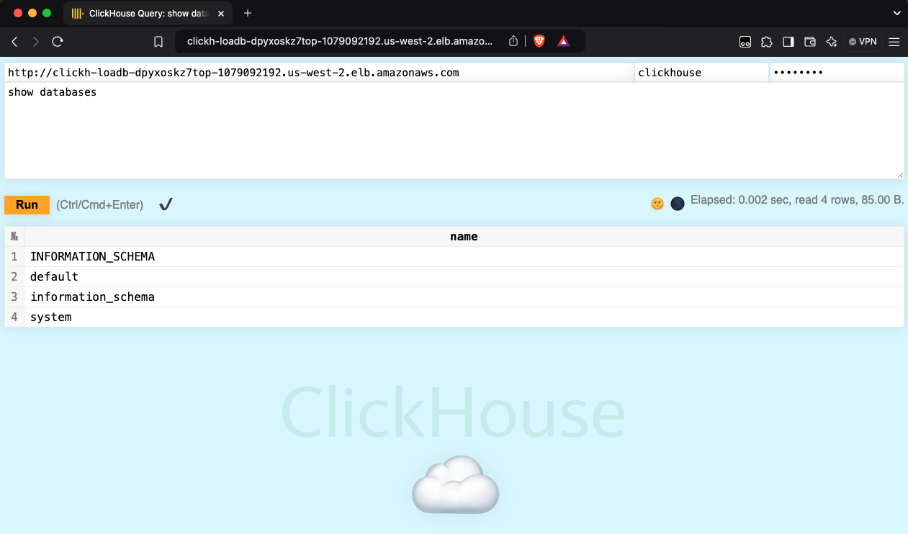

# Clickhouse on AWS Fargate with Amazon EFS for Data Persistence

This is a CDK Python project to deploy [Clickhouse](https://clickhouse.com/docs) running on **AWS ECS Fargate** with **Amazon EFS** for data persistence.


The `cdk.json` file tells the CDK Toolkit how to execute your app.

This project is set up like a standard Python project.  The initialization
process also creates a virtualenv within this project, stored under the `.venv`
directory.  To create the virtualenv it assumes that there is a `python3`
(or `python` for Windows) executable in your path with access to the `venv`
package. If for any reason the automatic creation of the virtualenv fails,
you can create the virtualenv manually.

To manually create a virtualenv on MacOS and Linux:

```
$ git clone --depth=1 https://github.com/aws-samples/aws-kr-startup-samples.git
$ cd aws-kr-startup-samples
$ git sparse-checkout init --cone
$ git sparse-checkout set database/clickhouse-on-ecs-fargate
$ cd database/clickhouse-on-ecs-fargate

$ python3 -m venv .venv
```

After the init process completes and the virtualenv is created, you can use the following
step to activate your virtualenv.

```
$ source .venv/bin/activate
```

If you are a Windows platform, you would activate the virtualenv like this:

```
% .venv\Scripts\activate.bat
```

Once the virtualenv is activated, you can install the required dependencies.

```
(.venv) $ pip install -r requirements.txt
```

> To add additional dependencies, for example other CDK libraries, just add
them to your `setup.py` file and rerun the `pip install -r requirements.txt`
command.

## Prerequisites

**Set up `cdk.context.json`**

Then, we need to set approperly the cdk context configuration file, `cdk.context.json`.

For example,

```
{
  "private_dns_namespace_name": "clickhouse.local",
  "ecr": [
    {
      "repository_name": "clickhouse",
      "docker_image_name": "clickhouse",
      "tag": "24.12.3.47"
    }
  ],
  "ecs_cluster_name": "clickhouse-cluster",
  "ecs_service_name": "clickhouse"
}
```

:information_source: For more details on the docker image version (`tag`) of `clickhouse`, please refer to [here](https://hub.docker.com/_/clickhouse).

**Bootstrap AWS environment for AWS CDK app**

Also, before any AWS CDK app can be deployed, you have to bootstrap your AWS environment to create certain AWS resources that the AWS CDK CLI (Command Line Interface) uses to deploy your AWS CDK app.

Run the `cdk bootstrap` command to bootstrap the AWS environment.

```
(.venv) $ cdk bootstrap
```

### Deploy

At this point you can now synthesize the CloudFormation template for this code.

```
(.venv) $ export CDK_DEFAULT_ACCOUNT=$(aws sts get-caller-identity --query Account --output text)
(.venv) $ export CDK_DEFAULT_REGION=$(aws configure get region)
(.venv) $ cdk synth --all
```

Use `cdk deploy` command to create the stack shown above.

```
(.venv) $ cdk deploy --require-approval never --all
```

We can list all the CDK stacks by using the `cdk list` command prior to deployment.

```
(.venv) $ cdk list
ClickhouseECRStack
ClickhouseVpcStack
ClickhouseServiceDiscoveryStack
ClickhouseALBStack
ClickhouseECSClusterStack
ClickhouseEFSStack
ClickhouseECSTaskStack
ClickhouseECSServiceStack
```

## Connect to ClickHouse

#### Web UI

After deploying all CDK stacks, we can find the Clickhouse URL using the following command:

```
aws cloudformation describe-stacks --stack-name ClickhouseECSServiceStack --region ${CDK_DEFAULT_REGION} | \
  jq -r '.Stacks[0].Outputs | map(select(.OutputKey == "ClickhouseHTTPEndpoint")) | .[0].OutputValue'
```

Web UI can be accessed here: `http://{clickhouse_http_endpoint}:8123/play`



> :information_source: The Clickhouse `username` and `password` are stored in the [AWS Secrets Manager](https://console.aws.amazon.com/secretsmanager/listsecrets) as a name such as `ClickhouseSecret-xxxxxxxxxxxx`.

#### Native interface with Clickhouse client

You can use the `clickhouse-client` to connect to your ClickHouse service.
First, set up **Cloud9** and add the ClickHouse client security group to it.

> :information_source: We can find the ClickHouse client security group with the following command:
```
aws cloudformation describe-stacks --stack-name ClickhouseECSServiceStack --region ${CDK_DEFAULT_REGION} | \
  jq -r '.Stacks[0].Outputs | map(select(.OutputKey == "ClickhouseClientSecurityGroupId")) | .[0].OutputValue'
```

Then, open **Cloud9**.

**Install**

To download ClickHouse, run:
```
curl https://clickhouse.com/ | sh
```

To also install it, run:
```
sudo ./clickhouse install
```

**Run**

To connect to a ClickHouse server, run:

<pre>
$ clickhouse-client \
  --host <i>clickhouse.clickhouse.local</i> \
  --port=9000 \
  --user <i>clickhouse</i> \
  --password <i>{password}</i> \
  --database <i>default</i>

ClickHouse client version 25.2.1.209 (official build).
Connecting to database default at clickhouse.clickhouse.local:9000 as user clickhouse.
Connected to ClickHouse server version 24.12.3.

ClickHouse server version is older than ClickHouse client. It may indicate that the server is out of date and can be upgraded.

clickhouse.clickhouse.local :)
</pre>

> :information_source: The Clickhouse server endpoint can be found with the following command:
```
aws cloudformation describe-stacks --stack-name ClickhouseECSServiceStack --region ${CDK_DEFAULT_REGION} | \
  jq -r '.Stacks[0].Outputs | map(select(.OutputKey == "ClickhouseEndpoint")) | .[0].OutputValue'
```

## Clean Up

Delete the CloudFormation stack by running the below command.

```
(.venv) $ cdk destroy --force --all
```

## Useful commands

 * `cdk ls`          list all stacks in the app
 * `cdk synth`       emits the synthesized CloudFormation template
 * `cdk deploy`      deploy this stack to your default AWS account/region
 * `cdk diff`        compare deployed stack with current state
 * `cdk docs`        open CDK documentation

Enjoy!

## References

 * [(DockerHub) Clickhouse Docker Official Image](https://hub.docker.com/_/clickhouse)
 * [ClickHouse Quick Start](https://clickhouse.com/docs/en/getting-started/quick-start)
 * [Clickhouse Client](https://clickhouse.com/docs/en/interfaces/cli)
 * [Clickhouse HTTP Interface](https://clickhouse.com/docs/en/interfaces/http)

## Related Works

 * [ClickHouse Cluster on AWS - Partner Solution Deployment Guide (July 2023)](https://aws-ia.github.io/cfn-ps-clickhouse-cluster/)
 * [(GitHub) Langfuse v3 Terraform Module Sample](https://github.com/tubone24/langfuse-v3-terraform/) - see deploying Clickhouse for Langfuse on AWS Fargate with EFS.
