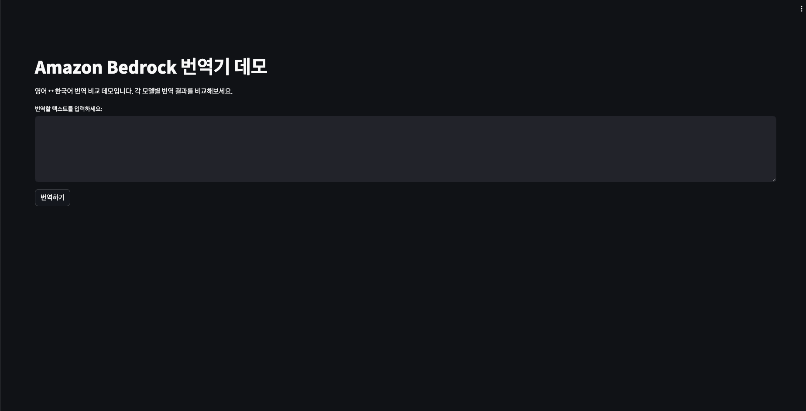
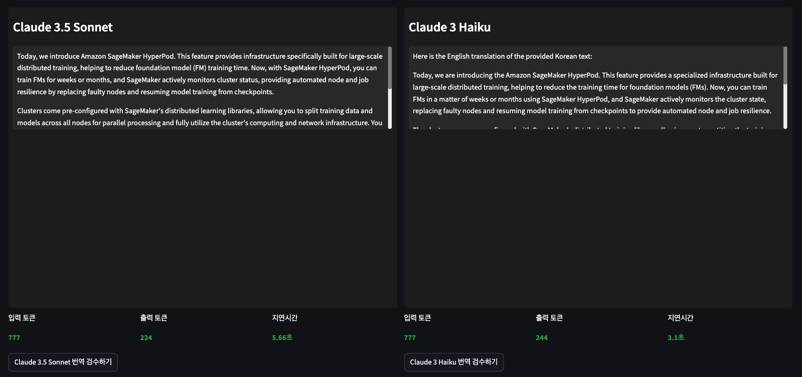
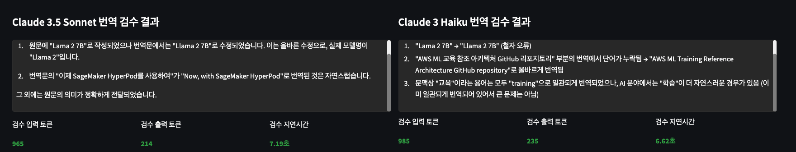

# Amazon Bedrock Translator Demo

A comparative translation demo application for English ↔ Korean translation. Compare and review translation results across different models.



## Local Execution

1. Activate virtualenv and install required packages:
```bash
cd app/
python -m venv .venv
source .venv/bin/activate
pip install -r requirements.txt
```

2. Run the application:
```bash
streamlit run app.py
```

## Docker Execution

```bash
# Build the image
docker build -t bedrock-translator .
docker run -p 8501:8501 bedrock-translator
```

## CDK Deployment

### Prerequisites

- [AWS CLI](https://aws.amazon.com/cli/) installed and configured
- [AWS CDK](https://docs.aws.amazon.com/cdk/v2/guide/getting_started.html) installed and configured
- Docker installed and configured
- Python 3.9 or higher

### CDK Deployment Steps

1. Set up CDK environment:
```bash
cd cdk
python -m venv .venv
source .venv/bin/activate
pip install -r requirements.txt
```

2. Bootstrap CDK (first time only):
```bash
cdk bootstrap
```
3. Fix ingress rule about security group ("YOUR_IP/32")
```bash
cd cdk/
vi cdk.context.json
```

4. Deploy CDK Stack:
```bash
cdk deploy
```

5. Access the application using cloudformation output:
```bash
TranslatorFargateStack.DockerImageUri = xxxxxxxxxx.dkr.ecr.<region>.amazonaws.com/<ecr_repo>:<tag>
```

## Models Used

- Amazon Nova Pro
- Anthropic Claude 3.7 Sonnet
- Anthropic Claude 3.5 Sonnet
- Anthropic Claude 3 Sonnet
- Anthropic Claude 3 Haiku

6. Clean resource
```bash
cdk destroy
```