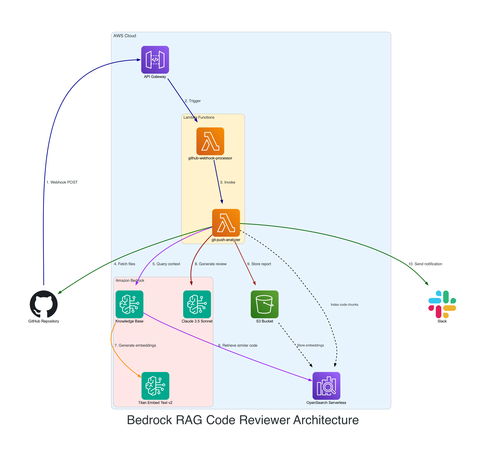
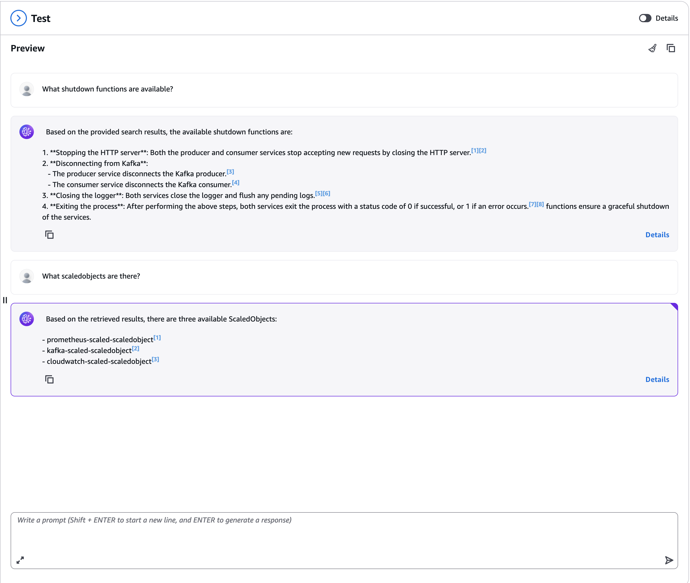

# Bedrock RAG Code Reviewer

An intelligent code review system powered by AWS Bedrock and RAG (Bedrock Knowledge Base) that automatically analyzes code changes and provides contextual feedback using AI.

## Project Explanation

This project enables users to set up an automated code review system using Large Language Models (LLM). The system intelligently analyzes code changes by leveraging contextual information from your entire codebase through a RAG-based approach.

### Key Features

- **GitHub Webhook Integration**: Automatically triggered by GitHub webhook on push events
- **Intelligent Code Analysis**: Fetches changes from GitHub and analyzes them using AWS Bedrock LLM
- **RAG-Enhanced Context**: Uses AWS Bedrock Knowledge Base to retrieve similar code snippets during analysis, providing better context for reviews
- **Smart Code Chunking**: Manually chunks source code using `tree-sitter` parser, dividing files into logical units (classes, functions, YAML sections, etc.)
- **NO-CHUNK Strategy**: Uses NO-CHUNK option in Knowledge Base for optimal performance
- **Consistent Hashing**: Generates unique chunk IDs using filename and semantic names (function names, class names), ensuring that when code definitions change, they overwrite previous chunks, keeping the vector database current
- **Rich Metadata Support**: Each code chunk includes comprehensive metadata stored in S3 for advanced filtering and hybrid search capabilities:
  - `chunk_type`: Type of code construct (function_declaration, class_definition, kubernetes_resource, etc.)
  - `chunk_name`: Name of the code construct (function name, class name, etc.)
  - `chunk_filepath`: Relative file path within the repository
  - `language`: Programming language (javascript, python, yaml)
  - `chunk_id`: Unique identifier for the chunk
  - `commit`: Commit hash for versioning and temporal filtering
- **Metadata Filtering & Hybrid Search**: Enables precise retrieval based on file paths, programming languages, code types, or specific commits for more targeted code analysis
- **Dual Operation Modes**:
  - **Full-Index Mode**: Indexes the entire codebase for initial RAG setup
  - **Push-Analysis Mode**: Analyzes only changed files for efficient incremental reviews

## Architecture



### Workflow Overview

The system follows a serverless, event-driven architecture that automatically processes code changes and provides intelligent reviews:

1. **Webhook Processing**: GitHub sends webhook POST request → API Gateway → github-webhook-processor validates and triggers analyzer
2. **Code Analysis**: git-push-analyzer fetches changed files and queries Bedrock Knowledge Base for context
3. **RAG Integration**: OpenSearch Serverless provides vector search capabilities for code similarity
4. **AI Review**: Claude 3.5 Sonnet generates intelligent code review using retrieved context
5. **Results**: Report saved to S3 and optional Slack notification sent

### Architecture Components

- **GitHub Webhook Processor**: Handles incoming webhook events from GitHub
- **Git Push Analyzer**: Main function that processes code changes and generates reviews
- **OpenSearch Index Creator**: Manages the vector database for RAG functionality
- **AWS Bedrock Integration**: Leverages Claude 3.5 Sonnet for intelligent code analysis
- **Knowledge Base**: Stores and retrieves code context using vector embeddings

## RAG Knowledge Base Example

The system creates a comprehensive knowledge base of your codebase using AWS Bedrock Knowledge Base. Here's an example of how the indexed code appears in the AWS Console:



## Setup

### Prerequisites

- AWS CLI configured with appropriate permissions
- Node.js and npm installed
- CDK CLI installed (`npm install -g aws-cdk`)
- GitHub repository with webhook access

### 1. CDK Configuration

Navigate to the CDK directory and install dependencies:

```bash
cd cdk
npm install
```

### 2. Configure Context in cdk.json

Update the `cdk/cdk.json` file with your specific configuration:

```json
{
  "app": "npx ts-node --prefer-ts-exts bin/app.ts",
  "context": {
    "s3Bucket": "your-account-id-codebase-datasource", // Bucket name to store code chunks and reports
    "codebaseS3Prefix": "code-chunks/",
    "reportS3Prefix": "reports/",
    "collectionName": "codebase-os", // Name of the OpenSearch Serverless Collection
    "knowledgeBaseName": "codebase-kb",
    "region": "us-east-1",
    "modelArn": "arn:aws:bedrock:us-east-1::foundation-model/anthropic.claude-3-5-sonnet-20240620-v1:0",
    "embeddingModelArn": "arn:aws:bedrock:us-east-1::foundation-model/amazon.titan-embed-text-v2:0",
    "iaUserArn": "arn:aws:iam::your-account-id:user/your-iam-user", // IAM User ARN that needs access to OpenSearch dashboard
    "slackWebhookUrl": "your-slack-webhook-url", // Optional, set this to receive Slack notification
    "gitPushAnalyzerFunctionName": "git-push-analyzer",
    "githubWebhookSecret": "your-github-webhook-secret",
    "githubToken": "your-github-token"
  }
}
```

**Important Configuration Notes:**
- Replace `your-account-id` with your AWS account ID
- Set `githubWebhookSecret` to a secure random string (this must match your GitHub webhook configuration)
- Add your GitHub personal access token to `githubToken`
- Configure your Slack webhook URL if you want notifications

### 3. Deploy the Infrastructure

Deploy the CDK stacks:

```bash
cdk deploy --require-approval never --all --context environment=dev
```

### 4. Initial Full-Index Setup

After deployment, perform a one-time full indexing of your codebase to populate the Knowledge Base:

```bash
aws lambda invoke \
  --function-name git-push-analyzer \
  --cli-binary-format raw-in-base64-out \
  --payload '{"mode":"full_index","repository":{"full_name":"your-username/your-repo","default_branch":"main"}}' \
  response.json
```

Replace `your-username/your-repo` with your actual GitHub repository.

### 5. Configure GitHub Webhook

1. Go to your GitHub repository settings
2. Navigate to **Webhooks** → **Add webhook**
3. Set the Payload URL to your deployed API Gateway endpoint
4. Set Content type to `application/json`
5. Set the **Secret** to the same value as `githubWebhookSecret` in your `cdk.json`
6. Select **Push** events
7. Set webhook to **Active**

### 6. Verify Setup

Test the webhook by making a push to your repository. The system should:
1. Receive the webhook event
2. Analyze the changed files
3. Generate an AI-powered code review
4. Store the results in S3 (and optionally send to Slack)

## Usage

Once set up, the system operates automatically:

- **Automatic Reviews**: Every push triggers an intelligent code review
- **Contextual Analysis**: Reviews consider similar code patterns from your entire codebase
- **Incremental Updates**: Only changed files are analyzed for efficiency
- **Persistent Knowledge**: The RAG system maintains an up-to-date understanding of your codebase

### Advanced Metadata Filtering

The system stores rich metadata with each code chunk, enabling sophisticated filtering and hybrid search capabilities:

**Available Metadata Fields:**
- `chunk_type`: Filter by code construct type (e.g., only functions, classes, or Kubernetes resources)
- `chunk_filepath`: Target specific files or directories for analysis
- `language`: Filter by programming language (JavaScript, Python, YAML)
- `commit`: Historical analysis using specific commit hashes
- `chunk_name`: Search for specific function or class names

**Use Cases:**
- **Language-Specific Analysis**: Review only Python changes by filtering `language: python`
- **Component-Focused Review**: Analyze specific microservices by filtering on file paths
- **Historical Context**: Compare current changes against specific previous commits
- **Code Pattern Discovery**: Find similar functions or classes across your codebase
- **Kubernetes Configuration Review**: Focus on YAML/configuration changes using `chunk_type: kubernetes_resource`

The metadata enables the AI to provide more targeted and relevant code reviews by understanding the context and type of code being analyzed.

## Clean Up
Delete the CloudFormation stack by running the below command.

```bash
cdk destroy --force --all
```
