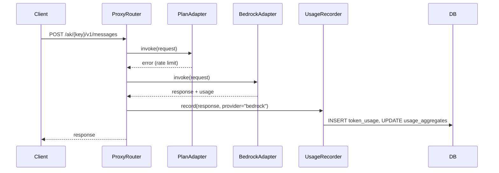
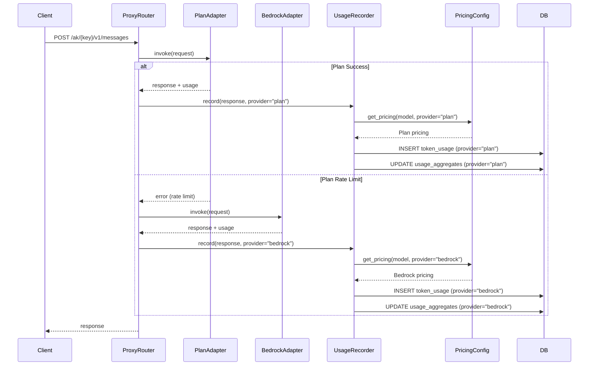
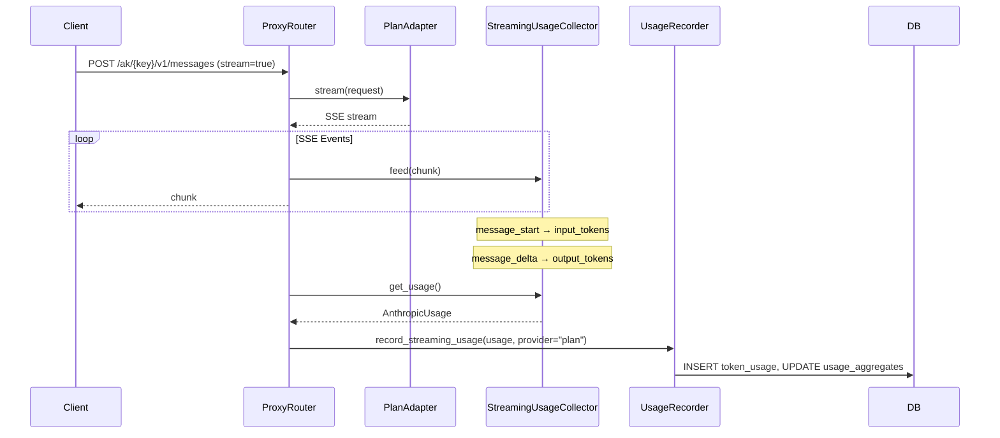

# Design Document: Plan Token Usage Aggregation

## Overview

이 설계 문서는 Claude Code Proxy 시스템에서 Anthropic Plan API 토큰 사용량을 추적하고 집계하는 기능을 정의합니다. 현재 시스템은 Bedrock 사용량만 추적하고 있으며, 이 기능을 통해 Plan API 사용량도 별도로 추적하여 프로바이더별 분석이 가능해집니다.

### 주요 변경 사항

1. **Usage Recording 확장**: `UsageRecorder`가 Plan API 응답(정적/스트리밍)의 사용량을 기록
2. **Provider-aware Aggregation**: `usage_aggregates` 테이블에 `provider` 컬럼 추가
3. **Plan Pricing Configuration**: Plan 전용 가격 설정 및 스냅샷 저장
4. **Admin API 필터링**: 프로바이더별 사용량 조회 지원
5. **CloudWatch Metrics 분리**: 프로바이더를 차원으로 포함

## Architecture

### 현재 아키텍처 (Bedrock Only)



### 목표 아키텍처 (Plan + Bedrock)



### 스트리밍 아키텍처



## Components and Interfaces

### 1. UsageRecorder (수정)

**파일**: `backend/src/proxy/usage.py`

```python
class UsageRecorder:
    """Records usage to database and emits metrics."""

    async def record(
        self,
        ctx: RequestContext,
        response: ProxyResponse,
        latency_ms: int,
        model: str,
    ) -> None:
        """Record usage for both Plan and Bedrock responses."""
        # 변경: provider 조건 제거, Plan/Bedrock 모두 기록
        if response.success and response.usage:
            await asyncio.shield(
                self._record_usage_with_cost(
                    ctx, response, latency_ms, model, provider=response.provider
                )
            )

    async def record_streaming_usage(
        self,
        ctx: RequestContext,
        usage: AnthropicUsage,
        latency_ms: int,
        model: str,
        is_fallback: bool,
        provider: str = "bedrock",  # 새 파라미터
    ) -> None:
        """Record streaming usage with explicit provider."""
        response = ProxyResponse(
            success=True,
            response=None,
            usage=usage,
            provider=provider,
            is_fallback=is_fallback,
            status_code=200,
        )
        await self._record_usage_with_cost(
            ctx, response, latency_ms, model, provider=provider
        )

    async def _record_usage_with_cost(
        self,
        ctx: RequestContext,
        response: ProxyResponse,
        latency_ms: int,
        model: str,
        provider: str,
    ) -> None:
        """Record usage with provider-aware pricing."""
        # 변경: provider에 따라 다른 pricing 조회
        region = ctx.bedrock_region if provider == "bedrock" else "global"
        pricing = PricingConfig.get_pricing(model, region, provider)
        # ... cost calculation and persistence
```

### 2. PricingConfig (수정)

**파일**: `backend/src/domain/pricing.py`

```python
class PricingConfig:
    """Configuration for model pricing by region and provider."""
    
    # 새로운 데이터 구조: provider → region → model → pricing
    _PRICING_DATA: Dict[str, Dict[str, Dict[str, ModelPricing]]] = {}
    
    @classmethod
    def get_pricing(
        cls, 
        model_id: str, 
        region: str = "ap-northeast-2",
        provider: str = "bedrock",
    ) -> ModelPricing | None:
        """Get pricing for a model by provider and region."""
        cls._initialize()
        normalized_id = cls._normalize_model_id(model_id)
        
        provider_pricing = cls._PRICING_DATA.get(provider, {})
        region_pricing = provider_pricing.get(region)
        if provider == "plan" and region_pricing is None:
            region_pricing = provider_pricing.get("global", {})
        if provider == "bedrock" and region_pricing is None:
            region_pricing = provider_pricing.get("ap-northeast-2", {})
        
        return region_pricing.get(normalized_id) if region_pricing else None
    
    @classmethod
    def _load_defaults(cls) -> None:
        """Load default pricing for both providers."""
        # Bedrock pricing (기존)
        cls._PRICING_DATA["bedrock"] = {
            "ap-northeast-2": {
                "claude-sonnet-4-5": ModelPricing(...),
                # ...
            }
        }
        
        # Plan pricing (신규)
        cls._PRICING_DATA["plan"] = {
            "global": {
                "claude-sonnet-4-5": ModelPricing(
                    model_id="claude-sonnet-4-5",
                    region="global",
                    input_price_per_million=Decimal("3.00"),
                    output_price_per_million=Decimal("15.00"),
                    cache_write_price_per_million=Decimal("3.75"),
                    cache_read_price_per_million=Decimal("0.30"),
                    effective_date=date(2025, 1, 1),
                ),
                # ...
            }
        }
```

### 3. UsageAggregateRepository (수정)

**파일**: `backend/src/repositories/usage_repository.py`

```python
class UsageAggregateRepository:
    async def increment(
        self,
        bucket_type: str,
        bucket_start: datetime,
        user_id: UUID,
        access_key_id: UUID,
        provider: str,  # 새 파라미터
        input_tokens: int,
        output_tokens: int,
        total_tokens: int,
        # ... other params
    ) -> None:
        """Increment usage aggregate with provider separation."""
        stmt = insert(UsageAggregateModel).values(
            id=uuid4(),
            bucket_type=bucket_type,
            bucket_start=bucket_start,
            user_id=user_id,
            access_key_id=access_key_id,
            provider=provider,  # 새 컬럼
            # ... other values
        ).on_conflict_do_update(
            # 변경: provider 포함
            index_elements=["bucket_type", "bucket_start", "user_id", "access_key_id", "provider"],
            set_={...}
        )
        await self.session.execute(stmt)

    async def query(
        self,
        bucket_type: str,
        start_time: datetime,
        end_time: datetime,
        user_id: UUID | None = None,
        access_key_id: UUID | None = None,
        provider: str | None = None,  # 새 파라미터
    ) -> list[UsageAggregate]:
        """Query aggregates with optional provider filter."""
        query = select(UsageAggregateModel).where(...)
        if provider:
            query = query.where(UsageAggregateModel.provider == provider)
        # ...
```

### 4. TokenUsageRepository (수정)

**파일**: `backend/src/repositories/usage_repository.py`

```python
class TokenUsageRepository:
    async def create(
        self,
        request_id: str,
        user_id: UUID,
        access_key_id: UUID,
        model: str,
        provider: str,  # 기존 파라미터를 명시적으로 받음
        # ... other params
    ) -> TokenUsage:
        """Create token usage record with explicit provider."""
        db_model = TokenUsageModel(
            # ...
            provider=provider,  # 명시적 설정
            pricing_region=pricing_region,  # Plan: "global", Bedrock: region
            # ...
        )

    async def get_cost_breakdown_by_model(
        self,
        start_time: datetime,
        end_time: datetime,
        user_id: UUID | None = None,
        access_key_id: UUID | None = None,
        provider: str | None = None,  # 새 파라미터
    ) -> list[dict]:
        """Get cost breakdown with optional provider filter."""
        query = select(...).where(...)
        if provider:
            query = query.where(TokenUsageModel.provider == provider)
```

### 5. BudgetService (수정)

**파일**: `backend/src/proxy/budget.py`

```python
class BudgetService:
    async def get_current_month_usage(self, user_id: UUID) -> Decimal:
        return await self._usage_repo.get_monthly_usage_total(
            user_id=user_id,
            start_time=start_utc,
            end_time=end_utc,
            provider="bedrock",
        )
```

### 6. CloudWatchMetricsEmitter (수정)

**파일**: `backend/src/proxy/metrics.py`

```python
class CloudWatchMetricsEmitter:
    async def emit(
        self, 
        response: ProxyResponse, 
        latency_ms: int,
    ) -> None:
        """Emit metrics with provider dimension."""
        dimensions = [
            {"Name": "Provider", "Value": response.provider},
            # ... other dimensions
        ]
        # ...
```

### 7. Admin Usage API (수정)

**파일**: `backend/src/api/admin_usage.py`

```python
@router.get("")
async def get_usage(
    period: str | None = Query(None),
    user_id: UUID | None = Query(None),
    access_key_id: UUID | None = Query(None),
    provider: str | None = Query(None),  # 새 파라미터
    session: AsyncSession = Depends(get_session),
):
    """Get usage aggregates with optional provider filter."""
    repo = UsageAggregateRepository(session)
    token_repo = TokenUsageRepository(session)
    aggregates = await repo.query_bucket_totals(
        bucket_type=period,
        start_time=start_time,
        end_time=end_time,
        user_id=user_id,
        access_key_id=access_key_id,
        provider=provider,
    )
    totals = await repo.get_totals(
        bucket_type=period,
        start_time=start_time,
        end_time=end_time,
        user_id=user_id,
        access_key_id=access_key_id,
        provider=provider,
    )
    breakdown = await token_repo.get_cost_breakdown_by_model(
        start_time=start_time,
        end_time=end_time,
        user_id=user_id,
        access_key_id=access_key_id,
        provider=provider,
    )
```

## Data Models

### UsageAggregateModel (수정)

**파일**: `backend/src/db/models.py`

```python
class UsageAggregateModel(Base):
    __tablename__ = "usage_aggregates"

    id: Mapped[UUID] = mapped_column(PG_UUID(as_uuid=True), primary_key=True, default=uuid4)
    bucket_type: Mapped[str] = mapped_column(String(10), nullable=False)
    bucket_start: Mapped[datetime] = mapped_column(TIMESTAMP(timezone=True), nullable=False)
    user_id: Mapped[UUID] = mapped_column(PG_UUID(as_uuid=True), nullable=False)
    access_key_id: Mapped[UUID | None] = mapped_column(PG_UUID(as_uuid=True), nullable=True)
    provider: Mapped[str] = mapped_column(String(10), nullable=False, default="bedrock")  # 새 컬럼
    total_requests: Mapped[int] = mapped_column(Integer, nullable=False, default=0)
    # ... 기존 컬럼들

    __table_args__ = (
        # 변경: provider 포함
        Index(
            "idx_usage_aggregates_lookup", 
            "bucket_type", "bucket_start", "user_id", "provider"
        ),
        # UPSERT용 유니크 제약
        Index(
            "uq_usage_aggregates_bucket",
            "bucket_type", "bucket_start", "user_id", "access_key_id", "provider",
            unique=True,
        ),
    )
```

### Migration Script

**파일**: `backend/alembic/versions/xxxx_add_provider_to_usage_aggregates.py`

```python
def upgrade() -> None:
    # 1. Add provider column with default
    op.add_column(
        'usage_aggregates',
        sa.Column('provider', sa.String(10), nullable=False, server_default='bedrock')
    )
    
    # 2. Drop old index
    op.drop_index('idx_usage_aggregates_lookup', table_name='usage_aggregates')
    
    # 3. Create new index with provider
    op.create_index(
        'idx_usage_aggregates_lookup',
        'usage_aggregates',
        ['bucket_type', 'bucket_start', 'user_id', 'provider']
    )
    
    # 4. Create unique constraint for UPSERT
    op.create_index(
        'uq_usage_aggregates_bucket',
        'usage_aggregates',
        ['bucket_type', 'bucket_start', 'user_id', 'access_key_id', 'provider'],
        unique=True
    )

def downgrade() -> None:
    op.drop_index('uq_usage_aggregates_bucket', table_name='usage_aggregates')
    op.drop_index('idx_usage_aggregates_lookup', table_name='usage_aggregates')
    op.create_index(
        'idx_usage_aggregates_lookup',
        'usage_aggregates',
        ['bucket_type', 'bucket_start', 'user_id']
    )
    op.drop_column('usage_aggregates', 'provider')
```

### Domain Entity (수정)

**파일**: `backend/src/domain/entities.py`

```python
@dataclass
class UsageAggregate:
    id: UUID
    bucket_type: str
    bucket_start: datetime
    user_id: UUID
    access_key_id: UUID | None
    provider: str  # 새 필드
    total_requests: int
    total_input_tokens: int
    total_output_tokens: int
    total_tokens: int
    total_cache_write_tokens: int
    total_cache_read_tokens: int
    total_input_cost_usd: Decimal
    total_output_cost_usd: Decimal
    total_cache_write_cost_usd: Decimal
    total_cache_read_cost_usd: Decimal
    total_estimated_cost_usd: Decimal
```

### Pricing Configuration Format

**환경 변수 (옵션 A)**: `PROXY_PLAN_PRICING` (Plan 전용)

```json
{
  "global": {
    "claude-sonnet-4-5": {
      "input_price_per_million": "3.00",
      "output_price_per_million": "15.00",
      "cache_write_price_per_million": "3.75",
      "cache_read_price_per_million": "0.30",
      "effective_date": "2025-01-01"
    }
  }
}
```

**환경 변수 (옵션 B)**: `PROXY_MODEL_PRICING` (provider 확장)

```json
{
  "bedrock": {
    "ap-northeast-2": {
      "claude-sonnet-4-5": {
        "input_price_per_million": "3.00",
        "output_price_per_million": "15.00",
        "cache_write_price_per_million": "3.75",
        "cache_read_price_per_million": "0.30",
        "effective_date": "2025-01-01"
      }
    }
  },
  "plan": {
    "global": {
      "claude-sonnet-4-5": {
        "input_price_per_million": "3.00",
        "output_price_per_million": "15.00",
        "cache_write_price_per_million": "3.75",
        "cache_read_price_per_million": "0.30",
        "effective_date": "2025-01-01"
      }
    }
  }
}
```


## Correctness Properties

*A property is a characteristic or behavior that should hold true across all valid executions of a system—essentially, a formal statement about what the system should do. Properties serve as the bridge between human-readable specifications and machine-verifiable correctness guarantees.*

Based on the prework analysis, the following correctness properties have been identified. Properties have been consolidated to eliminate redundancy while ensuring comprehensive coverage.

### Property 1: Plan Usage Recording Stores Correct Provider and Token Fields

*For any* successful Plan API response (streaming or non-streaming) with valid usage data, when the usage is recorded, the resulting token_usage record SHALL have provider="plan" and all token fields (input_tokens, output_tokens, cache_read_input_tokens, cache_creation_input_tokens) SHALL match the original usage data.

**Validates: Requirements 1.1, 1.2, 2.3, 8.3**

### Property 2: Plan Pricing Used for Cost Calculation

*For any* Plan API usage record, the cost calculation SHALL use Plan pricing configuration (with region="global") and the pricing snapshot stored in token_usage SHALL reflect Plan pricing values, not Bedrock pricing values.

**Validates: Requirements 1.3, 2.4**

### Property 3: SSE Event Parsing for Streaming Usage

*For any* valid Anthropic SSE stream containing message_start and message_delta events, the StreamingUsageCollector SHALL correctly extract input_tokens from message_start and output_tokens plus cache tokens from message_delta, producing an AnthropicUsage object with all fields populated.

**Validates: Requirements 2.1, 2.2, 2.5**

### Property 4: Provider-Aware Pricing Lookup

*For any* model ID and provider combination, PricingConfig.get_pricing(model, region, provider) SHALL return the correct pricing for that provider only. When provider="plan", the region SHALL be treated as "global" (no Bedrock fallback). When provider="bedrock", the region SHALL be the specified AWS region.

**Validates: Requirements 4.1, 4.4**

### Property 5: Pricing Snapshot Storage for Plan Usage

*For any* Plan usage record, the pricing snapshot fields (pricing_region, pricing_model_id, pricing_effective_date, pricing_*_price_per_million) SHALL be populated with Plan pricing values, where pricing_region is "global" and pricing_model_id matches the Plan pricing key.

**Validates: Requirements 5.1, 5.2, 5.3**

### Property 6: Provider-Separated Aggregation

*For any* usage recording operation, the usage_aggregates table SHALL maintain separate records for each (bucket_type, bucket_start, user_id, access_key_id, provider) combination. Plan and Bedrock usage SHALL never be aggregated into the same record.

**Validates: Requirements 3.1, 3.2**

### Property 7: Admin API Provider Filtering

*For any* admin usage API call with a provider filter, the returned data SHALL only include records matching that provider. When provider="plan", only Plan records are returned. When provider="bedrock", only Bedrock records are returned. When provider is not specified, the totals SHALL include both providers. Cost breakdown results SHALL use the same provider filter.

**Validates: Requirements 6.1, 6.2, 6.3, 6.4**

### Property 8: Provider Parameter Backward Compatibility

*For any* usage recording call where provider is not explicitly specified, the system SHALL default to provider="bedrock" to maintain backward compatibility. The provider value SHALL be passed through the entire recording pipeline without hardcoding.

**Validates: Requirements 8.2, 8.4**

## Error Handling

### 1. Plan API Response Parsing Errors

**Scenario**: Plan API returns a response without usage data or with malformed usage data.

**Handling**:
- If `response.usage` is None or missing required fields, skip usage recording
- Log warning with request_id for debugging
- Do not fail the request - return response to client normally

```python
if response.success and response.usage:
    try:
        await self._record_usage_with_cost(...)
    except Exception as e:
        logger.warning("usage_recording_failed", request_id=ctx.request_id, error=str(e))
        # Continue without failing the request
```

### 2. Pricing Configuration Errors

**Scenario**: Plan pricing is not configured or invalid.

**Handling**:
- Fall back to default Plan pricing (Plan은 Bedrock 가격으로 폴백하지 않음)
- If no pricing available, use zero cost breakdown
- Log warning for monitoring

```python
def _calculate_cost_safe(self, model, region, provider, ...):
    try:
        pricing = PricingConfig.get_pricing(model, region, provider)
        if pricing:
            return CostCalculator.calculate_cost(...), pricing
    except Exception:
        logger.warning("pricing_lookup_failed", model=model, provider=provider)
    return CostCalculator.zero_cost(), None
```

### 3. Streaming Usage Collection Errors

**Scenario**: SSE events are malformed or missing expected fields.

**Handling**:
- StreamingUsageCollector gracefully handles missing fields
- Returns None if no valid usage could be collected
- Caller checks for None before recording

```python
def _handle_event(self, data: dict) -> None:
    try:
        if data.get("type") == "message_start":
            # Safe access with defaults
            usage = data.get("message", {}).get("usage", {})
            self._input_tokens = usage.get("input_tokens", 0)
    except Exception:
        pass  # Ignore malformed events
```

### 4. Database Constraint Violations

**Scenario**: Duplicate aggregate record insertion (race condition).

**Handling**:
- Use UPSERT (INSERT ... ON CONFLICT DO UPDATE)
- Atomic increment operations
- Transaction isolation for consistency

```python
stmt = insert(UsageAggregateModel).values(...).on_conflict_do_update(
    index_elements=["bucket_type", "bucket_start", "user_id", "access_key_id", "provider"],
    set_={
        "total_requests": UsageAggregateModel.total_requests + 1,
        # ... atomic increments
    }
)
```

### 5. Migration Rollback

**Scenario**: Migration fails partway through.

**Handling**:
- Alembic supports automatic rollback on failure
- downgrade() function restores previous state
- No data loss due to additive-only changes (adding column with default)

## Testing Strategy

### Unit Tests

Unit tests focus on specific examples, edge cases, and error conditions.

**UsageRecorder Tests**:
- Test Plan static response recording
- Test Plan streaming response recording
- Test error handling when usage is None
- Test backward compatibility (default provider="bedrock")

**PricingConfig Tests**:
- Test Plan pricing lookup with "global" region
- Test Bedrock pricing lookup with specific region
- Test default pricing fallback
- Test environment variable loading

**StreamingUsageCollector Tests**:
- Test message_start event parsing
- Test message_delta event parsing
- Test malformed event handling
- Test empty stream handling

**UsageAggregateRepository Tests**:
- Test increment with provider
- Test query with provider filter
- Test query without provider filter (all providers)
- Test UPSERT behavior

**Admin API Tests**:
- Test provider filter parameter
- Test response format with provider data

### Property-Based Tests

Property-based tests verify universal properties across all inputs. Each test should run minimum 100 iterations.

**Test Configuration**:
- Framework: `hypothesis` (Python)
- Minimum iterations: 100
- Tag format: `Feature: plan-token-usage-aggregation, Property N: {property_text}`

**Property Test 1: Plan Usage Recording**
```python
# Feature: plan-token-usage-aggregation, Property 1: Plan usage recording stores correct provider and token fields
@given(
    input_tokens=st.integers(min_value=0, max_value=1000000),
    output_tokens=st.integers(min_value=0, max_value=1000000),
    cache_read=st.integers(min_value=0, max_value=100000),
    cache_write=st.integers(min_value=0, max_value=100000),
)
async def test_plan_usage_recording_stores_correct_fields(
    input_tokens, output_tokens, cache_read, cache_write
):
    usage = AnthropicUsage(
        input_tokens=input_tokens,
        output_tokens=output_tokens,
        cache_read_input_tokens=cache_read,
        cache_creation_input_tokens=cache_write,
    )
    # Record usage with provider="plan"
    # Assert token_usage record has provider="plan" and matching token values
```

**Property Test 2: Plan Pricing Cost Calculation**
```python
# Feature: plan-token-usage-aggregation, Property 2: Plan pricing used for cost calculation
@given(
    input_tokens=st.integers(min_value=0, max_value=1000000),
    output_tokens=st.integers(min_value=0, max_value=1000000),
)
async def test_plan_pricing_used_for_cost(input_tokens, output_tokens):
    # Record Plan usage
    # Assert pricing_region is "global"
    # Assert cost matches Plan pricing calculation
```

**Property Test 3: SSE Event Parsing**
```python
# Feature: plan-token-usage-aggregation, Property 3: SSE event parsing for streaming usage
@given(
    input_tokens=st.integers(min_value=0, max_value=1000000),
    output_tokens=st.integers(min_value=0, max_value=1000000),
)
def test_sse_event_parsing(input_tokens, output_tokens):
    collector = StreamingUsageCollector()
    # Feed message_start with input_tokens
    # Feed message_delta with output_tokens
    usage = collector.get_usage()
    assert usage.input_tokens == input_tokens
    assert usage.output_tokens == output_tokens
```

**Property Test 4: Provider-Aware Pricing Lookup**
```python
# Feature: plan-token-usage-aggregation, Property 4: Provider-aware pricing lookup
@given(
    provider=st.sampled_from(["plan", "bedrock"]),
    model=st.sampled_from(["claude-sonnet-4-5", "claude-opus-4-5", "claude-haiku-4-5"]),
)
def test_provider_aware_pricing_lookup(provider, model):
    pricing = PricingConfig.get_pricing(model, "ap-northeast-2", provider)
    if provider == "plan":
        assert pricing.region == "global"
    else:
        assert pricing.region == "ap-northeast-2"
```

**Property Test 5: Provider-Separated Aggregation**
```python
# Feature: plan-token-usage-aggregation, Property 6: Provider-separated aggregation
@given(
    provider=st.sampled_from(["plan", "bedrock"]),
    tokens=st.integers(min_value=1, max_value=10000),
)
async def test_provider_separated_aggregation(provider, tokens):
    # Record usage with given provider
    # Query aggregates
    # Assert records are separated by provider
```

**Property Test 6: Admin API Provider Filtering**
```python
# Feature: plan-token-usage-aggregation, Property 7: Admin API provider filtering
@given(
    filter_provider=st.sampled_from(["plan", "bedrock", None]),
)
async def test_admin_api_provider_filtering(filter_provider):
    # Create mixed usage data
    # Call API with filter
    # Assert only matching records returned (or all if None)
```

**Property Test 7: Backward Compatibility**
```python
# Feature: plan-token-usage-aggregation, Property 8: Provider parameter backward compatibility
@given(
    tokens=st.integers(min_value=1, max_value=10000),
)
async def test_backward_compatibility_default_provider(tokens):
    # Call record without explicit provider
    # Assert provider="bedrock" in stored record
```

### Integration Tests

- End-to-end Plan request with usage recording
- End-to-end streaming Plan request with usage recording
- Migration test with existing data
- Admin API with real database queries
