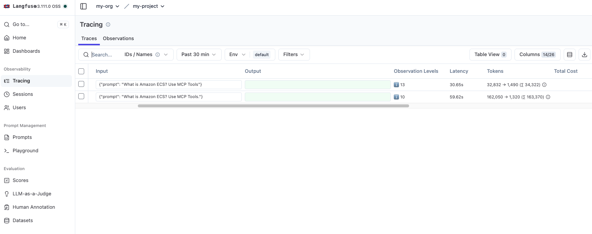

# Strands MCP Code Execution Demo

This repository demonstrates a pair of Strands agents instrumented with Langfuse tracing and AWS MCP servers, following the workflow outlined in [Anthropic – *Code execution with MCP*](https://www.anthropic.com/engineering/code-execution-with-mcp).



*Tip: for longer term maintenance, consider moving screenshots into a folder such as `docs/assets/` and updating the image path above accordingly.*

## Quick Start

```bash
pip install -r requirements.txt
cp env.example .env   # set Langfuse keys & host
python agent.py "What is AWS Lambda?" --user-id demo
```

Optional local Langfuse stack:
```bash
cd deploy/langfuse
docker compose up -d
```

## Agents

| Script | Purpose | Behavior |
| --- | --- | --- |
| `agent.py` | Baseline Strands agent | Instantiates AWS documentation, EKS, ECS, and CDK MCP servers up front and handles a single prompt using the listed tools (classic direct tool approach). |
| `agent-with-code-execution.py` | Code execution experiment | Applies the Anthropic playbook: use `search_tools` → `file_read` → wrappers under `./servers/` → invoke MCP via `python_repl`. Falls back to normal replies when MCP access is unnecessary. |

## Layout

- `servers/…` – Python wrappers per MCP tool (mirrors the “filesystem of tools” concept).
- `deploy/langfuse/docker-compose.yml` – Local Langfuse deployment (Postgres, Redis, ClickHouse, MinIO, web/worker).
- `requirements.txt` – Strands SDK dependencies, Langfuse Python SDK v3, python-dotenv.

## Langfuse

Populate `.env` with `LANGFUSE_PUBLIC_KEY`, `LANGFUSE_SECRET_KEY`, `LANGFUSE_HOST`, `LANGFUSE_USER_ID`. Both agents automatically initialize Langfuse; if credentials are absent they log a warning and continue without tracing.

## Troubleshooting

- Import errors → make sure your virtual environment installed `requirements.txt`.
- Langfuse issues → inspect `docker compose logs -f langfuse-web`, confirm credentials/ports.
- MCP failures → verify AWS CLI credentials and any optional environment overrides (e.g., `AWS_DOCS_MCP_LOG_LEVEL`, `ECS_MCP_ALLOW_WRITE`).

