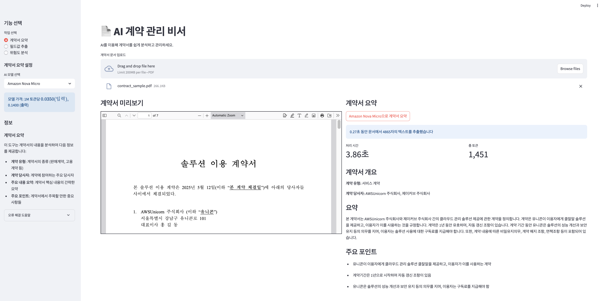
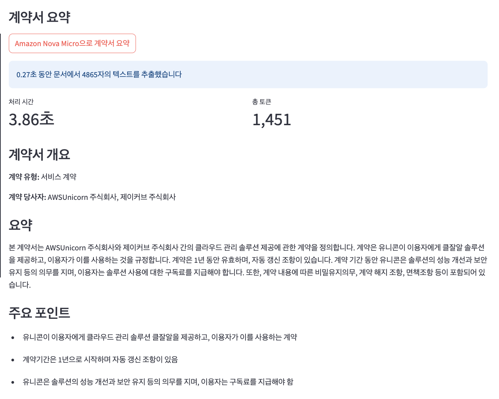
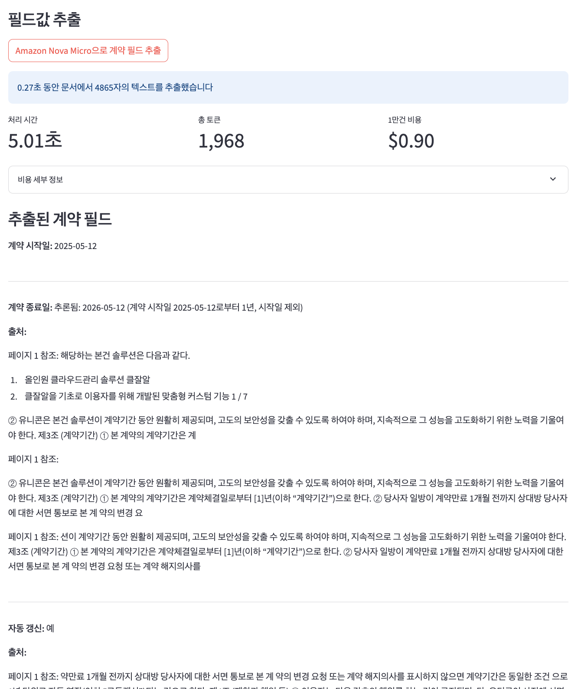
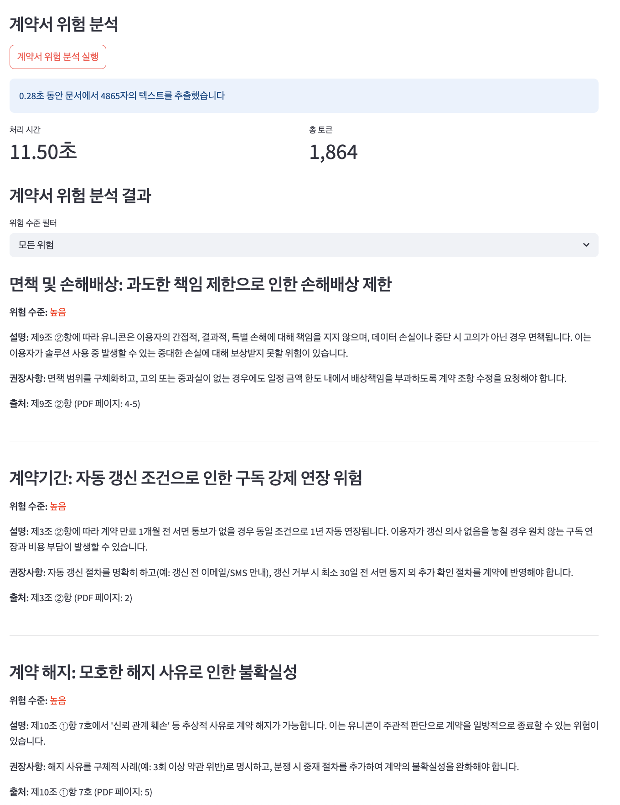

# Sample Overview



## 계약서 내용 요약

계약서의 주요 내용을 자동으로 요약하여 사용자가 빠르게 이해할 수 있도록 돕습니다. 이 기능은 계약서의 복잡한 조항을 간단한 요약으로 변환하여, 사용자가 중요한 정보를 놓치지 않도록 합니다. AI 모델을 활용하여 문서의 핵심 포인트를 추출하고, 이를 명확하고 간결한 형태로 제공합니다.

## 계약 필드 추출

계약 필드 추출 기능은 PDF 형식의 계약서에서 중요한 정보를 자동으로 식별하고 추출하는 데 중점을 둡니다. 이 기능은 계약서의 시작일, 종료일, 자동 갱신 여부, 갱신 거절 통지 기간 등과 같은 필드를 정확하게 추출하여 사용자가 쉽게 접근할 수 있도록 합니다. AI 모델을 활용하여 문서의 구조를 분석하고, 필요한 정보를 효율적으로 식별합니다. 이를 통해 사용자는 계약서의 중요한 세부 사항을 빠르게 파악할 수 있으며, 시간과 노력을 절약할 수 있습니다.

## 계약서 위험 분석

계약서의 위험 요소를 자동으로 분석하여 사용자가 사전에 문제를 인지하고 대응할 수 있도록 돕습니다. 이 기능은 계약서의 조항을 검토하여 잠재적인 법적 또는 비즈니스적 위험을 식별하고, 이를 사용자에게 명확하게 전달합니다. AI 모델을 활용하여 위험 요소를 평가하고, 필요한 경우 추가적인 조치를 추천합니다.

## 설치 방법

1. 가상 환경 생성 및 활성화
```bash
python -m venv .venv
# Windows
.venv\Scripts\activate
# macOS/Linux
source .venv/bin/activate
```

2. 의존성 설치
```bash
pip install -r requirements.txt
```

3. AWS 인증 설정
```bash
# AWS CLI를 이용한 자격 증명 설정
aws configure
# 프롬프트에 따라 Access Key, Secret Key, 리전(us-east-1) 입력
```

4. 앱 실행
```bash
streamlit run app.py
```

## 코드 구조

```
ai-document-form-parser/
├── app.py             # 메인 Streamlit 앱
├── models/            # 데이터 모델 클래스
│   ├── contract.py    # 계약서 데이터 모델
│   └── analytics.py   # 분석 결과 데이터 모델
├── services/          # 서비스 함수
│   ├── bedrock.py     # AWS Bedrock 연결 및 호출
│   ├── extraction.py  # 계약서 필드 추출
│   ├── pdf.py         # PDF 파일 처리
│   ├── risk_analysis.py # 위험 분석
│   └── summarization.py # 계약서 요약
├── prompts/           # AI 모델 프롬프트 템플릿
│   ├── extraction.txt # 계약 필드 추출 프롬프트
│   ├── risk_analysis.txt # 위험 분석 프롬프트
│   └── summarization.txt # 계약서 요약 프롬프트
├── utils/             # 유틸리티 함수
│   ├── fonts.py       # 한글 폰트 설정
│   ├── pricing.py     # 토큰 가격 계산
│   ├── text_processing.py # 텍스트 처리
│   ├── metrics.py     # 성능 지표 계산
│   └── file_utils.py  # 파일 처리 유틸리티
├── config/            # 설정 파일 디렉토리
│   └── pricing.json   # 토큰 가격 정보
├── fonts/             # 한글 폰트 파일 디렉토리
└── docs/              # 문서 및 도움말 파일
```

## 프롬프트 커스터마이징

애플리케이션은 `prompts/` 디렉토리에 있는 텍스트 파일에서 AI 모델 프롬프트를 로드합니다. 이를 통해 코드를 수정하지 않고도 프롬프트를 사용자화할 수 있습니다:

1. `prompts/` 디렉토리의 해당 `.txt` 파일을 텍스트 편집기로 엽니다
2. 필요에 맞게 프롬프트 내용을 수정합니다 (`{text}` 플레이스홀더는 그대로 유지)
3. 파일을 저장합니다

자세한 내용은 `prompts/README.md` 파일을 참조하세요.

## 필요한 권한

- `bedrock:InvokeModel` - AWS Bedrock 모델 호출
- `bedrock:GetFoundationModel` - 모델 정보 조회

## 지원 모델

- Amazon Nova Micro/Lite/Pro 
- Anthropic Claude 3/3.5/3.7 모델들
- DeepSeek AI R1

## 주의사항

- AWS Bedrock 서비스는 현재 모든 리전에서 사용 가능하지 않을 수 있습니다.
- 추출 및 분석 품질은 선택한 모델과 계약서 형식에 따라 달라질 수 있습니다.
- AWS Bedrock 사용에는 비용이 발생합니다. 애플리케이션 내 표시되는 가격 정보는 us-east-1 리전 기준이며, 가격은 수시로 변경될 수 있습니다. 최신 가격 정보는 [AWS Bedrock 가격 정책](https://aws.amazon.com/ko/bedrock/pricing/)을 참조하세요.
