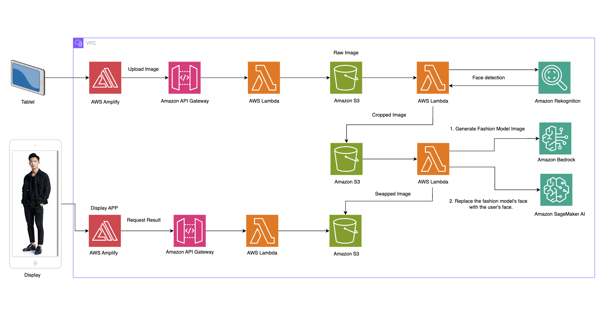

# Generative Fashion Stylist - AI-Powered Style Consultation

This repository contains three interconnected projects that together form an AI-powered fashion styling application:

1. **style-backend**: Backend infrastructure and APIs
2. **style-frontend**: User interface and frontend application
3. **image-generator**: AI-based image generation utility

## Project Overview

## Architecture Diagram



### Style Backend

The backend infrastructure is built using AWS CDK and provides the foundation for the entire application. It consists of several key components:

- **API Gateway**: RESTful endpoints for image upload, retrieval, and user agreement management
- **AWS Cognito**: User authentication and authorization
- **DynamoDB**: Data storage for image processing status, display information, and user agreements
- **Lambda Functions**: Serverless processing for image manipulation and business logic
- **S3 Buckets**: Object storage for images and assets
- **SageMaker Endpoints**: AI model deployment for FaceChain and GFPGAN
- **Container Infrastructure**: ECR repositories and CodeBuild pipelines for AI model containers

The backend handles all data processing, storage, and AI model integration, providing a robust foundation for the application.

### Style Frontend

The frontend is a React TypeScript application that provides the user interface for the fashion styling service. Key features include:

- User authentication with AWS Cognito
- Photo upload and personal style preferences input
- AI-powered fashion style generation
- Multiple style suggestions based on user preferences
- Multi-language support (i18n)
- User agreement management
- Style sharing capabilities

The frontend communicates with the backend APIs to provide a seamless user experience for style consultation and visualization.

## Application Features

Generative Stylist provides customers with an experience similar to receiving a consultation from a fashion designer. The application:

1. Allows users to upload their photo and input personal style preferences
2. Analyzes user preferences and current fashion trends
3. Generates multiple personalized style suggestions
4. Provides visual representations of recommended outfits and styles
5. Enables users to save and share their favorite style recommendations

## Deployment Instructions

### Requirements

- AWS Account with appropriate permissions
- Node.js v14 or higher
- Python 3.8 or higher
- AWS CDK installed and configured
- AWS CLI installed and configured

### AWS Bedrock Model Access Configuration

Before using AWS Bedrock models, you need to enable access to the following models:

1. Go to AWS Bedrock service in AWS Console
2. Select "Model access" from the left menu
3. Click "Manage model access"
4. Select the checkboxes for the following models and click "Save changes":

**Anthropic Models**
- Claude 3 Sonnet Sonnet 3/3.5/3.7

**Amazon Models**
- Amazon Nova Pro/Lite

**Stability AI Models**
Stable Diffusion 3.5 Large

Once enabled, the status will change to "Access granted". This setting applies at the AWS account level and works across all regions once configured.

For detailed instructions, refer to the [AWS Bedrock Model Access Management documentation](https://docs.aws.amazon.com/bedrock/latest/userguide/model-access-modify.html).


### Follow these steps to deploy the complete application:

#### 1. Deploy Style Backend

First, deploy the backend infrastructure:

```bash
cd style-backend
python3 -m venv .venv
source .venv/bin/activate
pip install -r requirements.txt

# Generate unique ID and update cdk.context.json
UNIQUE_ID=$(openssl rand -hex 4)
sed -i '' "s/<your-unique-id>/$UNIQUE_ID/g" cdk.context.json

# Run CDK bootstrap (only required for first time CDK usage in AWS account)
cdk bootstrap

# Generate CloudFormation templates before deploying CDK stacks
cdk synth
# Deploy all stacks to AWS
cdk deploy --all
```

This will create all necessary AWS resources including API Gateway, Lambda functions, DynamoDB tables, S3 buckets, and SageMaker endpoints.


#### 2. Deploy Style Frontend

Finally, deploy the frontend application:

```bash
cd ../style-frontend
npm install

# Update .env file with your backend API endpoints and Cognito settings
echo "REACT_APP_API_ENDPOINT=your-api-endpoint
REACT_APP_USER_AGREEMENT_ENDPOINT=your-user-agreement-endpoint
REACT_APP_COGNITO_USER_POOL_ID=your-user-pool-id
REACT_APP_COGNITO_CLIENT_ID=your-client-id" > .env

npm run build:prod
# Deploy the build directory to your hosting service of choice
```

## Testing the Application

Once all components are deployed, you can test the complete workflow:

1. Access the frontend application
2. Create an account and sign in
3. Upload your photo and input style preferences
4. Receive AI-generated style suggestions
5. View and save your favorite style recommendations
6. Share your style choices with others


## Contributing

Please refer to the individual project READMEs for specific contribution guidelines.
