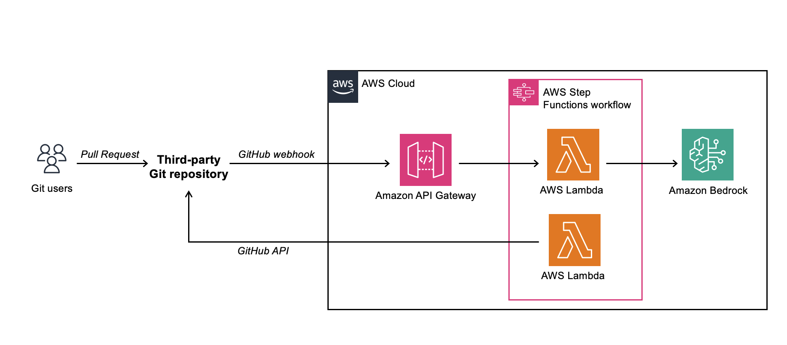
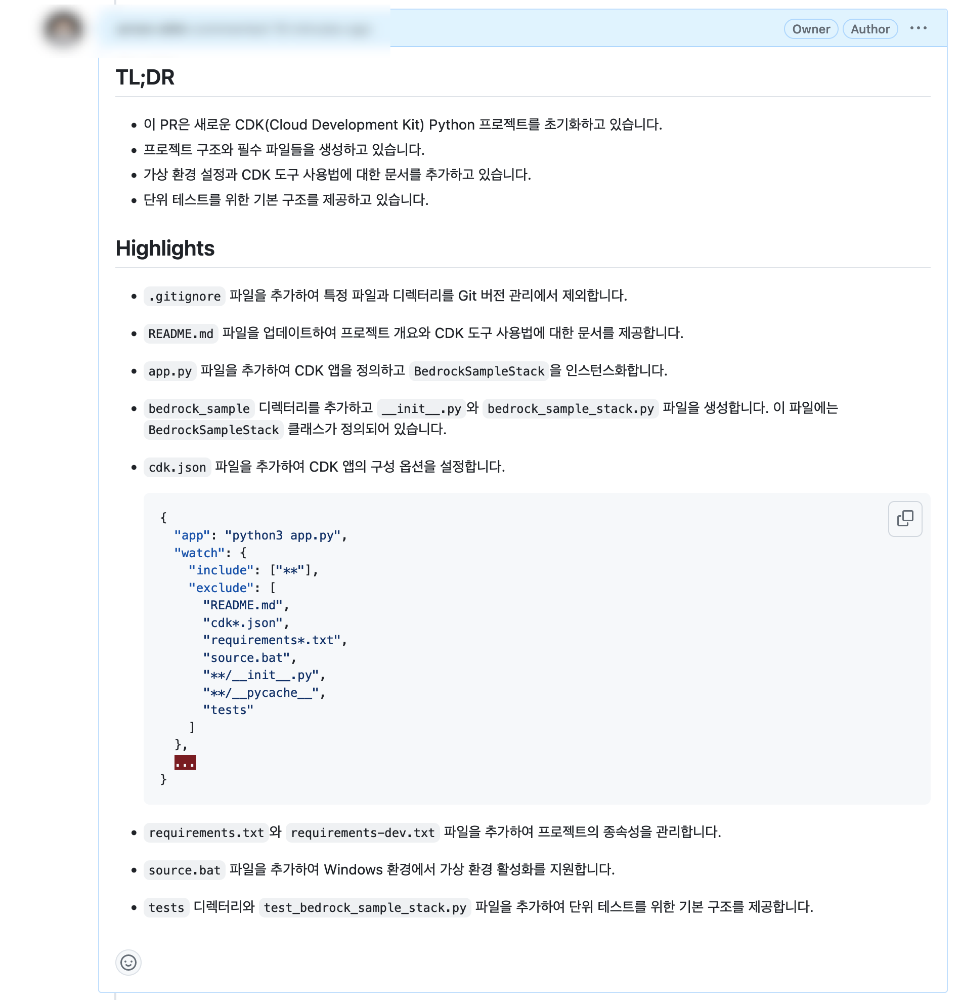

# GitHub PR Summary with Amazon Bedrock



This is a GitHub Pull Request Summary application using Amazon Bedrock deployed on AWS Lambda and Step Functions with Amazon CDK.

## Overview



This application automatically generates summaries for GitHub Pull Requests using Amazon Bedrock's AI capabilities. When a new PR is created or updated, it triggers an AWS Step Functions workflow that processes the PR content and generates a concise summary, which is then posted as a comment on the GitHub PR.

## Prerequisites

Before you begin, ensure you have met the following requirements:
* You have installed the latest version of [AWS CDK](https://docs.aws.amazon.com/cdk/latest/guide/getting_started.html)
* You have an [AWS account](https://aws.amazon.com/free/)
* You have the necessary permissions to create and manage AWS resources
* You have access to [Amazon Bedrock](https://aws.amazon.com/bedrock/) and the required model (e.g., Claude 3)
* You have a [GitHub account](https://github.com/) and a personal access token with appropriate permissions

## Setup

To set up this project:

1. Clone the repository:
    ```
    git clone https://github.com/aws-samples/aws-kr-startup-samples.git
    cd aws-kr-startup-samples
    git sparse-checkout init --cone
    git sparse-checkout set gen-ai/github-pr-summary-with-amazon-bedrock
    ```

2. Create a virtual environment:
    ```
    python3 -m venv .venv
    source .venv/bin/activate
   ```

3. Install the required dependencies:
    ```
    pip install -r requirements.txt
    ```

4. Configure your AWS credentials:
    ```
    aws configure
    ```

5. Update the `cdk.json` file with your GitHub token, repository name, and other configuration details.

## Deployment

To deploy the application:

1. Synthesize the CloudFormation template:
    ```
    cdk synth --all
    ```

2. Deploy the stacks:
    ```
    cdk deploy --require-approval never --all
    ```

## Usage

Once deployed, the application will automatically process new Pull Requests in the specified GitHub repository. You can view the summaries as comments on each PR.

To enable this functionality, you need to set up a webhook in your GitHub repository settings:

1. Go to your GitHub repository.
2. Click on "Settings" > "Webhooks" > "Add webhook".
3. In the "Payload URL" field, enter the URL of your API Gateway endpoint.
4. Set the "Content type" to "application/json".
5. Under "Which events would you like to trigger this webhook?", select "Let me select individual events".
6. Check only the "Pull requests" option.
7. Make sure the webhook is set to "Active".
8. Click "Add webhook" to save your settings.

**Important Note**: The application is designed to respond only to Pull Request events. If you have configured other events in the webhook settings, these will be ignored by the application.

After setting up the webhook, the application will automatically generate summaries for new Pull Requests or when existing PRs are reopened. These summaries will appear as comments on the respective Pull Requests.

## Clean Up

To remove all resources created by this project:

```
cdk destroy --force --all
```

## Useful Commands

* `cdk ls`          list all stacks in the app
* `cdk synth`       emits the synthesized CloudFormation template
* `cdk deploy`      deploy this stack to your default AWS account/region
* `cdk diff`        compare deployed stack with current state
* `cdk docs`        open CDK documentation

## Architecture

This application uses the following AWS services:
* Amazon API Gateway
* AWS Lambda
* AWS Step Functions
* Amazon Bedrock
* AWS IAM

The workflow is triggered by a GitHub webhook, which invokes an API Gateway endpoint. This triggers a Step Functions state machine, which orchestrates the process of fetching the PR content, generating a summary using Amazon Bedrock, and posting the summary back to GitHub.

## Contributing

Contributions to this project are welcome. Please ensure you follow the [code of conduct](CODE_OF_CONDUCT.md) when contributing.

## License

This project is licensed under the MIT License - see the [LICENSE](LICENSE) file for details.

## Acknowledgments

* Amazon Bedrock team for providing the AI capabilities
* AWS CDK team for the infrastructure as code toolkit
