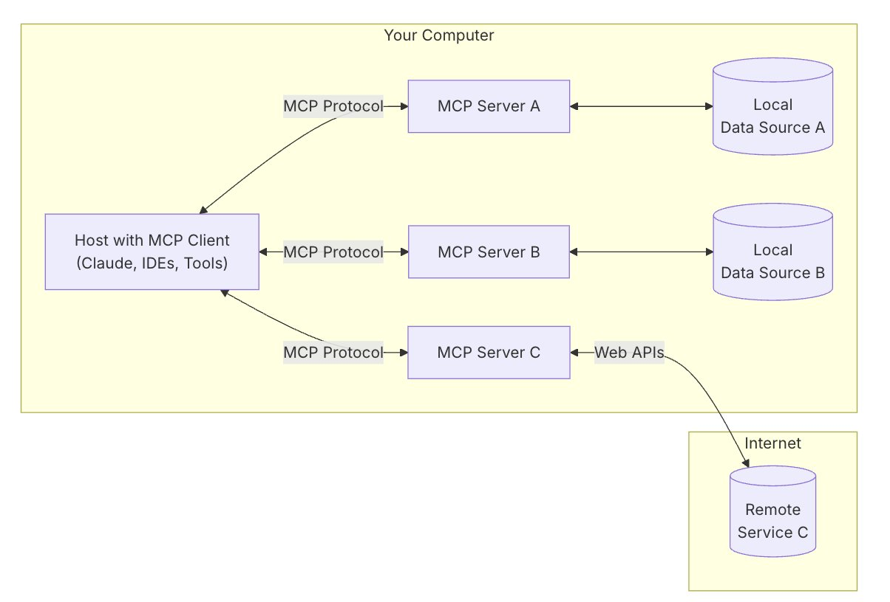
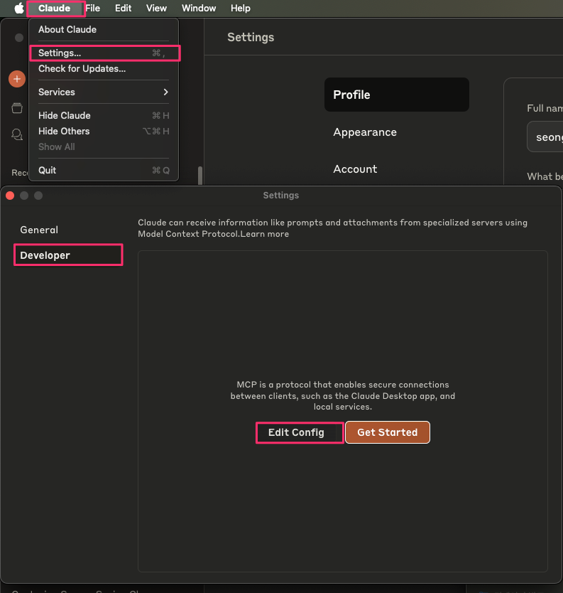
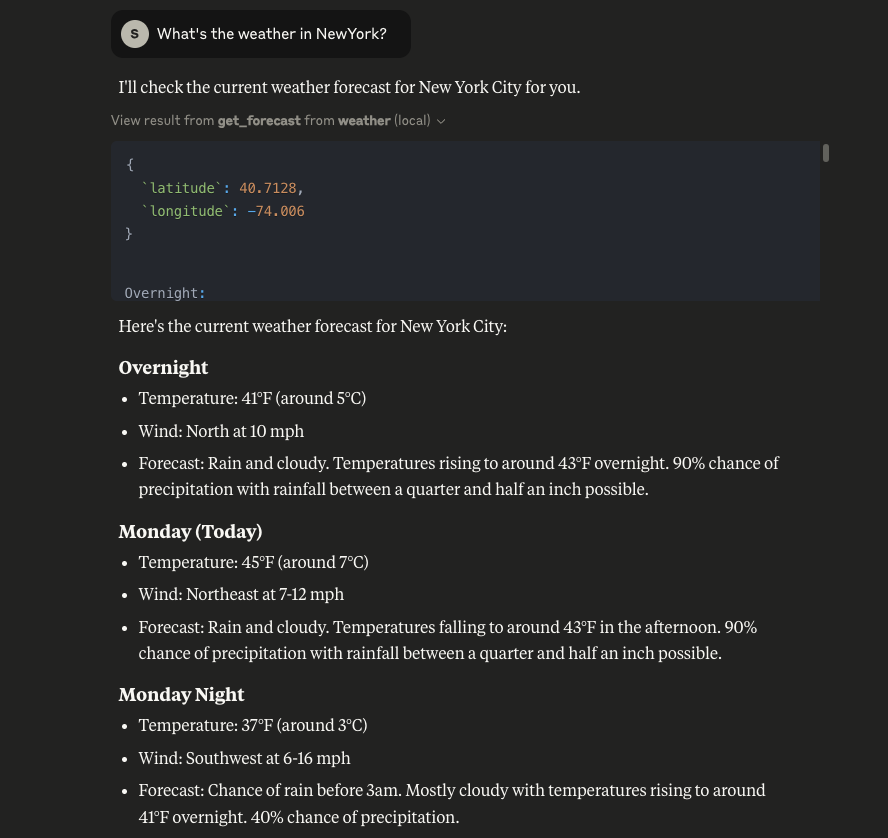
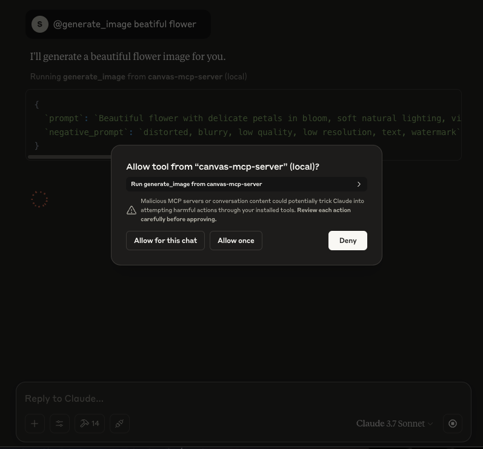

# (Module 1) Local MCP Server를 구축하기 - Claude Desktop에 연동하기
MCP(Model Context Protocol) Server는 LLM(Large Language Model)과 외부 데이터 소스나 도구를 연결하는 표준화된 방법을 제공하는 서버입니다. MCP Server는 특정 기능을 표준화된 Model Context Protocol을 통해 노출시키며 세 가지 주요 기능을 제공할 수 있습니다:

* 리소스(Resources): 클라이언트가 읽을 수 있는 파일과 같은 데이터(API 응답이나 파일 내용 등)
* 도구(Tools): LLM이 호출할 수 있는 함수(사용자 승인을 필요로 함)
* 프롬프트(Prompts): 사용자가 특정 작업을 수행하는 데 도움이 되는 미리 작성된 템플릿

MCP Server를 통해 Claude와 같은 LLM은 원래 접근할 수 없는 최신 데이터나 도구에 접근할 수 있게 됩니다. 이는 LLM이 더 유용하고 현재 상황에 맞는 응답을 제공할 수 있도록 합니다.

이 과정에서 MCP Server는 MCP Client와 표준화된 방식으로 통신합니다.


사용자는 [Claude Desktop](https://claude.ai/download)과 같은 MCP Client를 통해 이러한 기능에 쉽게 접근할 수 있습니다. Claude Desktop은 MCP 호스트 역할을 하며, 사용자의 질문을 Claude에 전달하고, Claude가 필요에 따라 MCP Server의 도구를 호출하도록 합니다. 서버는 요청된 데이터나 기능을 처리한 후 결과를 Client에 반환하고, 이 정보는 다시 Claude에게 전달되어 최종적으로 자연어 형태의 응답으로 사용자에게 제공됩니다.

예시를 통해 Local에서 MCP Server를 구성해보고 Claude Desktop을 통해 질의해보겠습니다.

## Prerequisites
### Install Claude Desktop
1. [Claude Desktop](https://claude.ai/download)을 설치합니다.
2. [For Claude Desktop Users](https://modelcontextprotocol.io/quickstart/user) 가이드에 따라서 MCP Host 설정을 진행합니다.
3. 로컬 환경에 맞는 [uv](https://docs.astral.sh/uv/getting-started/installation/#standalone-installer)를 설치합니다.

여기까지 설정이 완료됐으면 기본 예시로 현재 날씨를 조회하는 Weather API를 구성해보겠습니다. 

## 예시 1 - Weather API MCP Server 만들기
먼저 로컬에서 아래 명령어를 실행하여 파이썬 프로젝트를 구성합니다.

```bash
uv init weather
cd weather

uv venv
source .venv/bin/activate

uv add "mcp[cli]" httpx

touch weather.py
```
생성한 `weather.py`의 내용은 [weather.py](./src/example-1/weather.py) 파일을 복사하여 붙여 넣습니다.
위 스크립트는 미국 국립 기상 서비스 API를 통해 날씨 정보를 가져오는 MCP 서버를 구현합니다. 사용자의 프롬프트로부터 날씨를 받을 때, `get_alerts`, `get_forecast`를 활용하여 위도와 경보를 파악하고 기상 정보를 가져오도록 동작합니다.

이제 Claude Desktop에서 확인하기 위해 `/Library/Application\ Support/Claude/claude_desktop_config.json` 파일을 수정해야합니다. Claude는 해당 설정 파일로부터 MCP 서버의 정보를 읽고 실행합니다.

`args` 경로에 `weather.py`가 위치한 절대 경로로 변경합니다.

```json
{
    "mcpServers": {
        "weather": {
            "command": "uv",
            "args": [
                "--directory",
                "/ABSOLUTE/PATH/TO/PARENT/FOLDER/weather",
                "run",
                "weather.py"
            ]
        }
    }
}
```

<tip> 파일을 찾기 어려운 경우, Claude Desktop을 실행하고 Settings -> Developer -> Edit Config 에서 찾아보세요.


거의 마무리되었습니다. 이제 Claude Desktop을 로컬에서 실행하고 날씨를 질의합니다. 


## 예시 2 - Amazon Bedrock Nova Canvas MCP Server 만들기
이제 AWS Resource를 활용한 MCP Server를 만들어 보겠습니다. Claude Desktop에서 자연어로 [Amazon Nova Canvas](https://aws.amazon.com/ko/ai/generative-ai/nova/creative/) 모델을 호출하여 이미지를 생성하는 예시입니다.

```bash
uv init mcp-nova-canvas
cd mcp-nova-canvas

uv venv
source .venv/bin/activate

uv add "mcp[cli]"
```

필요한 종속성을 pyproject.toml에 설정합니다.

```toml
[project]
name = "mcp-server-amazon-nova-canvas"
version = "0.1.0"
description = "Add your description here"
readme = "README.md"
requires-python = ">=3.11"
dependencies = [
    "boto3>=1.37.24",
    "httpx>=0.28.1",
    "mcp[cli]>=1.6.0",
    "pillow>=11.1.0",
    "uuid>=1.30",
    "loguru"
]
```

main.py 파일에 [main.py](./src/example-2/mcp-nova-canvas.py)를 붙여넣습니다. 이제 Claude Desktop에서 확인하기 위해 `/Library/Application\ Support/Claude/claude_desktop_config.json` 파일에 아래 내용을 추가합니다. AWS_PROFILE이 로컬에 없는 경우, ENV에 Credential("AWS_ACCESS_KEY_ID, "AWS_SECRET_ACCESS_KEY")을 추가하여 진행할 수 있습니다. 가급적 Profile을 활용해야하며 Credential을 활용할 경우 외부에 노출되지 않도록 유의하세요.

```json
{
    "mcpServers": {
        "canvas": {
            "command": "uv",
            "args": [
                "--directory",
                "/ABSOLUTE/ATH/TO/PARENT/FOLDER/mcp-server-amazon-nova-canvas",
                "run",
                "main.py"
            ]
        }
    }
} 
```

이제 Claude Desktop을 재실행하여 "generate_image PROMPT"를 입력합니다.


output 폴더에서 이미지를 확인합니다.


