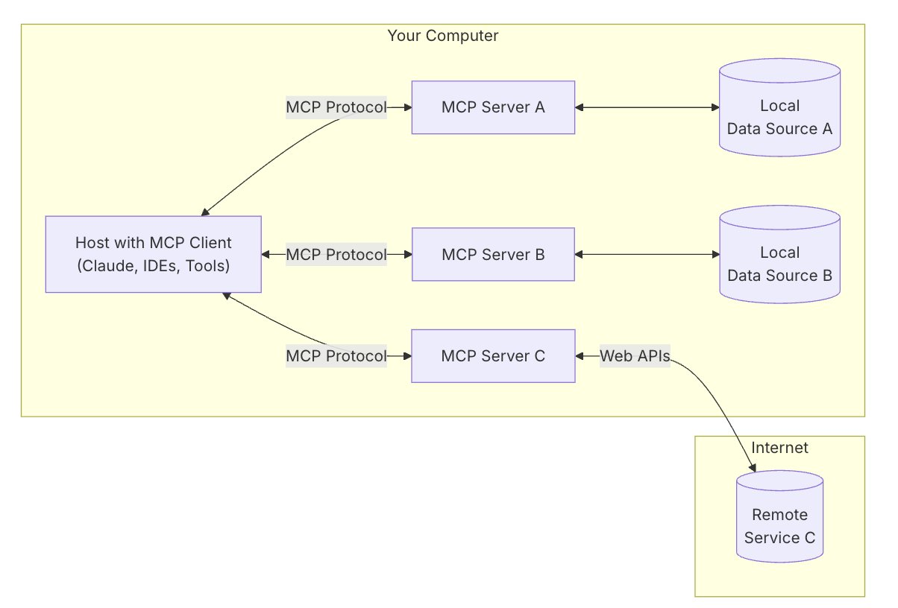
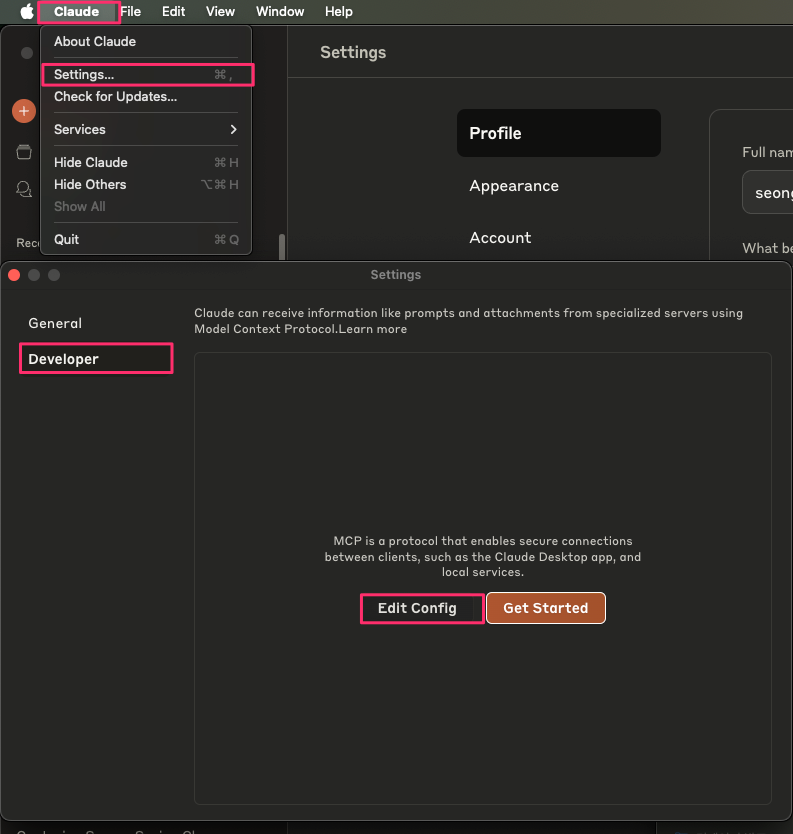
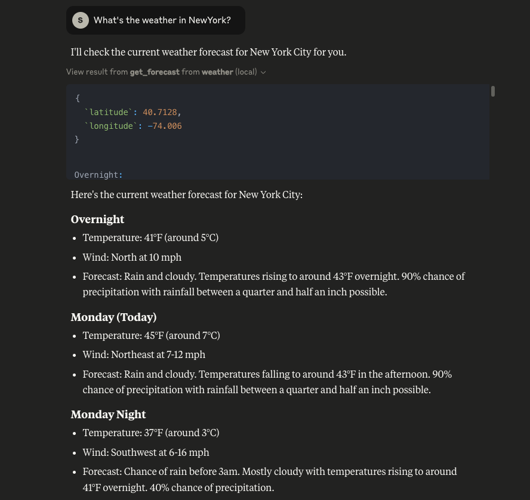
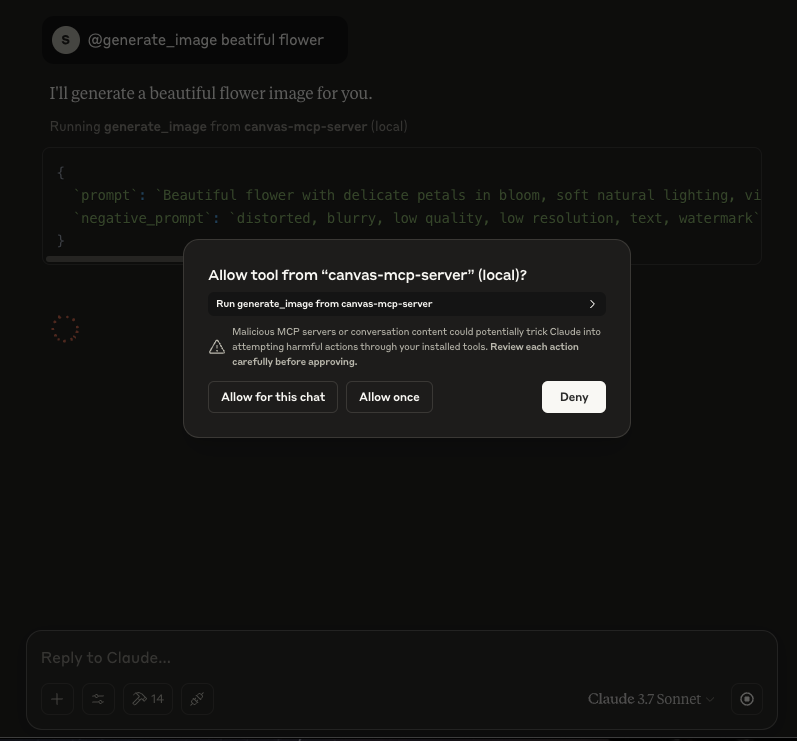

Read this in other languages: English, [Korean(한국어)](./README.kr.md)

# Building a Local MCP Server and Claude Desktop Integration

## Overview
This module teaches you how to build a Model Context Protocol (MCP) server in a local environment and integrate it with Claude Desktop. You will practice setting up an MCP server that allows LLMs to access external data sources or tools.

## Key Concepts
An MCP (Model Context Protocol) server provides a standardized method for connecting LLMs (Large Language Models) with external data sources or tools. The MCP server exposes specific functionalities through the standardized Model Context Protocol.

In this process, the MCP Server communicates with the MCP Client in a standardized way.


Users can easily access these features through MCP clients like [Claude Desktop](https://claude.ai/download). Claude Desktop acts as an MCP host, relaying user questions to Claude and enabling Claude to call tools from the MCP server as needed. The server processes the requested data or functionality and returns the results to the client, which are then passed back to Claude and ultimately provided to the user in natural language form.

## Prerequisites

### 1. Claude Desktop Installation and Setup
1. Download and install [Claude Desktop](https://claude.ai/download) for your operating system.
2. Complete the MCP Host setup according to the [For Claude Desktop Users](https://modelcontextprotocol.io/quickstart/user) guide.

> 💡 **Note**: Claude Desktop acts as a client for communicating with the MCP server.

### 2. Installing uv
[uv](https://github.com/astral-sh/uv) is a fast tool for Python package installation and virtual environment management. Run the following command in your terminal:
```bash
# On macOS and Linux.
curl -LsSf https://astral.sh/uv/install.sh | sh
```

After installation, verify by checking the version:
```bash
uv --version
```

> 💡 **Tip**: You may need to restart your terminal after installation. If the `uv` command is not recognized, restart your terminal or check if uv has been added to your PATH environment variable.

### Exercise 1: Creating a Weather API MCP Server

1. First, set up a Python project locally by running the following commands:
    ```bash
    uv init weather
    cd weather

    uv venv
    source .venv/bin/activate

    uv add "mcp[cli]" httpx

    touch weather.py
    ```

2. For the content of the created `weather.py`, copy and paste from the [weather.py](./src/example-1/weather.py) file.
    > 💡 **Note**: This script implements an MCP server that retrieves weather information through the US National Weather Service API. When receiving weather queries from user prompts, it uses `get_alerts` and `get_forecast` to determine latitude and alerts, and retrieve weather information.

3. Modify the `/Library/Application\ Support/Claude/claude_desktop_config.json` file to check in Claude Desktop:
   ```json
   {
       "mcpServers": {
           "weather": {
               "command": "uv",
               "args": [
                   "--directory",
                   "/ABSOLUTE/PATH/TO/PARENT/FOLDER/weather",
                   "run",
                   "weather.py"
               ]
           }
       }
   }
   ```
   > 💡 **Tip**: If you have trouble finding the file, run Claude Desktop and look in Settings -> Developer -> Edit Config.
   > 

4. Run Claude Desktop locally and query about the weather.
   

### Exercise 2: Creating an Amazon Bedrock Nova Canvas MCP Server

Now let's create an MCP Server using AWS Resources. This example shows how to call the [Amazon Nova Canvas](https://aws.amazon.com/ko/ai/generative-ai/nova/creative/) model in natural language through Claude Desktop to generate images.

1. First, set up a Python project locally by running the following commands:
    ```bash
    uv init mcp-nova-canvas
    cd mcp-nova-canvas

    uv venv
    source .venv/bin/activate

    uv add "mcp[cli]"
    ```

2. Set up the necessary dependencies in pyproject.toml:
    ```toml
    [project]
    name = "mcp-server-amazon-nova-canvas"
    version = "0.1.0"
    description = "Add your description here"
    readme = "README.md"
    requires-python = ">=3.11"
    dependencies = [
        "boto3>=1.37.24",
        "httpx>=0.28.1",
        "mcp[cli]>=1.8.0",
        "pillow>=11.1.0",
        "uuid>=1.30",
        "loguru"
    ]
    ```

3. Paste [mcp-nova-canvas.py](./src/example-2/mcp-nova-canvas.py) into the main.py file.

4. Add the following content to the `/Library/Application\ Support/Claude/claude_desktop_config.json` file to check in Claude Desktop:
    ```json
    {
        "mcpServers": {
            "canvas": {
                "command": "uv",
                "args": [
                    "--directory",
                    "/ABSOLUTE/ATH/TO/PARENT/FOLDER/mcp-server-amazon-nova-canvas",
                    "run",
                    "main.py"
                ]
            }
        }
    }
    ```
    > 💡 **Note**: If you don't have an AWS_PROFILE locally, you can proceed by adding Credentials ("AWS_ACCESS_KEY_ID, "AWS_SECRET_ACCESS_KEY") to the ENV. It's preferable to use a Profile, and if using Credentials, be careful not to expose them externally.

5. Restart Claude Desktop and enter "generate_image PROMPT".
    

6. Check the image in the output folder.
    

## Summary
In this module, you learned how to build an MCP server in a local environment and integrate it with Claude Desktop. You implemented an MCP server using the Weather API to allow Claude to access real-time weather information. This provides a foundation for understanding how LLMs can interact with external data sources.

## References
- [Model Context Protocol Official Documentation](https://modelcontextprotocol.io/)
- [Claude Desktop Download](https://claude.ai/download)
- [uv Installation Guide](https://docs.astral.sh/uv/getting-started/installation/#standalone-installer)
