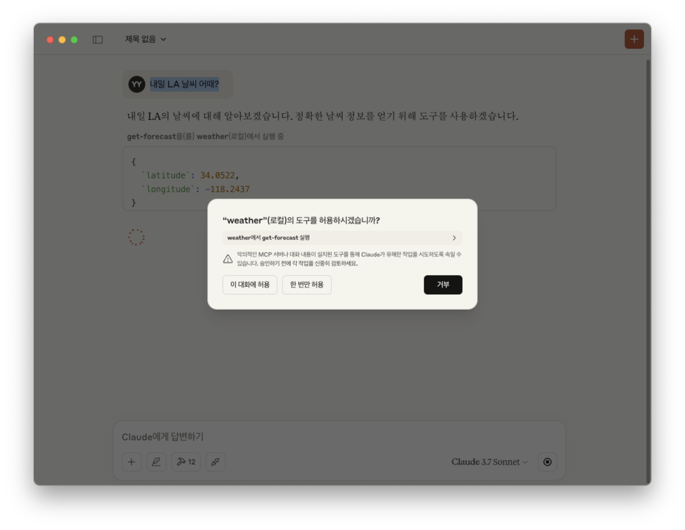
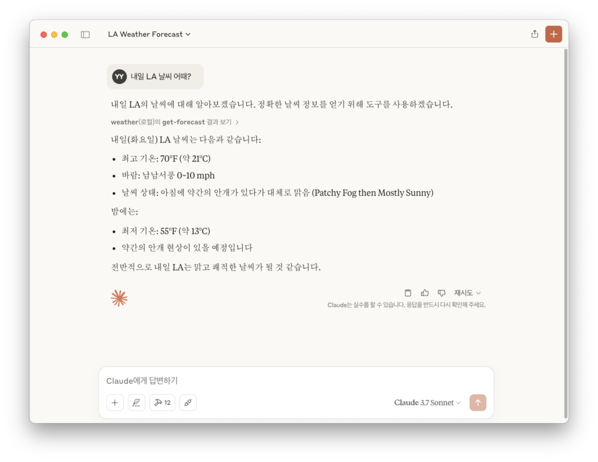

# Smithery의 MCP 서버 사용하기

## 로컬 클라이언트에서 Smithery 서버 사용하기

먼저 Smithery AI 서버를 설정하고 사용해보겠습니다.

### prerequisites

1. **Smithery AI 가입:** [Smithery AI 웹사이트](https://www.smithery.ai/) 에서 계정을 생성하고 API 키를 발급받으세요.
2. **Claude Desktop 설치:** [Claude AI 웹사이트](https://claude.ai/download) 에서 운영체제에 맞는 Claude Desktop 클라이언트를 설치합니다.

### mcp configuration

1. 터미널을 열고 다음 명령어를 실행하여 `@mcp-examples/weather` 도구를 설치하고 Claude Desktop 클라이언트에 연결합니다.

    ```bash
    npx -y @smithery/cli@latest install @mcp-examples/weather --client claude --key YOUR_API_KEY
    ```

    **주의:** 위 명령어에서 `YOUR_API_KEY` 부분을 실제로 발급받은 API 키로 교체해야 합니다.

    이제 Claude Desktop 클라이언트를 통해 `@mcp-examples/weather` 도구를 사용할 준비가 되었습니다. 

2. 아래와 같이 질문하여 weather mcp를 호출해봅니다. 도구 허용을 묻는 팝업에서 "이 대화에 허용"을 선택합니다.
    

3. Claude Desktop이 MCP 서버의 응답을 활용하여 답변을 생성합니다.
     