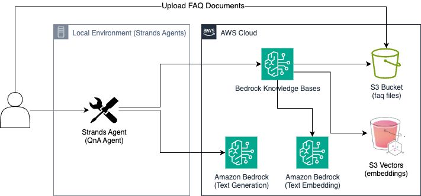

# Amazon Bedrock Knowledge Bases with S3 Vectors

[English](README.md) | [한국어](README.ko.md)

AWS S3 Vectors (preview)와 Amazon Bedrock을 활용한 FAQ 검색 시스템입니다. AWS AI 서비스(Bedrock, Q Business, Q Developer, SageMaker)에 대한 질문에 답변하는 대화형 AI 어시스턴트를 제공합니다.

## 아키텍처



- **Amazon Bedrock**: Foundation Models 및 Knowledge Base
- **S3 Vector Storage**: 임베딩 벡터 저장소
- **Strands Agent**: 대화형 AI 에이전트
- **CSV 데이터**: AWS AI 서비스 FAQ 데이터

## 프로젝트 구조

```
s3-vector-rag/
├── app.py              # 메인 애플리케이션 (대화형 AI 어시스턴트)
├── deploy.py           # AWS 리소스 배포 스크립트
├── cleanup.py          # AWS 리소스 정리 스크립트
├── utils.py            # 유틸리티 함수
├── requirements.txt    # Python 의존성
├── config.json         # 배포 후 생성되는 설정 파일
└── faq/                # FAQ 데이터
    ├── bedrock.csv
    ├── qbusiness.csv
    ├── qdev.csv
    └── sagemaker.csv
```

## 설치 및 설정

### 1. 사전 요구사항

- Python 3.10+
- AWS CLI 설정 및 자격 증명
- 적절한 AWS IAM 권한

### 2. 의존성 설치

```bash
python -m venv .venv
source .venv/bin/activate
pip install -r requirements.txt
```

### 3. 지원 리전

- us-east-1 
- us-east-2 
- us-west-2 - 기본값
- eu-central-1 
- ap-southeast-2 

## 배포

### 기본 배포

```bash
python deploy.py
```

### 사용자 정의 배포

```bash
python deploy.py --region us-east-1 \
                 --embedding-model cohere.embed-multilingual-v3 \
                 --generation-model anthropic.claude-3-5-sonnet-20241022-v2:0 \
                 --auto-approval
```

### 배포 옵션

- `--region`: AWS 리전 (기본값: us-west-2)
- `--embedding-model`: 임베딩 모델 (기본값: cohere.embed-multilingual-v3)
- `--generation-model`: 생성 모델 (기본값: anthropic.claude-3-5-sonnet-20241022-v2:0)
- `--auto-approval`: 확인 프롬프트 건너뛰기

## 사용 방법

### 애플리케이션 실행

```bash
python app.py
```

## 리소스 정리

배포된 AWS 리소스를 삭제하려면:

```bash
python cleanup.py
```

## 생성되는 AWS 리소스

배포 시 다음 리소스들이 생성됩니다:

- **S3 버킷**: FAQ 파일 저장
- **S3 Vector 버킷**: 임베딩 벡터 저장
- **Vector 인덱스**: 벡터 검색용 인덱스
- **IAM 역할**: Knowledge Base 실행 역할
- **Bedrock Knowledge Base**: 완전 관리형 RAG
- **Data Source**: S3와 Knowledge Base 연결

## FAQ 데이터 형식

CSV 파일은 다음 형식을 따릅니다:

```csv
question,answer
"질문 내용","답변 내용"
```

## 설정 파일 (config.json)

배포 완료 후 자동 생성되는 설정 파일:

```json
{
    "region": "us-west-2",
    "kb_id": "KNOWLEDGE_BASE_ID",
    "ds_id": "DATA_SOURCE_ID",
    "bucket_name": "s3-vectors-ACCOUNT-REGION-faqs",
    "vector_bucket_name": "s3-vectors-ACCOUNT-REGION-embeddings",
    "index_name": "s3-vectors-index",
    "embedding_model": "cohere.embed-multilingual-v3",
    "generation_model": "anthropic.claude-3-5-sonnet-20241022-v2:0"
}
```

## 주의사항

1. **권한**: 적절한 AWS IAM 권한이 필요합니다
2. **리전**: 모든 서비스가 모든 리전에서 지원되지 않을 수 있습니다
3. **비용**: 사용하지 않을 때는 리소스를 정리하세요
4. **모델 접근**: Bedrock 모델에 대한 접근 권한이 필요할 수 있습니다

##  문제 해결

### 일반적인 오류

1. **권한 오류**: 배포에 활용하는 IAM 정책 확인
2. **리전 오류**: 지원되는 리전 사용
3. **모델 접근 오류**: Bedrock 콘솔에서 모델 접근 권한 확인

## 참고 자료

- [Amazon Bedrock 문서](https://aws.amazon.com/bedrock/)
- [S3 Vector Storage 문서](https://aws.amazon.com/s3/features/vectors/)
- [Strands Agent 문서](https://strandsagents.com/latest/)