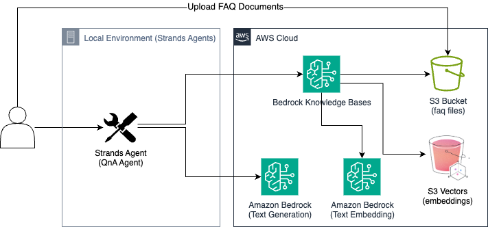

# Amazon Bedrock Knowledge Bases with S3 Vectors

[English](README.md) | [한국어](README.ko.md)

A FAQ search system leveraging AWS S3 Vectors (preview) and Amazon Bedrock. Provides an interactive AI assistant that answers questions about AWS AI services (Bedrock, Q Business, Q Developer, SageMaker).

## Architecture



- **Amazon Bedrock**: Foundation Models and Knowledge Base
- **S3 Vector Storage**: Embedding vector storage
- **Strands Agent**: Interactive AI agent
- **CSV Data**: AWS AI services FAQ data

## Project Structure

```
s3-vector-rag/
├── app.py              # Main application (interactive AI assistant)
├── deploy.py           # AWS resource deployment script
├── cleanup.py          # AWS resource cleanup script
├── utils.py            # Utility functions
├── requirements.txt    # Python dependencies
├── config.json         # Configuration file generated after deployment
└── faq/                # FAQ data
    ├── bedrock.csv
    ├── qbusiness.csv
    ├── qdev.csv
    └── sagemaker.csv
```

## Installation and Setup

### 1. Prerequisites

- Python 3.10+
- AWS CLI configuration and credentials
- Appropriate AWS IAM permissions

### 2. Install Dependencies

```bash
pip install -r requirements.txt
```

### 3. Supported Regions

- us-east-1 
- us-east-2 
- us-west-2 - default
- eu-central-1 
- ap-southeast-2 

## Deployment

### Basic Deployment

```bash
python deploy.py
```

### Custom Deployment

```bash
python deploy.py --region us-east-1 \
                 --embedding-model cohere.embed-multilingual-v3 \
                 --generation-model anthropic.claude-3-5-sonnet-20241022-v2:0 \
                 --auto-approval
```

### Deployment Options

- `--region`: AWS region (default: us-west-2)
- `--embedding-model`: Embedding model (default: cohere.embed-multilingual-v3)
- `--generation-model`: Generation model (default: anthropic.claude-3-5-sonnet-20241022-v2:0)
- `--auto-approval`: Skip confirmation prompts

## Usage

### Run Application

```bash
python app.py
```

## Resource Cleanup

To delete deployed AWS resources:

```bash
python cleanup.py
```

## Created AWS Resources

The following resources are created during deployment:

- **S3 Bucket**: FAQ file storage
- **S3 Vector Bucket**: Embedding vector storage
- **Vector Index**: Index for vector search
- **IAM Role**: Knowledge Base execution role
- **Bedrock Knowledge Base**: Fully managed RAG
- **Data Source**: Connection between S3 and Knowledge Base

## FAQ Data Format

CSV files follow this format:

```csv
question,answer
"Question content","Answer content"
```

## Configuration File (config.json)

Configuration file automatically generated after deployment:

```json
{
    "region": "us-west-2",
    "kb_id": "KNOWLEDGE_BASE_ID",
    "ds_id": "DATA_SOURCE_ID",
    "bucket_name": "s3-vectors-ACCOUNT-REGION-faqs",
    "vector_bucket_name": "s3-vectors-ACCOUNT-REGION-embeddings",
    "index_name": "s3-vectors-index",
    "embedding_model": "cohere.embed-multilingual-v3",
    "generation_model": "anthropic.claude-3-5-sonnet-20241022-v2:0"
}
```

## Important Notes

1. **Permissions**: Appropriate AWS IAM permissions are required
2. **Regions**: Not all services may be supported in all regions
3. **Costs**: Clean up resources when not in use
4. **Model Access**: Access permissions to Bedrock models may be required

## Troubleshooting

### Common Errors

1. **Permission Errors**: Check IAM policies used for deployment
2. **Region Errors**: Use supported regions
3. **Model Access Errors**: Check model access permissions in Bedrock console

## References

- [Amazon Bedrock Documentation](https://aws.amazon.com/bedrock/)
- [S3 Vector Storage Documentation](https://aws.amazon.com/s3/features/vectors/)
- [Strands Agent Documentation](https://strandsagents.com/latest/)