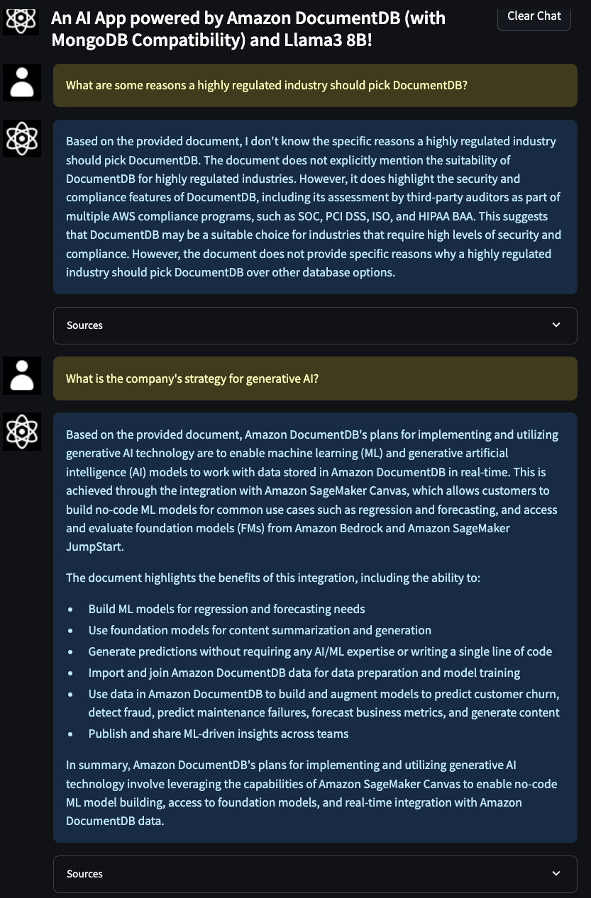

## Run the Streamlit application in Studio

Now we’re ready to run the Streamlit web application for our question answering bot.

SageMaker Studio provides a convenient platform to host the Streamlit web application. The following steps describes how to run the Streamlit app on SageMaker Studio. Alternatively, you could also follow the same procedure to run the app on Amazon EC2 instance or Cloud9 in your AWS Account.

1. Open Studio and then open a new **System terminal**.
2. Run the following commands on the terminal to clone the code repository for this post and install the Python packages needed by the application:
   ```
   git clone --depth=1 https://github.com/aws-samples/rag-with-amazon-bedrock-and-documentdb.git

   git clone --depth=1 https://github.com/aws-samples/aws-kr-startup-samples.git
   cd aws-kr-startup-samples
   git sparse-checkout init --cone
   git sparse-checkout set gen-ai/rag-with-amazon-documentdb-and-sagemaker

   cd gen-ai/rag-with-amazon-documentdb-and-sagemaker/app
   python -m venv .env
   source .env/bin/activate
   pip install -U -r requirements.txt
   ```
3. Download the Amazon DocumentDB Certificate Authority (CA) certificate required to authenticate to your instance
   ```
   curl -o global-bundle.pem https://truststore.pki.rds.amazonaws.com/global/global-bundle.pem
   ```
4. In the shell, set the following environment variables with the values that are available from the CloudFormation stack output.
   <pre>
   export AWS_REGION="us-east-1"
   export DOCDB_SECRET_NAME="{<i>DocumentDB-Secret-Name</i>}"
   export DOCDB_HOST="<i>{docdb-cluster-name}</i>.cluster-<i>{random-id}</i>.<i>{region}</i>.docdb.amazonaws.com"
   export DB_NAME="ragdemo"
   export COLLECTION_NAME="rag"
   export TEXT2TEXT_ENDPOINT_NAME="<i>{SageMakerEndpointName}</i>"
   </pre>
   :information_source: `COLLECTION_NAME` can be found in [data ingestion to vectordb](../data_ingestion_to_vectordb/data_ingestion_to_documentdb.ipynb) step.
5. When the application runs successfully, you’ll see an output similar to the following (the IP addresses you will see will be different from the ones shown in this example). Note the port number (typically `8501`) from the output to use as part of the URL for app in the next step.
   ```
   sagemaker-user@studio$ streamlit run app.py

   Collecting usage statistics. To deactivate, set browser.gatherUsageStats to False.

   You can now view your Streamlit app in your browser.

   Network URL: http://169.255.255.2:8501
   External URL: http://52.4.240.77:8501
   ```
6. You can access the app in a new browser tab using a URL that is similar to your Studio domain URL. For example, if your Studio URL is `https://d-randomidentifier.studio.us-east-1.sagemaker.aws/jupyter/default/lab?` then the URL for your Streamlit app will be `https://d-randomidentifier.studio.us-east-1.sagemaker.aws/jupyter/default/proxy/8501/app` (notice that `lab` is replaced with `proxy/8501/app`). If the port number noted in the previous step is different from 8501 then use that instead of 8501 in the URL for the Streamlit app.

   The following screenshot shows the app with a couple of user questions. (e.g., `What are some reasons a highly regulated industry should pick DocumentDB?`)

   

## References

  * [Vector search for Amazon DocumentDB](https://docs.aws.amazon.com/documentdb/latest/developerguide/vector-search.html)
    * [github.com/aws-samples/amazon-documentdb-samples](https://github.com/aws-samples/amazon-documentdb-samples/)
  * [Build Streamlit apps in Amazon SageMaker Studio (2023-04-11)](https://aws.amazon.com/blogs/machine-learning/build-streamlit-apps-in-amazon-sagemaker-studio/)
  * [Connecting Programmatically to Amazon DocumentDB](https://docs.aws.amazon.com/documentdb/latest/developerguide/connect_programmatically.html#connect_programmatically-tls_enabled)
  * [Amazon Bedrock - Inference parameters for foundation models](https://docs.aws.amazon.com/bedrock/latest/userguide/model-parameters.html)
  * [LangChain](https://python.langchain.com/docs/get_started/introduction.html) - A framework for developing applications powered by language models.
  * [LangChain Providers - AWS](https://python.langchain.com/docs/integrations/platforms/aws/) - The `LangChain` integrations related to `Amazon AWS` platform.
  * [Streamlit](https://streamlit.io/) - A faster way to build and share data apps
  * [PyMongo](https://pymongo.readthedocs.io/en/stable/) - A Python distribution containing tools for working with [MongoDB](http://www.mongodb.org/).
