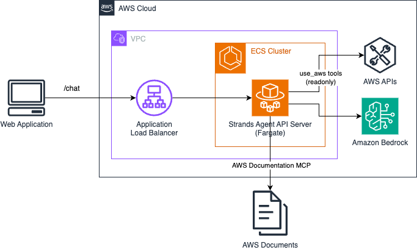
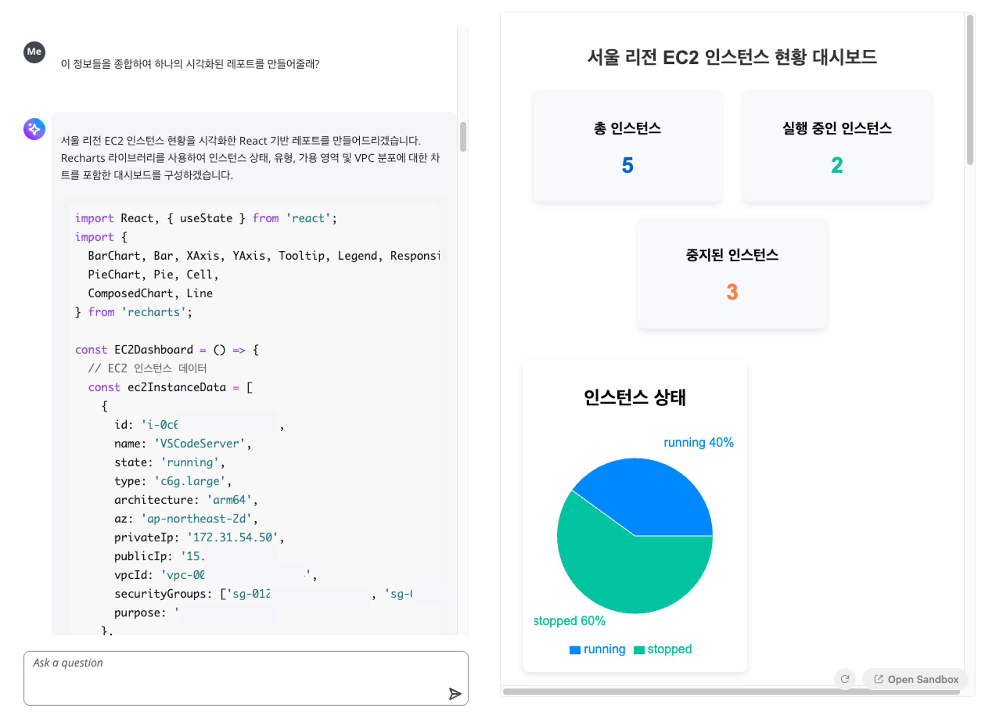
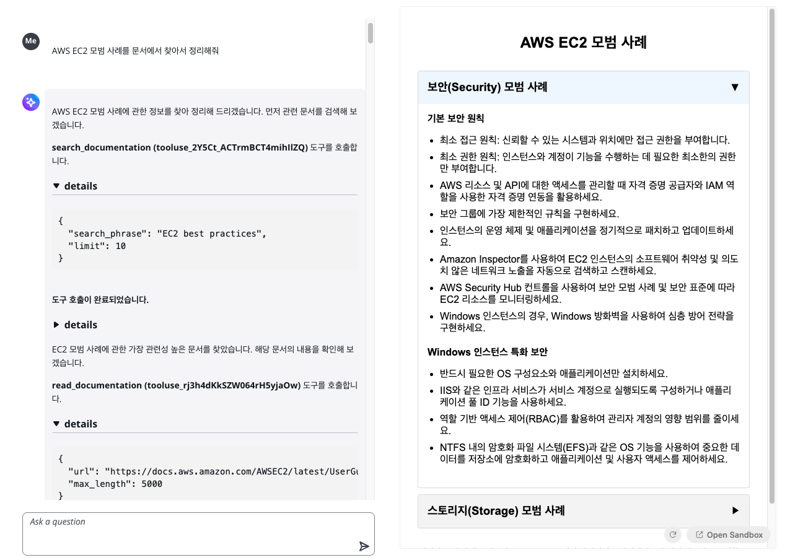

# AWS Strands Agents Chatbot

*Read this in other languages: [English](README.md), [한국어](README_ko.md)*

This sample application is an Generative AI-powered chatbot for AWS cloud resource management and data visualization. It includes a sample architecture for building generative AI-based AI Agents using [Strands Agents](https://strandsagents.com/latest/) and deploying them to AWS.

## Architecture



## Key Features

- **AWS Resource Management**: Cloud resource monitoring and optimization through AWS APIs

- **Real-time Data Visualization**: Chart generation for AWS metrics and resource data using Recharts

- **AWS Documentation Integration**: AWS official documentation search

- **Streaming Responses**: Real-time conversational interface
- **Code Execution**: Real-time JSX code preview and execution

## Tech Stack

### Frontend
- **React + TypeScript + Vite**: Modern web application framework
- **Cloudscape Design System**: AWS-style UI components
- **Sandpack**: Code execution and preview environment
- **React Markdown**: Markdown rendering

### Backend
- **FastAPI**: Python web framework
- **Strands Agents**: AI Agent framework
- **Amazon Bedrock**: LLM usage
- **AWS Documentation MCP (Model Context Protocol) Server**: AWS documentation server integration

## Installation and Setup

### Prerequisites
- Node.js 18+
- Python 3.12+
- AWS account and credentials setup

### Backend

#### Local Environment Testing
```bash
cd backend/docker
pip install -r requirements.txt

cd app
uvicorn app:app --reload --host 0.0.0.0 --port 8000
```

#### CDK Deployment


#### Environment Variables
Modify Frontend `.env` file
```
// Local environment testing
VITE_API_URL=http://localhost:8000

// CDK deployment
VITE_API_URL=http://{CDK_ALB_OUTPUT}
```

### Frontend Setup
```bash
cd frontend
npm install
npm run dev
```

### Usage

1. Access the application through a web browser
2. Enter AWS-related questions in the chat interface
3. Strands Agents calls AWS APIs and AWS Documentation MCP server to provide information
4. When JSX code is generated, use the "Apply" button to view real-time preview