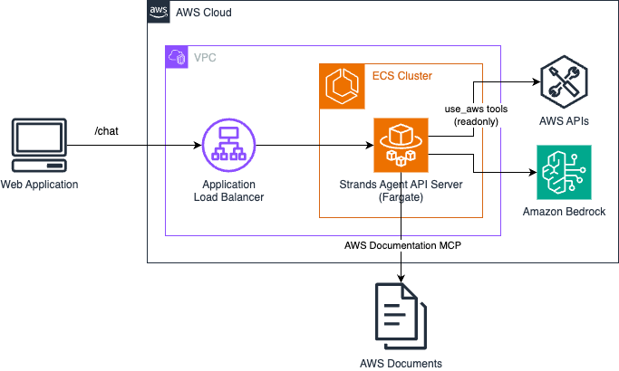
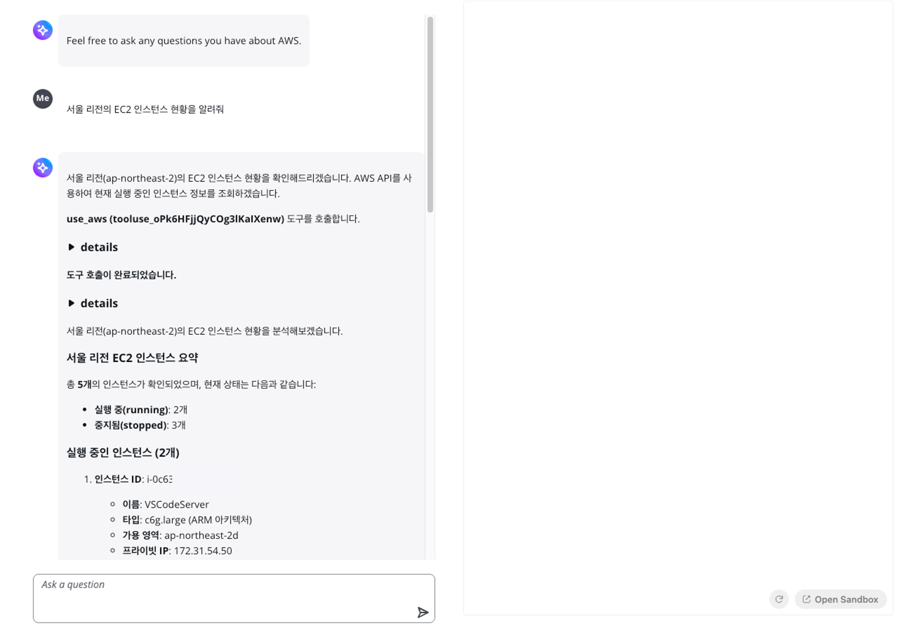
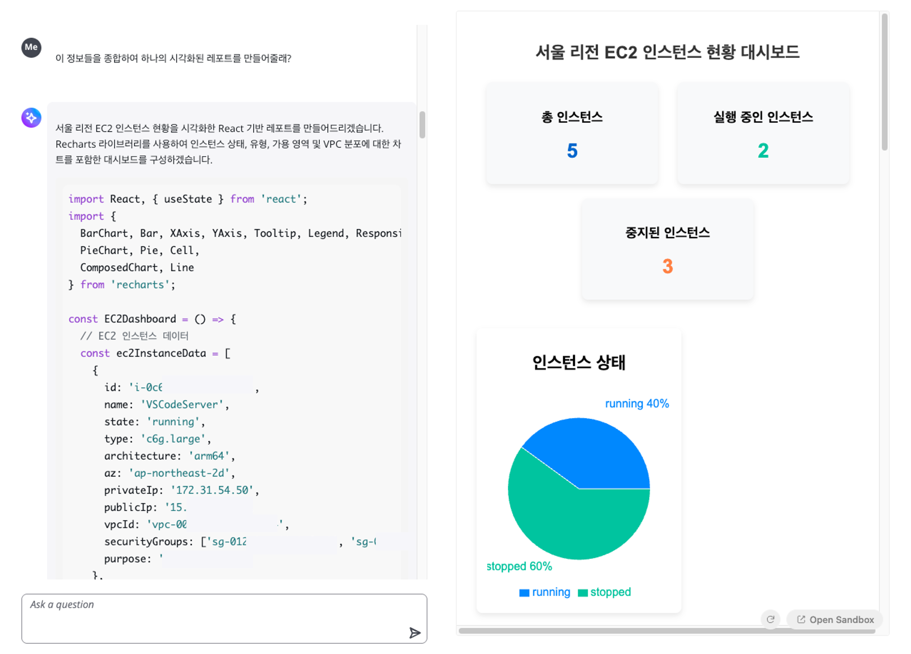
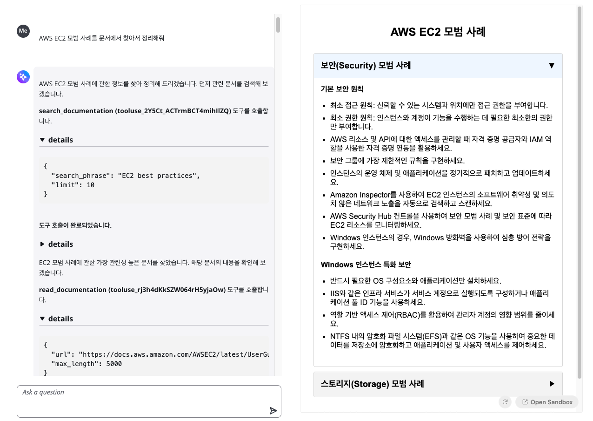

# AWS Strands Agents Chatbot

*Read this in other languages: [English](README.md), [한국어](README_ko.md)*

이 샘플 애플리케이션은 AWS 클라우드 리소스 관리 및 데이터 시각화를 위한 AI 기반 챗봇 애플리케이션입니다. [Strands Agents](https://strandsagents.com/latest/)를 활용하여 생성형 AI 기반의 AI Agent를 구축하고, 이를 AWS에 배포하는 샘플 아키텍처를 포함하고 있습니다.

## 아키텍처



## 주요 기능

- **AWS 리소스 관리**: AWS API를 통한 클라우드 리소스 모니터링 및 최적화

- **실시간 데이터 시각화**: Recharts를 사용한 AWS 메트릭 및 리소스 데이터 차트 생성

- **AWS 문서 통합**: AWS 공식 문서 검색

- **스트리밍 응답**: 실시간 대화형 인터페이스
- **코드 실행**: JSX 코드 실시간 미리보기 및 실행

## 기술 스택

### Frontend
- **React + TypeScript + Vite**: 모던 웹 애플리케이션 프레임워크
- **Cloudscape Design System**: AWS 스타일 UI 컴포넌트
- **Sandpack**: 코드 실행 및 미리보기 환경
- **React Markdown**: 마크다운 렌더링

### Backend
- **FastAPI**: Python 웹 프레임워크
- **Strands Agents**: AI Agent 프레임워크
- **Amazon Bedrock**: LLM 사용
- **AWS Documentation MCP (Model Context Protocol) Server**: AWS 문서 서버 통합

## 설치 및 실행

### 사전 요구사항
- Node.js 18+
- Python 3.12+
- AWS 계정 및 자격 증명 설정

### Backend

#### 로컬 환경 테스트
```bash
cd backend/docker
pip install -r requirements.txt

cd app
uvicorn app:app --reload --host 0.0.0.0 --port 8000
```

#### CDK 배포


#### 환경 변수
Frontend `.env` 파일 수정
```
// 로컬 환경 테스트
VITE_API_URL=http://localhost:8000

// CDK 배포
VITE_API_URL=http://{CDK_ALB_OUTPUT}
```

### Frontend 설정
```bash
cd frontend
npm install
npm run dev
```

## 사용법

1. 웹 브라우저를 통해 애플리케이션에 접속
2. 채팅 인터페이스에서 AWS 관련 질문 입력
3. Strands Agents가 AWS API와 AWS Documentation MCP 서버를 호출하여 정보 제공
4. JSX 코드가 생성되면 "Apply" 버튼으로 실시간 미리보기 확인