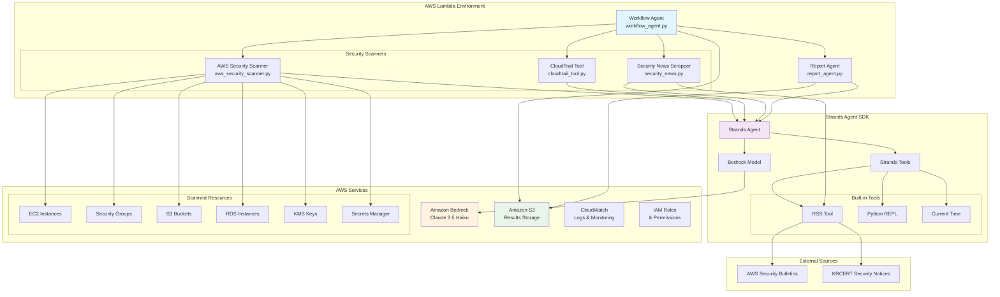

# AWS Security Analysis with Strands Agents

This project demonstrates how to build an intelligent AWS security analysis system using **Strands Agents SDK** and **AWS Lambda**. The system automatically scans AWS resources, analyzes CloudTrail events, monitors security news, and generates comprehensive HTML reports.

## Architecture



## Features

### Intelligent Security Analysis
- **AWS Resource Scanning**: Automatically discovers and analyzes 90+ AWS resources
- **Security Policy Evaluation**: Checks compliance against AWS security best practices
- **CloudTrail Analysis**: Analyzes recent CloudTrail events for security insights
- **Real-time Security News**: Monitors AWS and KRCERT security bulletins

### Strands Agent Integration
- **Multi-Agent Architecture**: Specialized agents for different security domains
- **Tool Integration**: Leverages RSS, Python REPL, and time tools
- **Bedrock Integration**: Uses Amazon Bedrock Claude 3.5 Haiku for intelligent analysis
- **Asynchronous Processing**: Efficient sequential execution of security scans

### Comprehensive Reporting
- **HTML Reports**: Professional security reports with charts and visualizations
- **S3 Storage**: Automatic storage of scan results and reports
- **Compliance Scoring**: Overall security compliance percentage
- **Risk Categorization**: High, medium, and low risk item classification

## Prerequisites

- AWS CLI configured with appropriate permissions
- Node.js 18+ and AWS CDK v2
- Python 3.12+
- Access to Amazon Bedrock (Claude 3.5 Haiku model)

## Installation and Deployment

### 1. Clone the Repository
```bash
git clone <repository-url>
cd aws-security-analysis-strands
```

### 2. Install CDK Dependencies
```bash
npm install -g aws-cdk
pip install -r requirements.txt
```

### 3. Configure AWS Bedrock Access
Ensure you have access to Amazon Bedrock and the Claude 3.5 Haiku model in your AWS region:
```bash
aws bedrock list-foundation-models --region us-east-1
```

If you don't have access, request model access in the AWS Console:
1. Go to Amazon Bedrock console
2. Navigate to "Model access" in the left sidebar
3. Click "Request model access"
4. Select "Anthropic Claude 3.5 Haiku" and submit request

### 4. Create Lambda Layer with Dependencies
The project uses a custom packaging script to create Lambda layers with the correct architecture:

```bash
# Install dependencies with correct architecture for Lambda
python package_for_lambda.py
```

This script:
- Installs Python dependencies with `--python-version 3.12 --platform manylinux2014_x86_64`
- Creates `dependencies.zip` with proper `/opt/python` structure for Lambda layers
- Creates `app.zip` with Lambda function code
- Handles architecture compatibility issues (feedparser, sgmllib3k, html2text)

### 5. Bootstrap CDK (First Time Only)
```bash
cdk bootstrap
```

This creates the necessary S3 bucket and IAM roles for CDK deployments in your account.

### 6. Deploy the Stack
```bash
cdk deploy --require-approval never
```

The deployment creates:
- Lambda function with 15-minute timeout and 2GB memory
- Lambda layer with Strands Agent dependencies
- S3 bucket for storing scan results and reports
- IAM roles with necessary permissions
- CloudWatch log groups for monitoring

## Testing and Usage

### Manual Lambda Execution
```bash
# Invoke the Lambda function
aws lambda invoke \
  --function-name AWSSecurityAgentFunction \
  --region us-east-1 \
  response.json

# Check the response
cat response.json
```

### Monitor Execution Progress
```bash
# Follow CloudWatch logs in real-time
aws logs tail /aws/lambda/AWSSecurityAgentFunction --follow --region us-east-1

# Or check specific log streams
aws logs describe-log-streams \
  --log-group-name "/aws/lambda/AWSSecurityAgentFunction" \
  --order-by LastEventTime --descending \
  --max-items 5 --region us-east-1
```

### Check Results in S3
The system automatically stores results in S3 with timestamped folders:
```bash
# List all scan results
aws s3 ls s3://aws-security-scan-<account-id>-<region>/ --recursive

# Example output:
# aws_security_scanner/20250820_051521/result.json
# cloudtrail_scanner/20250820_051521/result.json  
# security_news_scrapper/20250820_051521/result.json
# security_report/20250820_143350/security_report.html
```

### Download and View Reports
```bash
# Download the latest HTML report
aws s3 cp s3://aws-security-scan-<account-id>-<region>/security_report/latest/security_report.html ./report.html

# Open in browser (macOS)
open report.html

# Open in browser (Linux)
xdg-open report.html
```

### Test Individual Components
You can test individual scanners by modifying the Lambda handler or using the AWS Console test feature with different event payloads.

## Project Structure

```
├── app.py                      # CDK app entry point
├── agent_lambda_stack.py       # CDK stack definition with Lambda and Layer
├── agent_handler.py           # Lambda function handler
├── workflow_agent.py          # Main workflow orchestrator
├── package_for_lambda.py      # Lambda packaging script for dependencies
├── lambda/                    # Lambda function code
│   ├── aws_security_scanner.py    # AWS resource security scanner
│   ├── cloudtrail_tool.py         # CloudTrail event analyzer
│   ├── security_news.py           # Security news aggregator
│   ├── report_agent.py            # HTML report generator
│   └── requirements.txt           # Lambda dependencies (strands-agents, etc.)
├── report_template/           # HTML report templates
│   └── sample_report.html         # Report template with Tailwind CSS
├── packaging/                 # Build output directory
├── cdk.json                   # CDK configuration
└── requirements.txt           # CDK dependencies
```

## Configuration

### Environment Variables
The Lambda function uses these environment variables (automatically set by CDK):
- `SECURITY_SCAN_BUCKET`: S3 bucket for storing results
- `BYPASS_TOOL_CONSENT`: Enables automatic tool execution
- `PYTHONPATH`: Python module path for dependencies (`/opt/python`)
- `TMPDIR`, `TEMP`, `TMP`: Set to `/tmp` for python_repl compatibility

### IAM Permissions
The Lambda function requires permissions for:
- Amazon Bedrock (Claude 3.5 Haiku model)
- S3 (read/write to results bucket)
- EC2, RDS, KMS, Secrets Manager (resource scanning)
- CloudTrail (event analysis)
- CloudWatch Logs (logging)

All permissions are automatically configured by the CDK stack.

## Strands Agent Architecture

### Agent Hierarchy
```python
WorkflowAgent
├── AWSSecurityScanner (Strands Agent)
├── CloudTrailTool (Strands Agent)  
├── SecurityNewsScrapper (Strands Agent)
└── ReportAgent (Strands Agent)
```

### Tool Integration
Each agent leverages specific Strands tools:
- **RSS Tool**: For security news aggregation from AWS and KRCERT feeds
- **Python REPL**: For dynamic code execution and analysis (uses `/tmp` directory)
- **Current Time**: For time-based filtering and analysis

### Bedrock Model Configuration
```python
model = BedrockModel(
    region_name="us-east-1",
    model_id="us.anthropic.claude-3-5-haiku-20241022-v1:0"
)
```

## Security Checks

The system performs these security evaluations:

### AWS Resource Security
- **S3 Buckets**: Public access block settings
- **Security Groups**: SSH access restrictions (port 22 from 0.0.0.0/0)
- **EC2 Instances**: Security group configurations
- **RDS**: Encryption and backup settings
- **KMS Keys**: Key rotation and access policies
- **Secrets Manager**: Secret rotation and access

### CloudTrail Analysis
- Recent security-relevant events
- Unusual access patterns
- Failed authentication attempts
- Resource modification events

### Security News Monitoring
- AWS Security Bulletins RSS feed
- KRCERT Security Notices
- Recent 14-day security announcements
- CVE and vulnerability information

## Troubleshooting

### Common Issues

1. **Bedrock Access Denied**
   ```bash
   # Check model access in AWS Console
   aws bedrock list-foundation-models --region us-east-1
   
   # If access denied, request model access:
   # AWS Console > Bedrock > Model access > Request model access
   ```

2. **Lambda Timeout (15 minutes)**
   ```bash
   # Check CloudWatch logs for bottlenecks
   aws logs tail /aws/lambda/AWSSecurityAgentFunction --region us-east-1
   
   # Common causes:
   # - Bedrock API throttling (ThrottlingException)
   # - RSS feed loading issues
   # - Large number of AWS resources
   ```

3. **Memory Issues**
   ```bash
   # Current configuration: 2GB memory
   # Check memory usage in CloudWatch metrics
   aws cloudwatch get-metric-statistics \
     --namespace AWS/Lambda \
     --metric-name MemoryUtilization \
     --dimensions Name=FunctionName,Value=AWSSecurityAgentFunction
   ```

4. **Python REPL Errors**
   ```bash
   # The handler automatically changes to /tmp directory
   # Check logs for "Read-only file system" errors
   ```

5. **Dependency Issues**
   ```bash
   # Rebuild Lambda layer with correct architecture
   rm -rf packaging/_dependencies packaging/*.zip
   python package_for_lambda.py
   cdk deploy
   ```

### Monitoring and Debugging

Check CloudWatch logs for detailed execution information:
```bash
# Real-time log monitoring
aws logs tail /aws/lambda/AWSSecurityAgentFunction --follow --region us-east-1

# Get specific log events
aws logs get-log-events \
  --log-group-name "/aws/lambda/AWSSecurityAgentFunction" \
  --log-stream-name "<log-stream-name>" \
  --region us-east-1
```

Monitor Lambda metrics:
```bash
# Check concurrent executions
aws cloudwatch get-metric-statistics \
  --namespace AWS/Lambda \
  --metric-name ConcurrentExecutions \
  --dimensions Name=FunctionName,Value=AWSSecurityAgentFunction \
  --start-time 2025-08-20T05:00:00Z \
  --end-time 2025-08-20T07:00:00Z \
  --period 300 --statistics Maximum --region us-east-1
```

## Advanced Usage

### Custom Security Policies
Extend `aws_security_scanner.py` to add custom security checks:
```python
def check_custom_policy(aws_resources):
    """Add your custom security logic here"""
    rule = {
        "rule_id": "CUSTOM_RULE",
        "rule_name": "Custom Security Check",
        "service": "Custom",
        "description": "Your custom security policy",
        "severity": "HIGH",
        "compliance_status": "COMPLIANT",
        # ... implementation
    }
    return rule
```

### Additional RSS Feeds
Add more security news sources in `security_news.py`:
```python
self.feeds = [
    "https://aws.amazon.com/security/security-bulletins/rss/feed/",
    "https://knvd.krcert.or.kr/rss/securityNotice.do",
    "https://knvd.krcert.or.kr/rss/securityInfo.do",
    "https://your-custom-feed.com/rss",  # Add custom feeds
]
```

### Custom Report Templates
Modify `report_template/sample_report.html` for custom report layouts using Tailwind CSS and Chart.js.

## Clean Up

To remove all resources:
```bash
cdk destroy
```

This will delete:
- Lambda function and layer
- S3 bucket (if empty)
- IAM roles and policies
- CloudWatch log groups

## Contributing

1. Fork the repository
2. Create a feature branch
3. Make your changes
4. Test with `cdk deploy`
5. Submit a pull request

## License

This project is licensed under the MIT License - see the LICENSE file for details.

## Acknowledgments

- **Strands Agent SDK**: For providing the intelligent agent framework
- **Amazon Bedrock**: For powering the AI analysis capabilities
- **AWS CDK**: For infrastructure as code deployment
- **AWS Security Team**: For security best practices and guidelines

---

**Built with Strands Agents and AWS**
