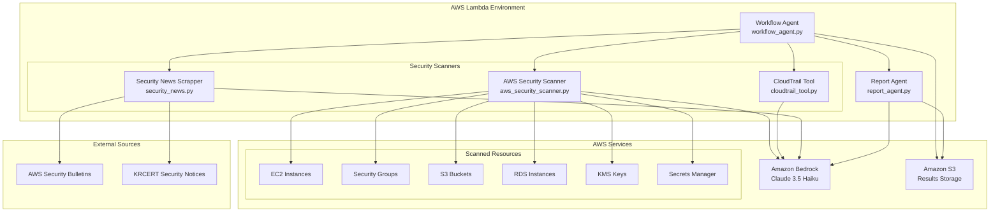

# AWS Security Analysis with Strands Agents

AWS 리소스 보안 분석을 위한 지능형 시스템입니다. **Strands Agents SDK**와 **AWS Lambda**를 사용하여 자동으로 AWS 리소스를 스캔하고, CloudTrail 이벤트를 분석하며, 보안 뉴스를 모니터링하여 종합적인 HTML 보고서를 생성합니다.

## 🏗 Architecture



## 🚀 Quick Start

### Prerequisites
- AWS CLI configured with appropriate permissions
- Node.js 18+ and AWS CDK v2
- Access to Amazon Bedrock (Claude 3.5 Haiku model)

### 1. Deploy
```bash
git clone <repository-url>
cd aws-security-analysis-strands
./deploy.sh
```

### 2. Run Security Analysis
```bash
# 비동기 실행 (권장)
aws lambda invoke \
  --function-name AWSSecurityAgentFunction \
  --region us-east-1 \
  --invocation-type Event \
  --payload '{}' \
  response.json
```

### 3. Check Results
```bash
# S3에서 결과 확인
aws s3 ls s3://aws-security-scan-<account-id>-<region>/security_report/ --recursive

# 최신 HTML 보고서 다운로드
aws s3 cp s3://aws-security-scan-<account-id>-<region>/security_report/latest/security_report.html ./report.html

# 브라우저에서 열기
open report.html  # macOS
```

## 📊 Features

### 🔍 **Security Analysis**
- **AWS Resource Scanning**: 90+ AWS 리소스 자동 검사
- **Security Policy Evaluation**: AWS 보안 모범 사례 준수 확인
- **CloudTrail Analysis**: 최근 CloudTrail 이벤트 보안 분석
- **Security News Monitoring**: AWS 및 KRCERT 보안 공지 실시간 모니터링

### 📈 **Intelligent Reporting**
- **HTML Reports**: 차트와 시각화가 포함된 전문적인 보안 보고서
- **Compliance Scoring**: 전체 보안 준수율 백분율
- **Risk Categorization**: 높음, 중간, 낮음 위험도 분류
- **S3 Storage**: 스캔 결과 및 보고서 자동 저장

## 🛠 Configuration

### Environment Variables (자동 설정)
- `SECURITY_SCAN_BUCKET`: S3 버킷 (결과 저장용)
- `BYPASS_TOOL_CONSENT`: 자동 도구 실행 활성화
- `PYTHONPATH`: Python 모듈 경로 (`/opt/python`)

### IAM Permissions (자동 구성)
Lambda 함수는 다음 권한이 필요합니다:
- Amazon Bedrock (Claude 3.5 Haiku 모델)
- S3 (결과 버킷 읽기/쓰기)
- EC2, RDS, KMS, Secrets Manager (리소스 스캔)
- CloudTrail (이벤트 분석)
- CloudWatch Logs (로깅)

## 📁 Project Structure

```
├── deploy.sh                     # 자동 배포 스크립트
├── app.py                        # CDK 앱 진입점
├── agent_lambda_stack.py         # CDK 스택 정의
├── agent_handler.py              # Lambda 함수 핸들러
├── workflow_agent.py             # 메인 워크플로우 오케스트레이터
├── lambda/                       # Lambda 함수 코드
│   ├── aws_security_scanner.py   # AWS 리소스 보안 스캐너
│   ├── cloudtrail_tool.py        # CloudTrail 이벤트 분석기
│   ├── security_news.py          # 보안 뉴스 수집기
│   └── report_agent.py           # HTML 보고서 생성기
└── report_template/              # HTML 보고서 템플릿
    └── sample_report.html        # Tailwind CSS 포함 보고서 템플릿
```

## 🔧 Development

### 코드 변경 후 재배포
```bash
./deploy.sh
```

### 로그 모니터링
```bash
# 실시간 로그 확인
aws logs tail /aws/lambda/AWSSecurityAgentFunction --follow --region us-east-1

# 특정 로그 스트림 확인
aws logs get-log-events \
  --log-group-name "/aws/lambda/AWSSecurityAgentFunction" \
  --log-stream-name "<log-stream-name>" \
  --region us-east-1
```

### 결과 확인
```bash
# 모든 스캔 결과 나열
aws s3 ls s3://aws-security-scan-<account-id>-<region>/ --recursive

# 특정 결과 다운로드
aws s3 cp s3://aws-security-scan-<account-id>-<region>/security_news_scrapper/latest/result.json ./
```

## 🧹 Clean Up

```bash
cdk destroy
```

## 🔒 Security Checks

시스템이 수행하는 보안 평가:

### AWS Resource Security
- **S3 Buckets**: 퍼블릭 액세스 차단 설정
- **Security Groups**: SSH 액세스 제한 (포트 22, 0.0.0.0/0)
- **EC2 Instances**: 보안 그룹 구성
- **RDS**: 암호화 및 백업 설정
- **KMS Keys**: 키 로테이션 및 액세스 정책
- **Secrets Manager**: 시크릿 로테이션 및 액세스

### CloudTrail Analysis
- 최근 보안 관련 이벤트
- 비정상적인 액세스 패턴
- 인증 실패 시도
- 리소스 수정 이벤트

### Security News Monitoring
- AWS Security Bulletins RSS 피드
- KRCERT 보안 공지
- 최근 14일 보안 발표
- CVE 및 취약점 정보

## 📞 Support

문제가 발생하면 CloudWatch 로그를 확인하거나 이슈를 생성해주세요.

---

**Built with Strands Agents and AWS** 🚀
