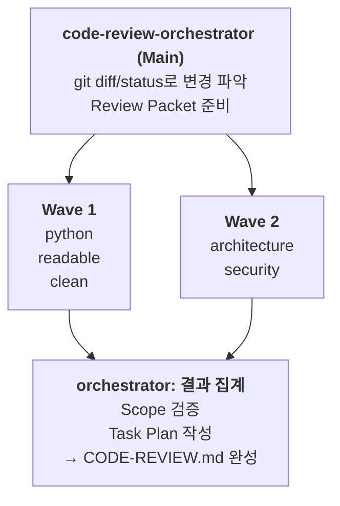

# Kiro Code Review Agents

Git 변경사항을 자동으로 분석하고 다각도로 코드 리뷰를 수행하는 Kiro Agent 세트입니다.

## 이 디렉토리만 클론하기

전체 레포가 크기 때문에, 이 디렉토리만 받으려면 sparse-checkout을 사용하세요:

```bash
git clone --depth=1 https://github.com/aws-samples/aws-kr-startup-samples.git
cd aws-kr-startup-samples
git sparse-checkout init --cone
git sparse-checkout set kiro/agents/code-review
```

## Agents

| Agent | 역할 |
|-------|------|
| `code-review-orchestrator` | 메인 오케스트레이터. diff 수집, subagent 호출, CODE-REVIEW.md 작성, Task Plan 생성 |
| `code-review-python` | Python 코드 리뷰 (타입힌트, 에러처리, PEP8) |
| `code-review-readable` | 가독성 리뷰 (The Art of Readable Code 기반) |
| `code-review-clean-code` | Clean Code 원칙 리뷰 (SOLID, 코드 스멜) |
| `code-review-architecture` | 아키텍처 리뷰 (모듈 경계, 의존성, 배포) |
| `code-review-security` | 보안 리뷰 (OWASP Top 10, 인젝션, 인증) |

## Flow



## 설치

```bash
./install.sh
```

`~/.kiro/agents/`와 `~/.kiro/prompts/`에 파일이 복사됩니다.

## 사용법

> ⚠️ **중요**: `code-review-orchestrator`는 반드시 **Main Agent**로 실행해야 합니다.
> 이 에이전트가 다른 subagent들을 호출하는 오케스트레이터 역할을 하기 때문입니다.

### 에이전트 전환

```
/agent swap code-review-orchestrator
```

### 코드 리뷰 실행

에이전트 전환 후 코드 리뷰를 요청합니다:

```
코드 리뷰 해줘
```

## 출력물

- `CODE-REVIEW.md` - 통합 리뷰 결과 + Task Plan
