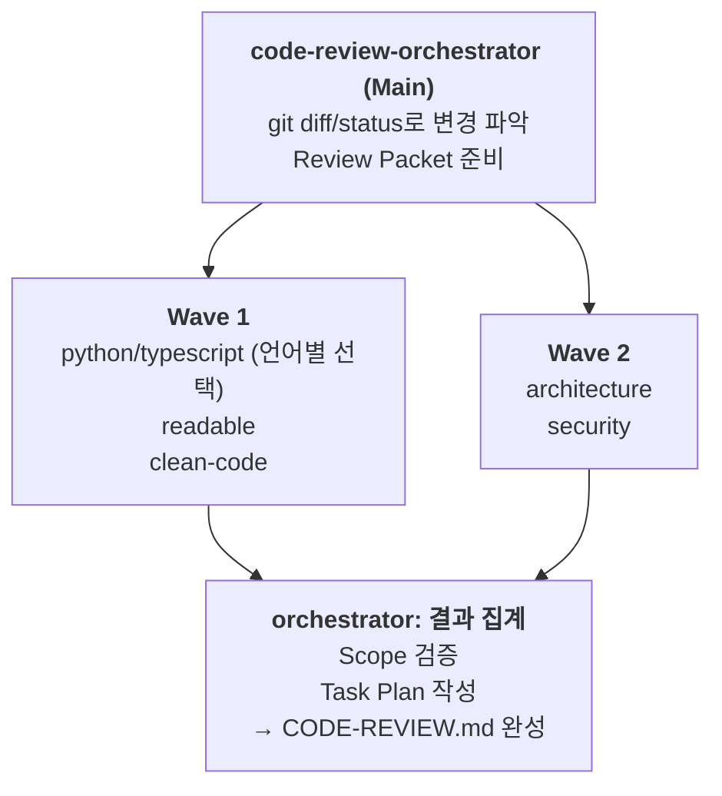

# Kiro Code Review Agents

Git 변경사항을 자동으로 분석하고 다각도로 코드 리뷰를 수행하는 Kiro Agent 세트입니다.

## 주요 기능

- 🔍 **자동 변경 감지**: git diff/status 기반으로 리뷰 대상 자동 파악
- 🌐 **다국어 지원**: Python, TypeScript/JavaScript 언어별 전문 리뷰
- 📚 **다각도 분석**: 가독성, Clean Code, 아키텍처, 보안 관점의 종합 리뷰
- 📋 **Task Plan 생성**: 우선순위별 개선 작업 목록 자동 생성

## 요구사항

- [Kiro CLI](https://kiro.dev) 설치 필요
- Git 저장소에서 실행

## 설치

```bash
git clone --depth=1 https://github.com/aws-samples/aws-kr-startup-samples.git
cd aws-kr-startup-samples
git sparse-checkout init --cone
git sparse-checkout set kiro/agents/code-review

cd kiro/agents/code-review
./install.sh
```

`~/.kiro/agents/`와 `~/.kiro/prompts/`에 파일이 복사됩니다.

## 사용법

### 1. 에이전트 전환

```
/agent swap code-review-orchestrator
```

> ⚠️ **중요**: `code-review-orchestrator`는 반드시 **Main Agent**로 실행해야 합니다.

### 2. 코드 리뷰 실행

```
코드 리뷰 해줘
```

### 리뷰 대상 지정 (선택)

기본적으로 현재 작업 중인 변경사항(staged + unstaged)을 리뷰합니다. 특정 범위를 지정할 수도 있습니다:

```
# 특정 파일만 리뷰
src/api/user.py 리뷰해줘

# 특정 커밋 범위 리뷰
main..feature-branch 커밋 범위 리뷰해줘

# 최근 커밋 리뷰
마지막 커밋 리뷰해줘
```

## 출력물

리뷰 완료 후 프로젝트 루트에 `CODE-REVIEW.md` 파일이 생성됩니다:

```markdown
# Code Review Report

## Overview
- 변경 요약 및 리뷰 범위

## Findings (P0 → P4)
- P0: 크리티컬 (회귀, 보안 취약점)
- P1: 중요 (버그, 타입 안전성)
- P2: 권장 (테스트 가능성, 구조)
- P3: 개선 (가독성, 네이밍)
- P4: 사소함 (스타일)

## Task Plan
- 우선순위별 개선 작업 목록
```

## Agents

| Agent | 역할 | 언어 |
|-------|------|------|
| `code-review-orchestrator` | 메인 오케스트레이터. diff 수집, subagent 호출, 결과 통합 | - |
| `code-review-python` | Python 전문 리뷰 (타입힌트, 에러처리, PEP8) | 🐍 |
| `code-review-typescript` | TypeScript 전문 리뷰 (타입 안전성, any 금지, 모던 패턴) | 📘 |
| `code-review-readable` | 가독성 리뷰 (The Art of Readable Code 기반) | 전체 |
| `code-review-clean-code` | Clean Code 원칙 리뷰 (SOLID, 코드 스멜) | 전체 |
| `code-review-architecture` | 아키텍처 리뷰 (모듈 경계, 의존성) | 전체 |
| `code-review-security` | 보안 리뷰 (OWASP Top 10, 인젝션, 인증) | 전체 |

## 리뷰 흐름



## 커스터마이징

### Steering 문서 추가

프로젝트별 코딩 컨벤션이나 리뷰 기준을 추가하려면 프로젝트 루트의 `.kiro/steering/` 디렉토리에 마크다운 파일을 생성하세요:

```bash
mkdir -p .kiro/steering
echo "# 프로젝트 코딩 컨벤션\n- 함수명은 snake_case 사용\n- ..." > .kiro/steering/conventions.md
```

Agent들이 자동으로 참조합니다.

## 문제 해결

### "subagent를 찾을 수 없습니다"

설치 스크립트를 다시 실행하세요:
```bash
./install.sh
```

### 리뷰가 너무 오래 걸림

대규모 변경의 경우 특정 파일만 지정하여 리뷰하세요:
```
src/core/ 디렉토리만 리뷰해줘
```

## 라이선스

이 프로젝트는 MIT-0 라이선스를 따릅니다.
