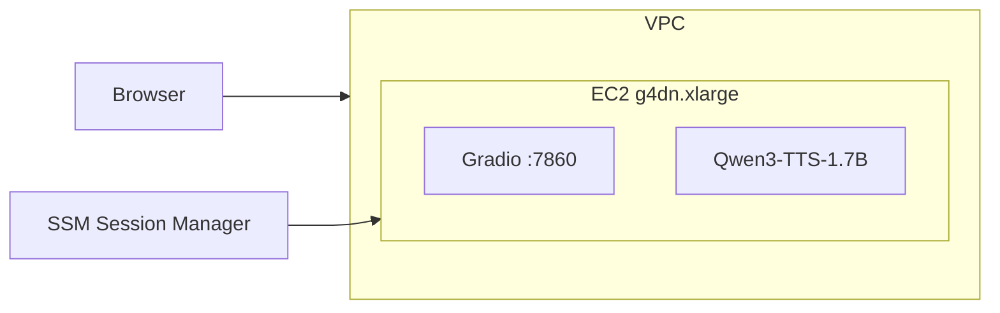

# Qwen3-TTS AWS EC2 Deployment

AWS EC2 GPU 인스턴스에 Qwen3-TTS 모델을 원클릭 배포하는 CDK 템플릿입니다.
배포 완료 후 브라우저에서 바로 TTS(Text-to-Speech)를 테스트할 수 있습니다.
CDK 배포 완료 후, 약 10분정도 setup이 진행되며 CloudWatch Logs에서 진행 상황을 확인할 수 있습니다.

## Features

- **배포**: `cdk deploy` 한 번으로 전체 인프라 + 모델 + UI 배포
- **Gradio UI**: 브라우저에서 바로 TTS 테스트 가능
- **CloudWatch 로그**: 설정 과정 실시간 모니터링

## Architecture



## Prerequisites

- AWS CLI 설정 완료
- Node.js 18+
- AWS CDK CLI (`npm install -g aws-cdk`)
- g4dn.xlarge 서비스 쿼터 확인 (vCPU 4개 필요)

## Quick Start

```bash
# 1. 의존성 설치
cd cdk
npm install

# 2. 배포 (약 10-15분 소요)
AWS_REGION=ap-northeast-2 npx cdk deploy --require-approval never

# 3. 출력된 GradioUrl로 브라우저 접속
# 예: http://xx.xx.xx.xx:7860
```

## Outputs

배포 완료 후 다음 정보가 출력됩니다:

| Output | 설명 |
|--------|------|
| GradioUrl | Gradio UI 접속 URL |
| InstanceId | EC2 인스턴스 ID |
| SsmConnectCommand | SSM 접속 명령어 |
| LogGroupUrl | CloudWatch 로그 URL |

## Model Info

| 항목 | 값 |
|------|-----|
| Model | Qwen3-TTS-12Hz-1.7B-CustomVoice |
| Instance | g4dn.xlarge (T4 16GB) |
| Speakers | aiden, dylan, eric, ono_anna, ryan, serena, sohee, uncle_fu, vivian |
| Languages | auto, chinese, english, french, german, italian, japanese, korean, portuguese, russian, spanish |

## Management

```bash
# SSM으로 인스턴스 접속
aws ssm start-session --target <instance-id>

# Gradio 서버 로그 확인 (인스턴스 내부)
tail -f /var/log/gradio-server.log

# 서버 재시작 (인스턴스 내부)
pkill -f server.py
export HF_HOME=/opt/huggingface
nohup python3 /opt/app/server.py > /var/log/gradio-server.log 2>&1 &

# 스택 삭제
AWS_REGION=ap-northeast-2 npx cdk destroy --force
```

## Cost

| 리소스 | 예상 비용 |
|--------|----------|
| g4dn.xlarge | ~$0.526/hour (On-Demand, ap-northeast-2) |
| EBS 100GB | ~$8/month |

**주의**: 사용하지 않을 때는 `cdk destroy`로 리소스를 삭제하세요.

## Customization

다른 모델로 교체하려면:

1. `scripts/setup.sh` - 패키지 설치 및 모델 다운로드 수정
2. `scripts/server.py` - Gradio UI 수정
3. `cdk/lib/cdk-stack.ts` - 인스턴스 타입 변경 (필요시)

상세 가이드: [.claude/deployment-checklist.md](.claude/deployment-checklist.md)

## Troubleshooting

### SSM 접속 안됨
- 인스턴스 상태 확인: `aws ec2 describe-instance-status --instance-ids <id>`
- 보통 5분 내 SSM Agent 등록됨

### Gradio 접속 안됨
- Security Group 확인: 7860 포트 Inbound 열려있는지
- 서버 프로세스 확인: `pgrep -f server.py`
- 로그 확인: `tail -f /var/log/gradio-server.log`

### 모델 로딩 실패
- CloudWatch 로그 확인: `/qwen3-tts/model-setup`
- GPU 메모리 확인: `nvidia-smi`

## Project Structure

```
├── README.md                     # 이 파일
├── CLAUDE.md                     # Claude Code 설정 (AI 어시스턴트용)
├── .claude/
│   ├── deployment-checklist.md   # 새 모델 배포 시 체크리스트
│   ├── lessons-learned.md        # 문제 해결 기록
│   └── current-deployment.md     # 현재 배포 상태
├── cdk/
│   ├── bin/cdk.ts               # CDK 앱 진입점
│   ├── lib/cdk-stack.ts         # 인프라 정의 (VPC, EC2, SG, IAM)
│   ├── package.json
│   └── tsconfig.json
└── scripts/
    ├── setup.sh                 # EC2 초기화 스크립트
    └── server.py                # Gradio 서버
```

## License

MIT
