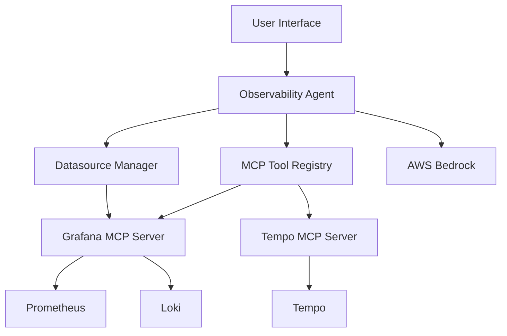

# Observability Assistant

A specialized AI-powered agent that helps analyze traces, logs, and metrics from observability platforms. The assistant can convert trace IDs to related logs, query observability data, and provide actionable insights through both CLI and web interfaces.

## 🎯 Features

### 🔍 **Natural Language Observability Queries**
- **Prometheus metrics**: Query metrics, alerts, and performance data using natural language
- **Loki logs**: Search and analyze logs across services with conversational queries
- **Tempo traces**: Explore distributed traces and spans through intuitive interactions
- **Cross-platform insights**: Correlate data across all three observability pillars for comprehensive debugging

### 🛠️ **Advanced Observability Tools**
- **Trace-to-logs correlation**: Automatically convert trace IDs to related log queries
- **Custom MCP tools**: Enhanced functionality built on top of standard MCP server capabilities
- **Smart query generation**: Uses datasource configurations to build optimized queries
- **Context-aware analysis**: Leverages cached configurations for efficient operations

### 🤖 **AI-Powered Debugging Assistant**
- **Conversational interface**: Ask questions about your system's behavior in plain English
- **AWS Bedrock integration**: Powered by Claude for intelligent observability insights
- **Real-time analysis**: Streaming responses for immediate feedback during debugging sessions
- **Actionable recommendations**: Get specific suggestions for troubleshooting and optimization

### 🔌 **MCP Server Integration**
- **Grafana MCP Server**: Direct integration with Prometheus and Loki datasources
- **Tempo MCP Server**: Specialized server for distributed tracing queries
- **Extensible architecture**: Model Context Protocol enables easy addition of new observability tools
- **Multi-server support**: Connect to multiple MCP servers for comprehensive coverage

### 💻 **Multiple Interfaces**
- **CLI interface**: Command-line tool for direct interaction
- **Web interface**: Streamlit-based web UI for browser access

## 🏗️ Architecture

### Integration Architecture


## 🚀 Getting Started

### Prerequisites
- **Python 3.11+**
- **AWS Account** with Bedrock access
- **Grafana instance** with Prometheus and Loki datasources
- **Tempo instance** for distributed tracing
- **MCP servers** for Grafana and Tempo integration

### Installation

1. **Clone the repository**
   ```bash
   git clone <repository-url>
   cd observability-assistant
   ```

2. **Create and activate a virtual environment**
   ```bash
   # Create virtual environment
   python -m venv .venv
   
   # Activate virtual environment
   # On macOS/Linux:
   source .venv/bin/activate
   
   # On Windows:
   # .venv\Scripts\activate
   ```

3. **Install dependencies**
   ```bash
   pip install -e .
   ```

3. **Configure environment variables**
   ```bash
   # Copy the environment template
   cp env.template .env
   
   # Edit .env with your actual values
   # Required variables:
   # - BEDROCK_MODEL_ID
   # - BEDROCK_REGION (or AWS_REGION)
   # - GRAFANA_MCP_URL
   ```

## 🚀 Production Deployment (EKS)

For production deployment to Amazon EKS with CDK and Helm:

### Prerequisites
- **AWS CDK**: Install with `npm install -g aws-cdk`
- **Helm**: Install with `curl https://raw.githubusercontent.com/helm/helm/main/scripts/get-helm-3 | bash`
- **Existing EKS cluster**: The deployment targets an existing cluster

### Deploy to EKS

1. **Navigate to CDK directory**:
   ```bash
   cd cdk
   ```

2. **Set up Python environment**:
   ```bash
   python -m venv .venv
   source .venv/bin/activate  # On Windows: .venv\Scripts\activate
   pip install -r requirements.txt
   ```

3. **Configure environment variables**:
   ```bash
   # Set required environment variables for MCP servers
   export GRAFANA_URL="https://your-grafana-instance.com"
   export GRAFANA_API_KEY="your-grafana-api-key"
   export TEMPO_URL="https://your-tempo-instance.com"
   export BEDROCK_MODEL_ID="anthropic.claude-3-7-sonnet-20250219-v1:0"
   export BEDROCK_REGION="us-east-1"
   ```

4. **Deploy everything**:
   ```bash
   ./deploy.sh <cluster-name> [region]
   ```

   Example:
   ```bash
   ./deploy.sh my-eks-cluster ap-northeast-2
   ```

5. **Access the web interface**:
   ```bash
   kubectl get service observability-assistant -n observability
   ```

6. **Clean up when done**:
   ```bash
   ./cleanup.sh <cluster-name> [region]
   ```

See [cdk/README.md](cdk/README.md) for detailed deployment instructions.

## 📖 Usage Guide

### CLI Interface

**Start the interactive CLI:**
```bash
python -m observability_agent.interfaces.cli
```

**Example interactions:**
```
You: Find logs for trace ID abc123def456
Assistant: I'll help you find logs related to trace ID abc123def456...

You: What logs are associated with trace abc123def456 and span 789xyz?
Assistant: Searching for logs with trace ID abc123def456 and span ID 789xyz...

You: exit
```

### Web Interface

**Start the Streamlit web app:**
```bash
streamlit run src/observability_agent/interfaces/web.py
```

Then open your browser to `http://localhost:8501` for the web interface.

### Configuration

All settings are configured through **environment variables**. The application will load variables from a `.env` file if present.

**Required environment variables:**
- `BEDROCK_MODEL_ID`: The Bedrock model to use (default: anthropic.claude-3-5-sonnet-20240620-v1:0)
- `BEDROCK_REGION`: AWS region for Bedrock (default: ap-northeast-2)  
- `GRAFANA_MCP_URL`: URL of your Grafana MCP server

**Optional environment variables:**
- `AWS_REGION`: Alternative to BEDROCK_REGION
- `ADDITIONAL_MCP_URLS`: Comma-separated list of additional MCP server URLs

**Configuration files:**
- `env.template`: Template showing all available environment variables
- `.env`: Your local environment variables (copy from env.template)

## 🛠️ Development

### Project Structure Guidelines
- **File size limit**: Maximum 500 lines per file
- **Import patterns**: Use domain-specific imports (`observability_agent.datasources.cache`)
- **Testing**: Each domain can be tested independently

### Running Tests
```bash
# Install development dependencies
pip install -e ".[dev]"

# Run tests
pytest

# Code formatting
black src/
isort src/
```

### Adding New Features
1. Follow the domain-based organization
2. Maintain single responsibility per file
3. Use proper import patterns
4. Update documentation and tests

## 🤝 Contributing

1. Fork the repository
2. Create a feature branch: `git checkout -b feature/new-feature`
3. Follow the project structure guidelines
4. Add tests for new functionality
5. Submit a pull request

## 📄 License

This project is licensed under the MIT License - see the LICENSE file for details.

## 🙋 Support

For questions or issues:
1. Check the troubleshooting section above
2. Review the [project structure rule](.cursor/rules/project-structure.mdc)
3. Open an issue with detailed error information and steps to reproduce 