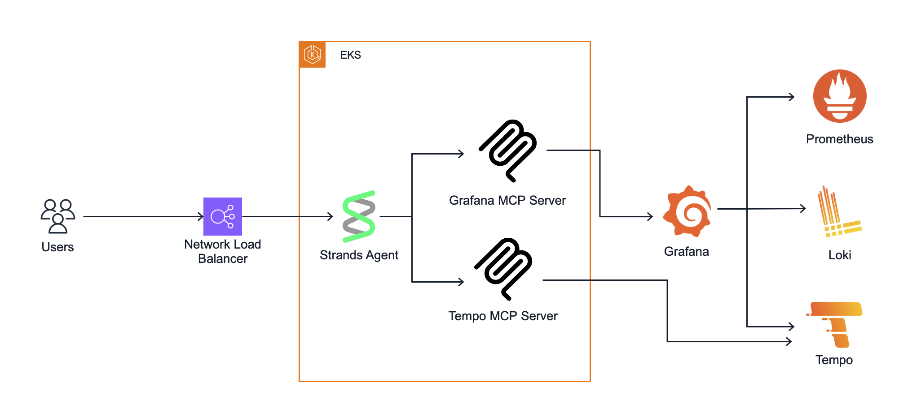
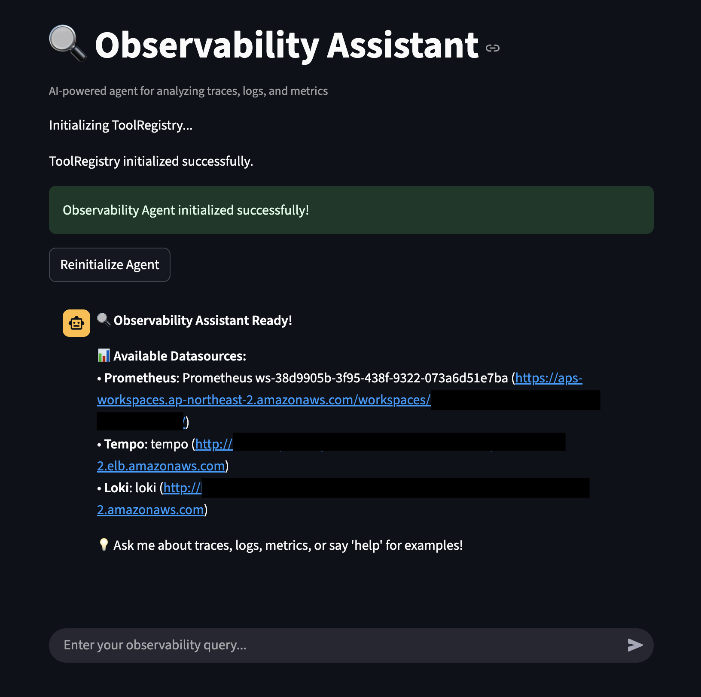
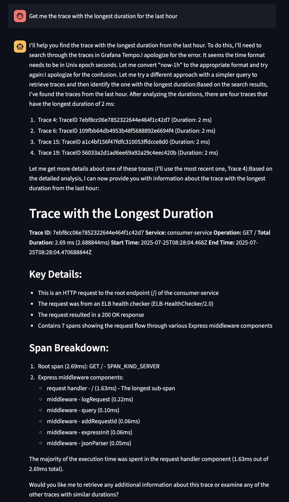
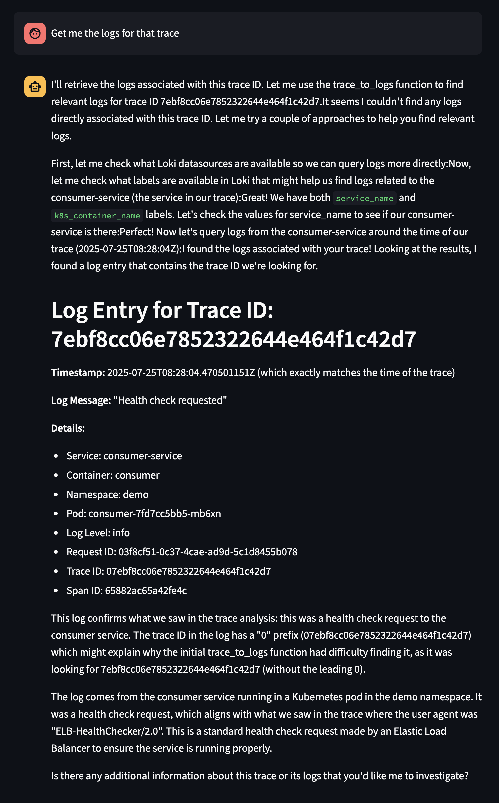

# Observability Assistant

A specialized AI-powered agent that helps analyze traces, logs, and metrics from observability platforms. The assistant can convert trace IDs to related logs, query observability data, and provide actionable insights through both CLI and web interfaces.

## 🏗️ Project Overview

This project leverages several key components to provide comprehensive observability insights:

### **Agent Framework**
- **Strands Agent**: The core agent framework that orchestrates AI-powered observability analysis and interactions

### **MCP Server Integration**
- **Grafana MCP Server**: Connects directly to your Grafana instance to query Prometheus metrics and Loki logs
- **Tempo MCP Server**: Dedicated server for distributed tracing queries since Grafana MCP Server doesn't include Tempo tools

### **Data Source Requirements**
Your Grafana instance must be properly configured with the following datasources to function correctly:
- **Prometheus**: For metrics collection and querying
- **Loki**: For log aggregation and search
- **Tempo**: For distributed tracing (accessed via dedicated Tempo MCP Server)

This architecture enables seamless correlation between metrics, logs, and traces through natural language interactions.

## 🎯 Features

### 🔍 **Natural Language Observability Queries**
- **Prometheus metrics**: Query metrics, alerts, and performance data using natural language
- **Loki logs**: Search and analyze logs across services with conversational queries
- **Tempo traces**: Explore distributed traces and spans through intuitive interactions
- **Cross-platform insights**: Correlate data across all three observability pillars for comprehensive debugging

### 🛠️ **Advanced Observability Tools**
- **Trace-to-logs correlation**: Automatically convert trace IDs to related log queries
- **Custom MCP tools**: Enhanced functionality built on top of standard MCP server capabilities
- **Smart query generation**: Uses datasource configurations to build optimized queries
- **Context-aware analysis**: Leverages cached configurations for efficient operations

### 🤖 **AI-Powered Debugging Assistant**
- **Conversational interface**: Ask questions about your system's behavior in plain English
- **AWS Bedrock integration**: Powered by Claude for intelligent observability insights
- **Real-time analysis**: Streaming responses for immediate feedback during debugging sessions
- **Actionable recommendations**: Get specific suggestions for troubleshooting and optimization

### 💻 **Multiple Interfaces**
- **CLI interface**: Command-line tool for direct interaction
- **Web interface**: Streamlit-based web UI for browser access

## 🏗️ Architecture



## 🚀 Deployment (EKS)

For production deployment to Amazon EKS with CDK and Helm:

### Prerequisites
- **AWS Account** with Bedrock access
- **Grafana instance** with Prometheus, Loki, and Tempo datasources configured
- **Grafana Service Account Token**: You'll need to create a service account and generate an API token for authentication. Follow the [Grafana Service Accounts documentation](https://grafana.com/docs/grafana/latest/administration/service-accounts/) to:
  1. Create a service account in your Grafana instance
  2. Assign appropriate permissions (Viewer role minimum, Editor recommended for full functionality)
  3. Generate a service account token
  4. Use this token as your `GRAFANA_API_KEY` environment variable
- **Tempo instance** for distributed tracing
- **AWS CDK**: Install with `npm install -g aws-cdk`
- **Helm**: Install with `curl https://raw.githubusercontent.com/helm/helm/main/scripts/get-helm-3 | bash`
- **Existing EKS cluster**: The deployment targets an existing cluster

### Deploy to EKS

1. **Navigate to CDK directory**:
   ```bash
   cd cdk
   ```

2. **Set up Python environment**:
   ```bash
   python -m venv .venv
   source .venv/bin/activate  # On Windows: .venv\Scripts\activate
   pip install -r requirements.txt
   ```

3. **Configure environment variables**:
   ```bash
   # Set required environment variables for MCP servers
   export GRAFANA_URL="https://your-grafana-instance.com"
   export GRAFANA_API_KEY="your-grafana-api-key"
   export TEMPO_URL="https://your-tempo-instance.com"
   export BEDROCK_MODEL_ID="us.anthropic.claude-3-7-sonnet-20250219-v1:0"
   export BEDROCK_REGION="us-east-1"
   
   # Optional: Set Tempo authentication (if required by your Tempo instance)
   export TEMPO_USERNAME="your-tempo-username"
   export TEMPO_PASSWORD="your-tempo-password"
   # OR use bearer token instead of username/password
   export TEMPO_TOKEN="your-tempo-bearer-token"
   ```

4. **Deploy everything**:
   ```bash
   ./deploy.sh <cluster-name> [region]
   ```

   Example:
   ```bash
   ./deploy.sh my-eks-cluster ap-northeast-2
   ```

5. **Access the web interface with url from**:
   ```bash
   kubectl get service observability-assistant -n observability
   ```

6. **Clean up when done**:
   ```bash
   ./cleanup.sh <cluster-name> [region]
   ```

See [cdk/README.md](cdk/README.md) for detailed deployment instructions.

## 📖 Usage Guide

### Web Interface (EKS Deployment)

After deploying to EKS, access the web interface through the Kubernetes service:

1. **Get the service URL:**
   ```bash
   kubectl -n observability get service observability-assistant
   ```

2. **Access the web interface:**
   - Copy the external IP or load balancer URL from the service output
   - Open your browser and navigate to the service URL
   - The web interface provides an intuitive chat-based interface for observability queries

**Example interactions through the web interface:**





## 🤝 Contributing

1. Fork the repository
2. Create a feature branch: `git checkout -b feature/new-feature`
3. Follow the project structure guidelines
4. Add tests for new functionality
5. Submit a pull request

## 📄 License

This project is licensed under the MIT License - see the LICENSE file for details.

## 🙋 Support

For questions or issues:
1. Check the troubleshooting section above
2. Review the [project structure rule](.cursor/rules/project-structure.mdc)
3. Open an issue with detailed error information and steps to reproduce 