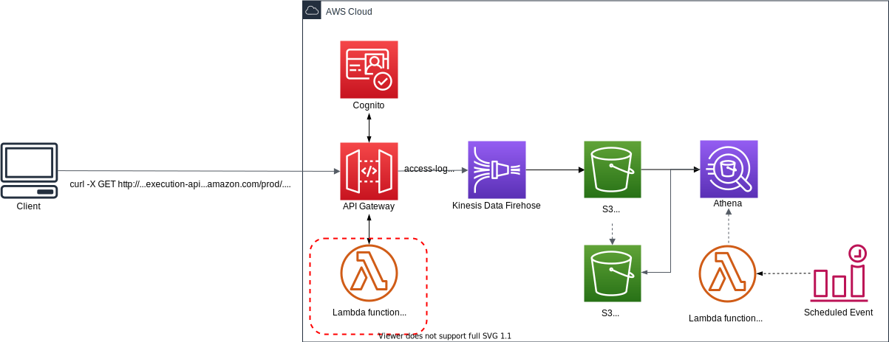
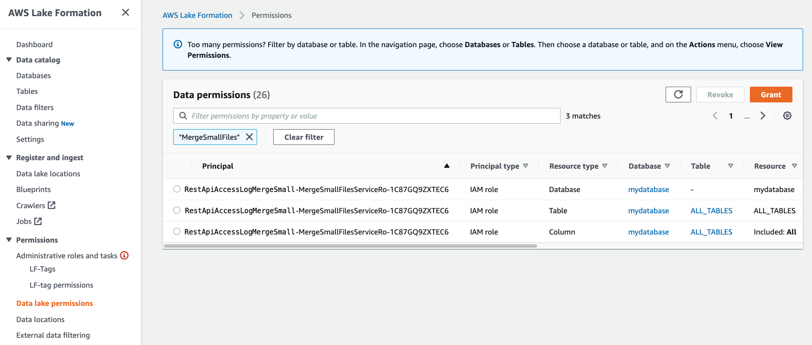
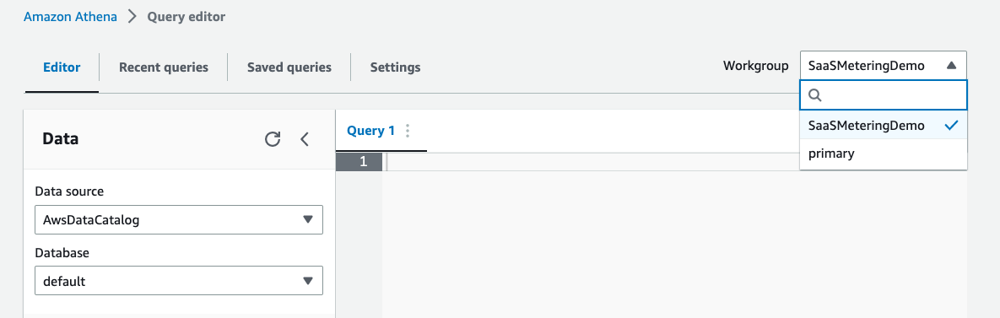

# SaaS Metering system on AWS demo project!

This SaaS Metering system allows Software-as-a-Service (SaaS) providers to accurately meter and bill their customers based on precise **API usage**. This fully-managed service streamlines tracking and monetizing SaaS offerings by enabling **usage-based billing models**.

**Key features**:

1. **Usage-Based Billing**: Bill customers only for what they use based on API calls, data transfers, or custom metrics aligned with your business model.
2. **Seamless Integration**: Integrate with existing AWS infrastructure to instrument applications and capture real-time usage data.
3. **Automated Billing**: Automate billing and invoicing processes, reducing overhead.
4. **Scalability and Reliability**: Highly scalable and reliable service to support SaaS business growth.
5. **Flexible Pricing Models**: Easily extensible to support pay-per-use, tiered pricing, and custom pricing rules.

This SaaS Metering system can unlock new revenue streams, improve customer satisfaction, and provide a competitive edge in the SaaS market through accurate usage-based billing. Getting started is straightforward with this solution. SaaS providers can now streamline billing processes, optimize pricing strategies, and drive business growth with this new AWS service.

This repository provides you cdk scripts and sample codes on how to implement a simple SaaS metering system.

Below diagram shows what we are implementing.



The `cdk.json` file tells the CDK Toolkit how to execute your app.

This project is set up like a standard Python project.  The initialization
process also creates a virtualenv within this project, stored under the `.venv`
directory.  To create the virtualenv it assumes that there is a `python3`
(or `python` for Windows) executable in your path with access to the `venv`
package. If for any reason the automatic creation of the virtualenv fails,
you can create the virtualenv manually.

To manually create a virtualenv on MacOS and Linux:

```
$ python3 -m venv .venv
```

After the init process completes and the virtualenv is created, you can use the following
step to activate your virtualenv.

```
$ source .venv/bin/activate
```

If you are a Windows platform, you would activate the virtualenv like this:

```
% .venv\Scripts\activate.bat
```

Once the virtualenv is activated, you can install the required dependencies.

```
(.venv) $ pip install -r requirements.txt
```

### Deploy

At this point you can now synthesize the CloudFormation template for this code.

Before synthesizing the CloudFormation, you should set approperly the cdk context configuration file, `cdk.context.json`.

In this project, we use the following cdk context:
<pre>
{
  "vpc_name": "default",
  "firehose": {
    "stream_name": "random-gen",
    "buffer_size_in_mbs": 128,
    "buffer_interval_in_seconds": 300,
    "s3_bucket": "apigw-access-log-to-firehose-<i>{region}</i>-<i>{account-id}</i>",
    "s3_output_folder": "json-data",
    "prefix": "json-data/year=!{timestamp:yyyy}/month=!{timestamp:MM}/day=!{timestamp:dd}/hour=!{timestamp:HH}/",
    "error_output_prefix": "error/year=!{timestamp:yyyy}/month=!{timestamp:MM}/day=!{timestamp:dd}/hour=!{timestamp:HH}/!{firehose:error-output-type}"
  },
  "athena_work_group_name": "SaaSMeteringDemo",
  "merge_small_files_lambda_env": {
    "OLD_DATABASE": "mydatabase",
    "OLD_TABLE_NAME": "restapi_access_log_json",
    "NEW_DATABASE": "mydatabase",
    "NEW_TABLE_NAME": "restapi_access_log_parquet",
    "NEW_TABLE_S3_FOLDER_NAME": "parquet-data",
    "COLUMN_NAMES": "requestId,ip,user,requestTime,httpMethod,resourcePath,status,protocol,responseLength"
  }
}
</pre>

:warning: You can set `s3_bucket` to store access logs for yourself. Otherwise, `{region}` and `{account-id}` of `s3_bucket` option will be replaced based on your AWS account profile.

<pre>
(.venv) $ export CDK_DEFAULT_ACCOUNT=$(aws sts get-caller-identity --query Account --output text)
(.venv) $ export CDK_DEFAULT_REGION=$(curl -s 169.254.169.254/latest/dynamic/instance-identity/document | jq -r .region)
(.venv) $ cdk synth --all
</pre>

Use `cdk deploy` command to create the stack shown above.

<pre>
(.venv) $ cdk deploy --require-approval never --all
</pre>

After all CDK stacks are successfully deployed, make sure that the AWS Lambda function merging many small files to a few of large parquet files is granted appropriate LakeFormation permissions.

Go checking [Amazon Lake Formation Web console](https://console.aws.amazon.com/lakeformation/home?#permissions-list)



Otherwise, you need to grant appropriate LakeFormation permissions to the AWS Lambda function merging many small files to a few of large parquet files by running the following commands:
<pre>
(.venv) $ MERGE_SMALL_FILES_JOB_ROLE_ARN=$(aws cloudformation describe-stacks \
            --stack-name RestApiAccessLogMergeSmallFiles | \
            jq -r '.Stacks[0].Outputs[] | \
            select(.OutputKey | endswith("LambdaExecRoleArn")) | \
            .OutputValue')
(.venv) $ aws lakeformation grant-permissions \
              --principal DataLakePrincipalIdentifier=${MERGE_SMALL_FILES_JOB_ROLE_ARN} \
              --permissions CREATE_TABLE DESCRIBE ALTER DROP \
              --resource '{ "Database": { "Name": "<i>mydatabase</i>" } }'
(.venv) $ aws lakeformation grant-permissions \
              --principal DataLakePrincipalIdentifier=${MERGE_SMALL_FILES_JOB_ROLE_ARN} \
              --permissions SELECT DESCRIBE ALTER INSERT DELETE DROP \
              --resource '{ "Table": {"DatabaseName": "<i>mydatabase</i>", "TableWildcard": {}} }'
</pre>

> :information_source: `mydatabase` is the database for access logs specified as `OLD_DATABASE` and `NEW_DATABASE` in the `cdk.context.json` file.

> :information_source: `RestApiAccessLogMergeSmallFiles` is the CDK Stack name to create the lambda function merging small files to large one by running Amazon Athena Create Table As Select(CTAS) query.

To add additional dependencies, for example other CDK libraries, just add
them to your `setup.py` file and rerun the `pip install -r requirements.txt`
command.

## Run Test

1. Register a Cognito User, using the aws cli
   <pre>
   USER_POOL_CLIENT_ID=$(aws cloudformation describe-stacks --stack-name <i>RandomGenApiGw</i> | jq -r '.Stacks[0].Outputs[] | select(.OutputKey == "UserPoolClientId") | .OutputValue')

   aws cognito-idp sign-up \
     --client-id <i>${USER_POOL_CLIENT_ID}</i> \
     --username "<i>user-email-id@domain.com</i>" \
     --password "<i>user-password</i>"
   </pre>
   Note: You can find `UserPoolClientId` with the following command:
   <pre>
   aws cloudformation describe-stacks --stack-name <i>RandomGenApiGw</i> | jq -r '.Stacks[0].Outputs[] | select(.OutputKey == "UserPoolClientId") | .OutputValue'
   </pre>
   :information_source: `RandomGenApiGw` is the CDK stack name to create a user pool.

2. Confirm the user, so they can log in:
   <pre>
   USER_POOL_ID=$(aws cloudformation describe-stacks --stack-name <i>RandomGenApiGw</i> | jq -r '.Stacks[0].Outputs | map(select(.OutputKey == "UserPoolId")) | .[0].OutputValue')

   aws cognito-idp admin-confirm-sign-up \
     --user-pool-id <i>${USER_POOL_ID}</i> \
     --username "<i>user-email-id@domain.com</i>"
   </pre>
   At this point if you look at your cognito user pool, you would see that the user is confirmed and ready to log in:
   

   Note: You can find `UserPoolId` with the following command:
   <pre>
   aws cloudformation describe-stacks --stack-name <i>RandomGenApiGw</i> | jq -r '.Stacks[0].Outputs | map(select(.OutputKey == "UserPoolId")) | .[0].OutputValue'
   </pre>

3. Log the user in to get an identity JWT token
   <pre>
   USER_POOL_CLIENT_ID=$(aws cloudformation describe-stacks --stack-name <i>RandomGenApiGw</i> | jq -r '.Stacks[0].Outputs[] | select(.OutputKey == "UserPoolClientId") | .OutputValue')

   aws cognito-idp initiate-auth \
     --auth-flow USER_PASSWORD_AUTH \
     --auth-parameters USERNAME="<i>user-email-id@domain.com</i>",PASSWORD="<i>user-password</i>" \
     --client-id <i>${USER_POOL_CLIENT_ID}</i>
   </pre>

4. Invoke REST API method
   <pre>
   $ MY_ID_TOKEN=$(aws cognito-idp initiate-auth --auth-flow USER_PASSWORD_AUTH --auth-parameters USERNAME="<i>user-email-id@domain.com</i>",PASSWORD="<i>user-password</i>" --client-id <i>your-user-pool-client-id</i> | jq -r '.AuthenticationResult.IdToken')
   $ curl -X GET 'https://<i>{your-api-gateway-id}</i>.execute-api.<i>{region}</i>.amazonaws.com/prod/random/strings?len=7' --header "Authorization: ${MY_ID_TOKEN}"
   </pre>

   The response is:
   <pre>
   ["weBJDKv"]
   </pre>

5. Generate test requests and run them.
   <pre>
   $ source .venv/bin/activate
   (.venv) $ pip install "requests==2.31.0" "boto3==1.34.61"
   (.venv) $ python tests/run_test.py --execution-id <i>{your-api-gateway-execution-id}</i> \
                                      --region-name <i>{region}</i> \
                                      --auth-token ${MY_ID_TOKEN} \
                                      --max-count 10
   </pre>

6. Check the access logs in S3

   After `5~10` minutes, you can see that the access logs have been delivered by **Kinesis Data Firehose** to **S3** and stored in a folder structure by year, month, day, and hour.

   

7. Creating and loading a table with partitioned data in Amazon Athena

   Go to [Athena](https://console.aws.amazon.com/athena/home) on the AWS Management console.

   * (step 1) Specify the workgroup to use

     To run queries, switch to the appropriate workgroup like this:
     

   * (step 2) Create a database

     In order to create a new database called `mydatabase`, enter the following statement in the Athena query editor and click the **Run** button to execute the query.

     <pre>
     CREATE DATABASE IF NOT EXISTS mydatabase
     </pre>

    * (step 3) Create a table

      Copy the following query into the Athena query editor, replace the `xxxxxxx` in the last line under `LOCATION` with the string of your S3 bucket, and execute the query to create a new table.
      <pre>
      CREATE EXTERNAL TABLE mydatabase.restapi_access_log_json (
        `requestId` string,
        `ip` string,
        `user` string,
        `requestTime` timestamp,
        `httpMethod` string,
        `resourcePath` string,
        `status` string,
        `protocol` string,
        `responseLength` integer)
      PARTITIONED BY (
        `year` int,
        `month` int,
        `day` int,
        `hour` int)
      ROW FORMAT SERDE
        'org.openx.data.jsonserde.JsonSerDe'
      STORED AS INPUTFORMAT
        'org.apache.hadoop.mapred.TextInputFormat'
      OUTPUTFORMAT
        'org.apache.hadoop.hive.ql.io.IgnoreKeyTextOutputFormat'
      LOCATION
        's3://apigw-access-log-to-firehose-<i>xxxxx</i>/json-data'
      </pre>
      If the query is successful, a table named `restapi_access_log_json` is created and displayed on the left panel under the **Tables** section.

      If you get an error, check if (a) you have updated the `LOCATION` to the correct S3 bucket name, (b) you have mydatabase selected under the Database dropdown, and (c) you have `AwsDataCatalog` selected as the **Data source**.

      :information_source: If you fail to create the table, give Athena users access permissions on `mydatabase` through [AWS Lake Formation](https://console.aws.amazon.com/lakeformation/home), or you can grant anyone using Athena to access `mydatabase` by running the following command:
      <pre>
      (.venv) $ aws lakeformation grant-permissions \
                    --principal DataLakePrincipalIdentifier=arn:aws:iam::<i>{account-id}</i>:user/<i>example-user-id</i> \
                    --permissions CREATE_TABLE DESCRIBE ALTER DROP \
                    --resource '{ "Database": { "Name": "<i>mydatabase</i>" } }'
      (.venv) $ aws lakeformation grant-permissions \
                    --principal DataLakePrincipalIdentifier=arn:aws:iam::<i>{account-id}</i>:user/<i>example-user-id</i> \
                    --permissions SELECT DESCRIBE ALTER INSERT DELETE DROP \
                    --resource '{ "Table": {"DatabaseName": "<i>mydatabase</i>", "TableWildcard": {}} }'
      </pre>

    * (step 4) Load the partition data

      Run the following query to load the partition data.
      <pre>
      MSCK REPAIR TABLE mydatabase.restapi_access_log_json;
      </pre>
      After you run this command, the data is ready for querying.

      Instead of `MSCK REPAIR TABLE` command, you can use the `ALTER TABLE ADD PARTITION` command to add each partition manually.

      For example, to load the data in <pre>s3://apigw-access-log-to-firehose-<i>xxxxx</i>/json-data/year=2023/month=01/day=10/hour=06/</pre> you can run the following query.

      <pre>
      ALTER TABLE mydatabase.restapi_access_log_json ADD IF NOT EXISTS
      PARTITION (year=2023, month=1, day=10, hour=6)
      LOCATION 's3://apigw-access-log-to-firehose-<i>xxxxx</i>/json-data/year=2023/month=01/day=10/hour=06/';
      </pre>

    * (Optional) (step 5) Check partitions

      Run the following query to list all the partitions in an Athena table in unsorted order.

      <pre>
      SHOW PARTITIONS mydatabase.restapi_access_log_json;
      </pre>

8. Run test query

   Enter the following SQL statement and execute the query.
   <pre>
   SELECT COUNT(*)
   FROM mydatabase.restapi_access_log_json;
   </pre>

9.  Merge small files into large one

    When real-time incoming data is stored in S3 using Kinesis Data Firehose, files with small data size are created.<br/>
    To improve the query performance of Amazon Athena, it is recommended to combine small files into one large file.<br/>
    Also, it is better to use columnar dataformat (e.g., `Parquet`, `ORC`, `AVRO`, etc) instead of `JSON` in Amazon Athena.<br/>
    To run these tasks periodically, the AWS Lambda function that executes Athena's Create Table As Select (CTAS) query has been deployed.<br/>
    Now we create an Athena table to query for large files that are created by periodical merge files task.
    <pre>
    CREATE EXTERNAL TABLE mydatabase.restapi_access_log_parquet (
      `requestId` string,
      `ip` string,
      `user` string,
      `requestTime` timestamp,
      `httpMethod` string,
      `resourcePath` string,
      `status` string,
      `protocol` string,
      `responseLength` integer)
    PARTITIONED BY (
     `year` int,
     `month` int,
     `day` int,
     `hour` int)
    ROW FORMAT SERDE
     'org.apache.hadoop.hive.ql.io.parquet.serde.ParquetHiveSerDe'
    STORED AS INPUTFORMAT
     'org.apache.hadoop.hive.ql.io.parquet.MapredParquetInputFormat'
    OUTPUTFORMAT
     'org.apache.hadoop.hive.ql.io.parquet.MapredParquetOutputFormat'
    LOCATION
     's3://apigw-access-log-to-firehose-<i>xxxxx</i>/parquet-data'
    </pre>
    After creating the table and once merge files task is completed, the data is ready for querying.

## Clean Up

Delete the CloudFormation stack by running the below command.
<pre>
(.venv) $ cdk destroy --force --all
</pre>

## Useful commands

 * `cdk ls`          list all stacks in the app
 * `cdk synth`       emits the synthesized CloudFormation template
 * `cdk deploy`      deploy this stack to your default AWS account/region
 * `cdk diff`        compare deployed stack with current state
 * `cdk docs`        open CDK documentation

Enjoy!

## References

 * [Amazon API Gateway - Logging API calls to Kinesis Data Firehose](https://docs.aws.amazon.com/apigateway/latest/developerguide/apigateway-logging-to-kinesis.html)
 * [Setting up CloudWatch logging for a REST API in API Gateway](https://docs.aws.amazon.com/apigateway/latest/developerguide/set-up-logging.html)
 * [Amazon API Gateway - $context Variables for data models, authorizers, mapping templates, and CloudWatch access logging](https://docs.aws.amazon.com/apigateway/latest/developerguide/api-gateway-mapping-template-reference.html#context-variable-reference)
 * [Amazon AIP Gateway - Integrate a REST API with an Amazon Cognito user pool](https://docs.aws.amazon.com/apigateway/latest/developerguide/apigateway-enable-cognito-user-pool.html)
 * [Building fine-grained authorization using Amazon Cognito, API Gateway, and IAM (2021-05-21)](https://aws.amazon.com/ko/blogs/security/building-fine-grained-authorization-using-amazon-cognito-api-gateway-and-iam/)
 * [How to resolve "Invalid permissions on Lambda function" errors from API Gateway REST APIs](https://aws.amazon.com/premiumsupport/knowledge-center/api-gateway-rest-api-lambda-integrations/)
 * [AWS Lake Formation - Create a data lake administrator](https://docs.aws.amazon.com/lake-formation/latest/dg/getting-started-setup.html#create-data-lake-admin)
 * [AWS Lake Formation Permissions Reference](https://docs.aws.amazon.com/lake-formation/latest/dg/lf-permissions-reference.html)
 * [Tutorial: Schedule AWS Lambda Functions Using CloudWatch Events](https://docs.aws.amazon.com/AmazonCloudWatch/latest/events/RunLambdaSchedule.html)
 * [Amazon Athena Workshop](https://athena-in-action.workshop.aws/)
 * [Curl Cookbook](https://catonmat.net/cookbooks/curl)

## Security

See [CONTRIBUTING](CONTRIBUTING.md#security-issue-notifications) for more information.

## License

This library is licensed under the MIT-0 License. See the LICENSE file.

