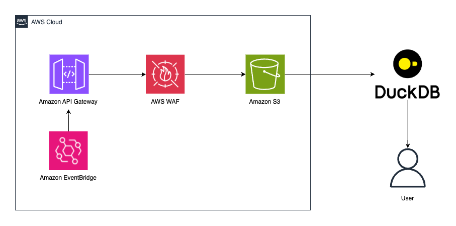

# WAF Log Analysis

A CDK stack for generating AWS WAF logs for security analysis and monitoring practice through automated traffic generation.

## 🏗️ Architecture Overview


## 🏗️ Architecture Components

- **API Gateway**: REST API with mock responses (`/users`, `/admin` endpoints)
- **WAF Web ACL**: Rate limiting rules (20 requests per 5 minutes per IP)
- **S3 Bucket**: WAF log storage with public access blocked and encryption enabled
- **EventBridge**: Periodic API calls for traffic generation
- **CloudFormation Outputs**: URLs and paths for easy access

## 🔒 Security Enhancements

- **S3 Security**: Complete public access blocking, S3-managed encryption
- **WAF Configuration**: Strict rate limiting (20 requests/5 minutes)
- **Bucket Naming**: `aws-waf-logs-` prefix for direct WAF logging
- **Timestamp**: Unique identifier to prevent bucket name conflicts

## 🚀 Deployment Guide

### 1. Install Dependencies
```bash
# Create and activate Python virtual environment
python3 -m venv venv
source venv/bin/activate

# Install CDK libraries
pip install -r requirements.txt
```

### 2. Deploy CDK Stack
```bash
# Bootstrap CDK (first time only)
cdk bootstrap

# Deploy stack
cdk deploy
```

### 3. Post-Deployment Verification
After deployment, check CloudFormation Outputs for:

- **`ApiGatewayUrl`**: API testing URL
- **`WafLogPath`**: S3 WAF log path (for analysis tools)
- **`WafLogConsoleUrl`**: Click to view logs in S3 console (one-click access)
- **`S3BucketName`**: WAF log storage bucket name

## 📊 Generated Traffic Patterns

- **Normal Traffic**: `/users` endpoint called every minute (200 response)
- **Rate Limit Testing**: `/admin` endpoint called every 5 minutes (403 response)
- **WAF Logs**: Available in S3 bucket after 5-10 minutes

## 📁 WAF Log Structure

WAF logs are stored in the following path structure:
```
s3://aws-waf-logs-{account}-{region}-{timestamp}/
└── AWSLogs/
    └── {account}/
        └── WAFLogs/
            └── {region}/
                └── {WebACL-ID}/
                    ├── 2024/11/01/15/
                    │   ├── aws-waf-logs-*.gz
                    │   └── ...
                    └── ...
```

## 🔍 Log Analysis Examples

### DuckDB Setup
```sql
INSTALL httpfs;
LOAD httpfs;

CREATE SECRET (
      TYPE s3,
      KEY_ID '<ACCESS KEY>',
      SECRET '<SECRET KEY>',
      REGION 'us-east-1'
  );
```

### Create table from s3
```sql
CREATE TABLE waf_logs_table AS
SELECT * FROM read_json_auto('<TARGET S3 PATH>/**/*.gz');

```

### Log Analysis DuckDB
```sql
-- Analyze WAF logs
SELECT 
    timestamp,
    httpRequest.clientIP as client_ip,
    httpRequest.uri as uri,
    action,
    terminatingRuleId
FROM waf_logs_table
ORDER BY timestamp DESC;


-- Top10 ip
SELECT httpRequest.clientIp, COUNT(*) AS requests
FROM waf_logs_table
WHERE to_timestamp(timestamp / 1000) >= current_date - INTERVAL 7 DAY
GROUP BY httpRequest.clientIp
ORDER BY requests DESC
LIMIT 10;

```

### Using AWS CLI
```bash
# List log files
aws s3 ls s3://your-bucket/AWSLogs/account/WAFLogs/us-east-1/ --recursive

# Download log files
aws s3 cp s3://your-bucket/AWSLogs/account/WAFLogs/us-east-1/WebACL-ID/ . --recursive
```

## 🧹 Cleanup Instructions

### Important Note
Due to WAF logging creating data in S3, you must manually empty the bucket before running `cdk destroy`.

```bash
# 1. Empty S3 bucket
aws s3 rm s3://your-waf-logs-bucket --recursive

# 2. Destroy CDK stack
cdk destroy
```

## 📋 Prerequisites

- **AWS CLI**: Configured AWS credentials
- **Python**: 3.8 or higher
- **Node.js**: 18.x or higher for CDK execution
- **DuckDB**: For log analysis ([Installation Guide](https://duckdb.org/docs/installation/))
- **Permissions**: IAM, API Gateway, WAF, S3, EventBridge creation permissions

## 🎯 Use Cases

- **Security Analysis Practice**: WAF log pattern analysis
- **Monitoring Tool Testing**: Log-based alerting system development
- **DuckDB Learning**: Large-scale log data analysis practice
- **WAF Rule Validation**: Rate limiting and blocking policy testing

## 🔗 Related Resources

- [AWS WAF Logging Guide](https://docs.aws.amazon.com/waf/latest/developerguide/logging.html)
- [DuckDB S3 Extension](https://duckdb.org/docs/extensions/httpfs.html)
- [AWS CDK Python Guide](https://docs.aws.amazon.com/cdk/v2/guide/work-with-cdk-python.html)
